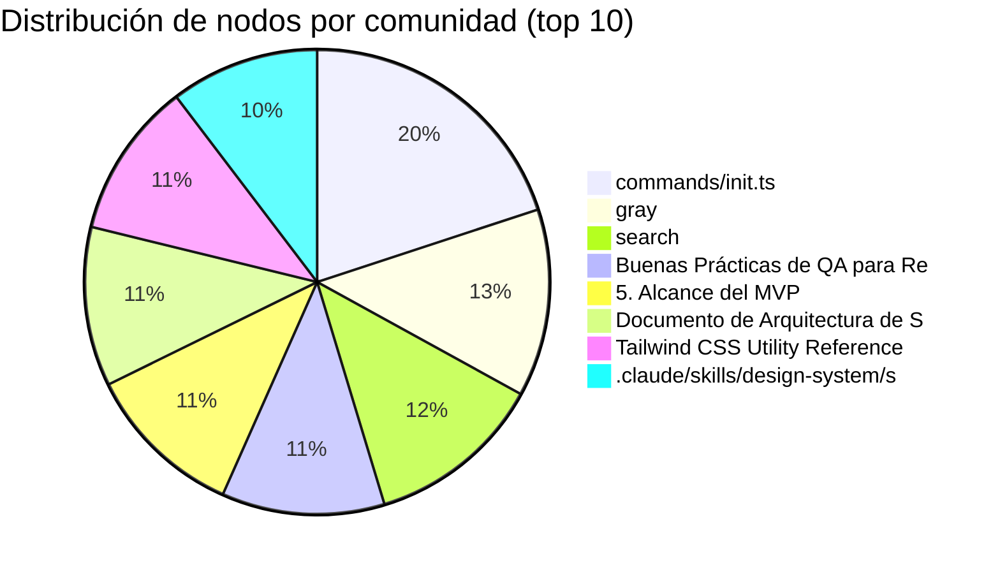

# 🧠 AgroIA — Grafo de Contexto del Proyecto

> **5458 nodos** extraídos del código y documentación del proyecto.
> **388 comunidades** detectadas (mín. 3 nodos cada una).
> **7582 enlaces** entre componentes.

## 🗺️ Mapa de Comunidades

| # | Comunidad | Nodos | Links externos |
|---|-----------|-------|---------------|
| 1 | [[commands⁄init.ts\|commands/init.ts]] | 81 | 0 |
| 2 | [[gray\|gray]] | 53 | 1 |
| 3 | [[gray\|gray]] | 53 | 1 |
| 4 | [[search\|search]] | 50 | 0 |
| 5 | [[Buenas Prácticas de QA para React y Next.js\|Buenas Prácticas de QA para React y Next.js]] | 46 | 0 |
| 6 | [[5. Alcance del MVP\|5. Alcance del MVP]] | 45 | 0 |
| 7 | [[Documento de Arquitectura de Software∶ AgroInteligente Colombia (AgroIA)\|Documento de Arquitectura de Software: AgroIntelig]] | 45 | 0 |
| 8 | [[Tailwind CSS Utility Reference\|Tailwind CSS Utility Reference]] | 44 | 0 |
| 9 | [[Tailwind CSS Utility Reference\|Tailwind CSS Utility Reference]] | 44 | 0 |
| 10 | [[.claude⁄skills⁄design-system⁄scripts⁄slide_search_core.py\|.claude/skills/design-system/scripts/slide_search_]] | 42 | 0 |
| 11 | [[assets⁄skills⁄design-system⁄scripts⁄slide_search_core.py\|assets/skills/design-system/scripts/slide_search_c]] | 42 | 0 |
| 12 | [[Brand Guidelines v1.0\|Brand Guidelines v1.0]] | 38 | 0 |
| 13 | [[Brand Guidelines v1.0\|Brand Guidelines v1.0]] | 38 | 0 |
| 14 | [[Design\|Design]] | 36 | 0 |
| 15 | [[Canvas Design System\|Canvas Design System]] | 36 | 0 |
| 16 | [[Design\|Design]] | 36 | 0 |
| 17 | [[Canvas Design System\|Canvas Design System]] | 36 | 0 |
| 18 | [[Prerequisites\|Prerequisites]] | 34 | 0 |
| 19 | [[Prerequisites\|Prerequisites]] | 34 | 0 |
| 20 | [[Patrones de Automatización de Pruebas para React y Next.js\|Patrones de Automatización de Pruebas para React y]] | 34 | 0 |
| 21 | [[Form & Input Components\|Form & Input Components]] | 33 | 0 |
| 22 | [[Tailwind CSS Responsive Design\|Tailwind CSS Responsive Design]] | 33 | 0 |
| 23 | [[Form & Input Components\|Form & Input Components]] | 33 | 0 |
| 24 | [[Tailwind CSS Responsive Design\|Tailwind CSS Responsive Design]] | 33 | 0 |
| 25 | [[contextoFuncional⁄contextAgro.md\|contextoFuncional/contextAgro.md]] | 33 | 0 |
| 26 | [[BM25\|BM25]] | 31 | 5 |
| 27 | [[Typography Specifications\|Typography Specifications]] | 31 | 0 |
| 28 | [[Typography Specifications\|Typography Specifications]] | 31 | 0 |
| 29 | [[Estrategias de Testing para Aplicaciones React y Next.js\|Estrategias de Testing para Aplicaciones React y N]] | 31 | 0 |
| 30 | [[contextoFuncional⁄RFP-inicial.md\|contextoFuncional/RFP-inicial.md]] | 30 | 0 |
| 31 | [[tests⁄test_tailwind_config_gen.py\|tests/test_tailwind_config_gen.py]] | 29 | 13 |
| 32 | [[scripts⁄design_system.py\|scripts/design_system.py]] | 29 | 5 |
| 33 | [[tests⁄test_tailwind_config_gen.py\|tests/test_tailwind_config_gen.py]] | 29 | 14 |
| 34 | [[Logo Usage Rules\|Logo Usage Rules]] | 29 | 0 |
| 35 | [[Component Specifications\|Component Specifications]] | 29 | 0 |
| 36 | [[shadcn⁄ui Accessibility Patterns\|shadcn/ui Accessibility Patterns]] | 29 | 0 |
| 37 | [[Logo Usage Rules\|Logo Usage Rules]] | 29 | 0 |
| 38 | [[Component Specifications\|Component Specifications]] | 29 | 0 |
| 39 | [[shadcn⁄ui Accessibility Patterns\|shadcn/ui Accessibility Patterns]] | 29 | 0 |
| 40 | [[scripts⁄design_system.py\|scripts/design_system.py]] | 28 | 5 |
| 41 | [[Ranger — Ingeniero de QA Senior\|Ranger — Ingeniero de QA Senior]] | 28 | 0 |
| 42 | [[scripts⁄html-token-validator.py\|scripts/html-token-validator.py]] | 27 | 0 |
| 43 | [[search\|search]] | 27 | 2 |
| 44 | [[scripts⁄html-token-validator.py\|scripts/html-token-validator.py]] | 27 | 0 |
| 45 | [[Asset Approval Checklist\|Asset Approval Checklist]] | 26 | 0 |
| 46 | [[Logo AI Prompt Engineering\|Logo AI Prompt Engineering]] | 26 | 0 |
| 47 | [[Asset Approval Checklist\|Asset Approval Checklist]] | 26 | 0 |
| 48 | [[Logo AI Prompt Engineering\|Logo AI Prompt Engineering]] | 26 | 0 |
| 49 | [[BM25\|BM25]] | 25 | 0 |
| 50 | [[BM25\|BM25]] | 25 | 0 |
| 51 | [[Color Palette Management\|Color Palette Management]] | 25 | 0 |
| 52 | [[States and Variants\|States and Variants]] | 25 | 0 |
| 53 | [[CIP Deliverable Guide\|CIP Deliverable Guide]] | 25 | 0 |
| 54 | [[UI Styling Skill\|UI Styling Skill]] | 25 | 0 |
| 55 | [[Color Palette Management\|Color Palette Management]] | 25 | 0 |
| 56 | [[States and Variants\|States and Variants]] | 25 | 0 |
| 57 | [[CIP Deliverable Guide\|CIP Deliverable Guide]] | 25 | 0 |
| 58 | [[UI Styling Skill\|UI Styling Skill]] | 25 | 0 |
| 59 | [[Workflow\|Workflow]] | 24 | 0 |
| 60 | [[Workflow\|Workflow]] | 24 | 0 |
| 61 | [[Guía de Descomposición de Épicas\|Guía de Descomposición de Épicas]] | 24 | 0 |
| 62 | [[Design System\|Design System]] | 23 | 0 |
| 63 | [[Tailwind CSS Customization\|Tailwind CSS Customization]] | 23 | 0 |
| 64 | [[Design System\|Design System]] | 23 | 0 |
| 65 | [[Tailwind CSS Customization\|Tailwind CSS Customization]] | 23 | 0 |
| 66 | [[templates⁄design-tokens-starter.json\|templates/design-tokens-starter.json]] | 22 | 5 |
| 67 | [[DesignSystemGenerator\|DesignSystemGenerator]] | 22 | 15 |
| 68 | [[templates⁄design-tokens-starter.json\|templates/design-tokens-starter.json]] | 22 | 5 |
| 69 | [[scripts⁄sync-assets.mjs\|scripts/sync-assets.mjs]] | 22 | 0 |
| 70 | [[DesignSystemGenerator\|DesignSystemGenerator]] | 22 | 5 |
| 71 | [[scripts⁄generate-slide.py\|scripts/generate-slide.py]] | 20 | 0 |
| 72 | [[scripts⁄design_system.py\|scripts/design_system.py]] | 20 | 5 |
| 73 | [[scripts⁄generate-slide.py\|scripts/generate-slide.py]] | 20 | 0 |
| 74 | [[Routing by Task Type\|Routing by Task Type]] | 20 | 0 |
| 75 | [[shadcn⁄ui Theming & Customization\|shadcn/ui Theming & Customization]] | 20 | 0 |
| 76 | [[ui-ux-pro-max-skill-main⁄README.zh.md\|ui-ux-pro-max-skill-main/README.zh.md]] | 20 | 4 |
| 77 | [[Routing by Task Type\|Routing by Task Type]] | 20 | 0 |
| 78 | [[shadcn⁄ui Theming & Customization\|shadcn/ui Theming & Customization]] | 20 | 0 |
| 79 | [[Specter — Jira Epic Breakdown\|Specter — Jira Epic Breakdown]] | 20 | 0 |
| 80 | [[templates⁄design-tokens-starter.json\|templates/design-tokens-starter.json]] | 19 | 8 |
| 81 | [[templates⁄design-tokens-starter.json\|templates/design-tokens-starter.json]] | 19 | 8 |
| 82 | [[Asset Organization Guide\|Asset Organization Guide]] | 19 | 0 |
| 83 | [[Primary Color Meanings\|Primary Color Meanings]] | 19 | 0 |
| 84 | [[Core Logo Types\|Core Logo Types]] | 19 | 0 |
| 85 | [[Asset Organization Guide\|Asset Organization Guide]] | 19 | 0 |
| 86 | [[Primary Color Meanings\|Primary Color Meanings]] | 19 | 0 |
| 87 | [[Core Logo Types\|Core Logo Types]] | 19 | 0 |
| 88 | [[Janus — RFP Requirements Extractor\|Janus — RFP Requirements Extractor]] | 19 | 0 |
| 89 | [[scripts⁄fetch-background.py\|scripts/fetch-background.py]] | 18 | 0 |
| 90 | [[scripts⁄tailwind_config_gen.py\|scripts/tailwind_config_gen.py]] | 18 | 18 |
| 91 | [[scripts⁄fetch-background.py\|scripts/fetch-background.py]] | 18 | 0 |
| 92 | [[scripts⁄tailwind_config_gen.py\|scripts/tailwind_config_gen.py]] | 18 | 16 |
| 93 | [[compilerOptions\|compilerOptions]] | 18 | 0 |
| 94 | [[PRD to Mockups (Figma + Excalidraw)\|PRD to Mockups (Figma + Excalidraw)]] | 18 | 0 |
| 95 | [[Brand Consistency Checklist\|Brand Consistency Checklist]] | 18 | 0 |
| 96 | [[Color Semantics\|Color Semantics]] | 18 | 0 |
| 97 | [[CIP Mockup Prompt Engineering\|CIP Mockup Prompt Engineering]] | 18 | 0 |
| 98 | [[Brand Consistency Checklist\|Brand Consistency Checklist]] | 18 | 0 |
| 99 | [[Color Semantics\|Color Semantics]] | 18 | 0 |
| 100 | [[CIP Mockup Prompt Engineering\|CIP Mockup Prompt Engineering]] | 18 | 0 |

---

## 📊 Comunidades por tamaño

## 🔍 Cómo navegar este vault

- Cada comunidad tiene su propia nota con la lista de nodos que la componen.
- Los **wikilinks** `[[doble corchete]]` conectan comunidades relacionadas.
- Usa el **Graph View** de Obsidian (`Ctrl+G`) para ver el grafo completo.
- Activa **Local Graph** en cualquier nota para ver sus conexiones inmediatas.
- Los tags permiten filtrar por tipo: `#code`, `#markdown`, `#functional`, `#architecture`.