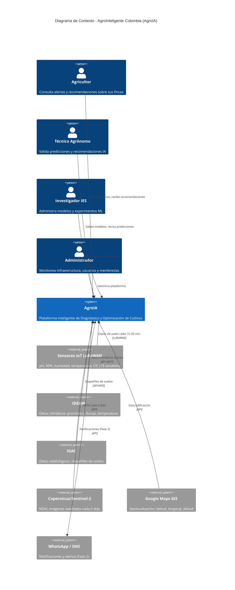
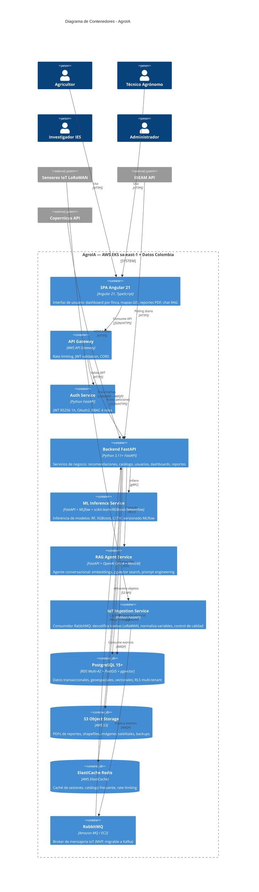
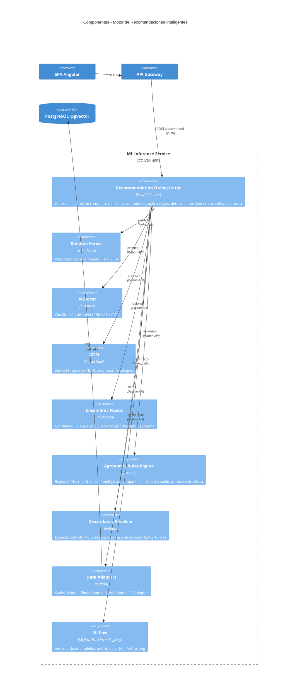
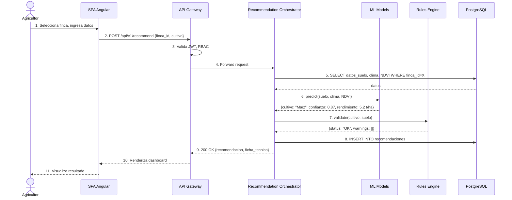
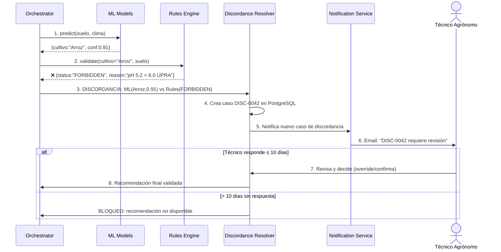
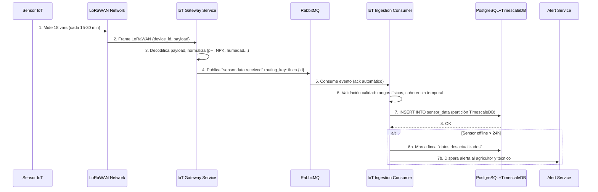
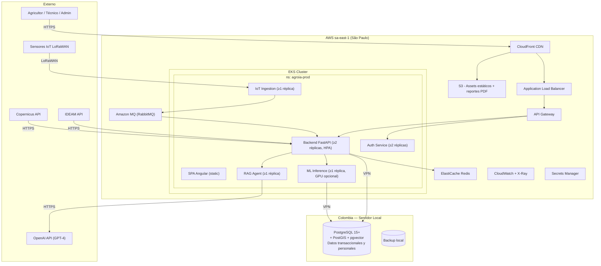

# Documento de Arquitectura de Software: AgroInteligente Colombia (AgroIA)

**Versión:** 1.0
**Fecha:** 2026-08-03
**Tipo de documento:** Arquitectura propuesta (Caso A — Greenfield con ML/IA)
**Autor:** Generado con asistencia de IA, revisado por —
**Diagramas draw.io:** `resources/architecture/AgroIA-Arquitectura-C4.drawio` (6 pestañas)

---

## 1. Introducción y Objetivos

### 1.1 Propósito del sistema

AgroIA es una plataforma inteligente de diagnóstico agronómico que funciona como un **ingeniero agrónomo virtual** para el mercado agrícola colombiano. A partir de sensores IoT de campo (18 variables de suelo), datos climáticos del IDEAM, información edafológica del IGAC e imágenes satelitales Copernicus/Sentinel-2, la plataforma determina la aptitud de un terreno para un cultivo, recomienda acciones correctivas cuando el suelo no es óptimo, y sugiere el cultivo más adecuado con justificación trazable. Incluye un agente conversacional con arquitectura RAG que responde preguntas agronómicas usando exclusivamente un corpus documental indexado (Cenicafé, AGROSAVIA, UPRA), sin conexión a Internet.

### 1.2 Requerimientos funcionales clave

| # | Requerimiento | Refinamiento |
|---|--------------|-------------|
| RF-1 | Motor de recomendaciones inteligentes (5 modelos ML + reglas agronómicas + orquestador híbrido) | [001](resources/functional/reqs/001-motor-recomendaciones-inteligentes.md) |
| RF-2 | Catálogo de cultivos y fichas técnicas con validación de técnico ≤5 días | [002](resources/functional/reqs/002-catalogo-cultivos-fichas-tecnicas.md) |
| RF-3 | Ingesta de datos IoT (LoRaWAN, 18 variables, RabbitMQ) + APIs externas (IDEAM, IGAC, Copernicus, GIS) | [003](resources/functional/reqs/003-ingesta-datos-iot-apis-externas.md) |
| RF-4 | Seguridad integral: JWT RS256, RBAC 4 roles, RLS multi-tenant, OWASP Top 10, Ley 1581/2012 | [004](resources/functional/reqs/004-seguridad-aislamiento-datos.md) |
| RF-5 | Dashboards interactivos por finca, reportes PDF, UX dual (agricultor/técnico) | [005](resources/functional/reqs/005-dashboards-reportes-ux.md) |
| RF-6 | Agente conversacional RAG (GPT-4 + pgvector + embeddings open-source en español) | [006](resources/functional/reqs/006-agente-conversacional-rag.md) |
| RF-7 | Infraestructura DevOps/MLOps: AWS EKS, Terraform, GitHub Actions, MLflow, CloudWatch+X-Ray | [007](resources/functional/reqs/007-infraestructura-devops-mlops.md) |
| RF-8 | Usuarios, roles y membresías (4 roles RBAC, auto-registro, planes) | [008](resources/functional/reqs/008-usuarios-roles-membresias.md) |
| RF-9 | Requisitos transversales y post-MVP | [009](resources/functional/reqs/009-cierre-requisitos-transversales.md) |

### 1.3 Atributos de calidad

| Atributo | Prioridad | Métrica / Objetivo |
|----------|-----------|-------------------|
| Precisión de recomendaciones | Crítico | F1-score ≥ 0.80 por modelo; ≥85% respuestas correctas en banco RAG de 50 preguntas |
| Disponibilidad | Alta | 99.9% mensual (excluyendo ventanas de mantenimiento programadas) |
| Seguridad | Crítico | OWASP Top 10 cubierto; SAST/DAST mensual; pentest automatizado mensual; TLS 1.2+; datos personales cifrados en reposo |
| Escalabilidad | Alta | 5,000 usuarios registrados; 500-1,000 concurrentes en hora pico; HPA en EKS |
| Latencia (recomendación) | Alta | p95 < 5s para el pipeline completo de recomendación |
| Latencia (RAG) | Alta | Búsqueda vectorial < 500ms; respuesta completa < 10s |
| Tiempo de despliegue | Media | < 15 min desde merge a producción (CI/CD) |
| Resiliencia IoT | Alta | Sensor offline > 24h → alerta y datos marcados "desactualizados"; ≥ 12 meses autonomía de batería solar |
| Cumplimiento normativo | Crítico | Ley 1581/2012 (habeas data); residencia de datos en Colombia; consentimiento informado |
| Observabilidad | Alta | Trazas distribuidas (X-Ray), métricas (CloudWatch), logs centralizados ≥ 6 meses |

### 1.4 Interesados (stakeholders)

| Interesado | Rol | Interés principal |
|-----------|-----|------------------|
| Agricultor | Usuario final | Recomendaciones confiables y accionables para su finca |
| Técnico Agrónomo | Validador de dominio | Calidad agronómica de las predicciones; herramientas de revisión eficientes |
| Investigador IES | Operador ML | Administración de modelos, experimentos, publicaciones científicas |
| Administrador | Operador de plataforma | Infraestructura, seguridad, membresías, monitoreo |
| Comité de Cafeteros del Quindío | Aliado estratégico | Validación del piloto en café |
| MinCiencias / ColombIA Inteligente | Potencial financiador | Resultados de investigación aplicada |
| Cenicafé / AGROSAVIA / UPRA | Proveedores de conocimiento | Uso adecuado de su propiedad intelectual |
| IDEAM / IGAC | Proveedores de datos | Consumo responsable de APIs de datos abiertos |

---

## 2. Restricciones

| # | Restricción | Tipo | Impacto |
|---|------------|------|---------|
| R1 | Angular 21 para el frontend | Técnica (cliente vinculante) | Define el ecosistema frontend; incompatible con React/Vue |
| R2 | Python para backend y modelos de IA | Técnica (cliente vinculante) | FastAPI como framework natural; stack científico Python |
| R3 | El agente conversacional no puede navegar por Internet | Funcional (RFP) | Arquitectura RAG cerrada sobre corpus documental; sin web search |
| R4 | El sistema nunca debe inventar información ("no alucinación") | Funcional (RFP) | Circuito de "sin datos suficientes" obligatorio en ML y RAG |
| R5 | Datos deben residir en servidores en Colombia | Legal (Ley 1581/2012) | Arquitectura híbrida: datos en Colombia + cómputo en AWS sa-east-1 |
| R6 | Licencia CC BY-NC-ND de Cenicafé | Legal | Uso en RAG comercial requiere validación legal; bloqueante para producción |
| R7 | Piloto inicial en café en el Quindío | Organizacional | Datos de calibración inicial limitados a un cultivo y región |
| R8 | No hay presupuesto definido | Organizacional | Estimaciones de costo son referenciales; puede limitar alcance cloud |
| R9 | Equipo multidisciplinario (agrónomos + ingenieros + científicos de datos) | Organizacional | Necesidad de herramientas que sirvan a perfiles técnicos y no técnicos |

---

## 3. Alcance y Contexto del Sistema

### 3.1 Contexto de negocio

AgroIA opera en el ecosistema agrícola colombiano, conectando a agricultores (70% pequeños y medianos productores) con inteligencia agronómica basada en datos. El sistema se sitúa entre los sensores de campo (IoT), las fuentes oficiales de datos agroclimáticos (IDEAM, IGAC, Copernicus), el conocimiento científico institucional (Cenicafé, AGROSAVIA, UPRA), y la toma de decisiones del agricultor asistida por un técnico agrónomo.

**Límites del sistema:**
- **IN:** Captura de datos de suelo (sensores), datos climáticos y edafológicos (APIs externas), conocimiento agronómico (corpus documental), gestión de usuarios y fincas, generación de recomendaciones, interacción conversacional.
- **OUT:** Procesamiento de pagos (fase 2), provisión de sensores IoT físicos (aliado tecnológico), operación de red LoRaWAN (operador local), predicción de plagas/enfermedades (post-MVP).

### 3.2 Diagrama de Contexto (C4 Nivel 1)

> **Archivo draw.io:** Pestaña `C1 - Contexto` en `resources/architecture/AgroIA-Arquitectura-C4.drawio`



---

## 4. Estrategia de Solución

### 4.1 Estilo arquitectónico

**Arquitectura híbrida: Modular Monolith + Microservicios acotados.**

La plataforma adopta un **monolito modular** en Python/FastAPI para el núcleo de negocio (recomendaciones, catálogo, usuarios, dashboards) con **servicios independientes** para los componentes que tienen requerimientos de escalado, tecnología o ciclo de vida distintos:

| Componente | Estrategia | Justificación |
|-----------|-----------|--------------|
| **Backend de negocio** | Monolito modular FastAPI | Cohesión de dominio, simplicidad operativa en MVP, evolución a microservicios cuando la escala lo justifique |
| **ML Inference Service** | Servicio independiente | Escalado independiente, GPU opcional, ciclo de deploy de modelos distinto al código de negocio |
| **RAG Agent Service** | Servicio independiente | Dependencia de LLM externo (OpenAI), latencia diferente, posible reemplazo futuro del proveedor |
| **IoT Ingestion Service** | Servicio independiente | Alto throughput de mensajes, desacople vía RabbitMQ, procesamiento asíncrono |
| **Auth Service** | Servicio independiente | Responsabilidad única de seguridad, stateless, escalado independiente |

**Comunicación:** REST síncrono para operaciones de negocio, mensajería asíncrona (RabbitMQ) para ingesta IoT, gRPC para inferencia ML (baja latencia).

### 4.2 Fundamentos de la decisión

- **No microservicios completos en MVP:** El equipo es multidisciplinario y pequeño; la complejidad operativa de microservicios completos (service mesh, distributed tracing, eventual consistency) no se justifica para 5,000 usuarios.
- **Servicios independientes donde sí hay diferencia real de escala/tecnología:** ML, RAG e IoT tienen requerimientos de infraestructura radicalmente distintos al CRUD de negocio.
- **Arquitectura híbrida de datos:** Datos transaccionales y personales en servidor Colombia (cumplimiento Ley 1581), cómputo en AWS sa-east-1 (elasticidad, servicios gestionados). La latencia del enlace Colombia↔São Paulo es aceptable para el caso de uso (< 100ms RTT típico).

---

## 5. Vista de Contenedores (C4 Nivel 2)

> **Archivo draw.io:** Pestaña `C2 - Contenedores` en `resources/architecture/AgroIA-Arquitectura-C4.drawio`



### 5.1 Responsabilidades y tecnología por contenedor

| Contenedor | Responsabilidad | Tecnología | Por qué |
|-----------|----------------|-----------|---------|
| **SPA Angular 21** | UI completa: dashboards, mapas, chat, reportes, admin | Angular 21, TypeScript, Leaflet/Mapbox | Vinculante del cliente; ecosistema maduro para formularios complejos y SPA empresarial |
| **API Gateway** | Rate limiting, validación JWT inicial, CORS, ruteo | AWS API Gateway | Servicio gestionado, integración nativa con EKS y CloudWatch |
| **Auth Service** | Autenticación, emisión/refresh de tokens, RBAC | FastAPI, PyJWT, bcrypt/argon2 | Stateless, escalable horizontalmente, sin sesiones en servidor |
| **Backend FastAPI** | Lógica de negocio: recomendaciones, catálogo, usuarios, dashboards, reportes, ingesta de datos externos | FastAPI, SQLAlchemy, Pydantic, Celery (tareas asíncronas) | Rendimiento async, tipado fuerte, ecosistema científico Python compatible |
| **ML Inference** | Inferencia de modelos ML, versionado, A/B testing | FastAPI, scikit-learn, XGBoost, TensorFlow, MLflow | Ciclo de deploy independiente, GPU opcional, escalado por demanda de inferencia |
| **RAG Agent** | Chat agronómico: embeddings, búsqueda vectorial, prompt + LLM | FastAPI, sentence-transformers, OpenAI API, pgvector | Dependencia externa (OpenAI), latencia distinta, reemplazable |
| **IoT Ingestion** | Decodificación LoRaWAN, normalización, validación de calidad, publicación en broker | FastAPI, paho-mqtt, aioamqp | Alto throughput de mensajes, desacople total del backend |
| **PostgreSQL** | Datos transaccionales, geoespaciales (PostGIS), vectoriales (pgvector), RLS | PostgreSQL 15+ RDS Multi-AZ | Un solo motor para tres dominios; pgvector evita introducir Pinecone/Weaviate en MVP |
| **S3** | Objetos binarios: PDFs, imágenes, shapefiles, backups | AWS S3 Standard | Durabilidad 99.999999999%, lifecycle policies para backup |
| **ElastiCache Redis** | Caché de catálogo, sesiones, rate limiting | AWS ElastiCache Redis | Latencia sub-ms, réplicas de lectura, integración nativa AWS |
| **RabbitMQ** | Mensajería asíncrona IoT → Backend | Amazon MQ / EC2 | Protocolo AMQP maduro; suficiente para throughput de sensores cada 15-30 min; migrable a Kafka si se añade streaming de eventos en fase 2 |

---

## 6. Vista de Componentes (C4 Nivel 3)

> **Archivo draw.io:** Pestaña `C3 - Componentes Motor ML` en `resources/architecture/AgroIA-Arquitectura-C4.drawio`

### 6.1 Motor de Recomendaciones Inteligentes (ML Inference Service)



**Modelos ML del MVP:**

| # | Modelo | Propósito | Algoritmo | Métrica objetivo |
|---|--------|----------|-----------|-----------------|
| M1 | Clasificación del estado del suelo | Aptitud según UPRA (Alta/Media/Baja/No apta) | XGBoost | F1 ≥ 0.82 |
| M2 | Predicción del cultivo ideal | Top 5 cultivos con score y confianza | Random Forest | F1 ≥ 0.80 |
| M3 | Detección de deficiencias nutricionales | Nutrientes faltantes, cantidad, prioridad | Random Forest | F1 ≥ 0.80 |
| M4 | Recomendación de fertilización | Tipo, kg/ha, frecuencia, costo estimado | XGBoost + Reglas | F1 ≥ 0.80 |
| M5 | Predicción de rendimiento | Ton/ha, intervalo de confianza, factores limitantes | Random Forest + LSTM | F1 ≥ 0.80 |

**Estrategia cold-start:**
- Semana 1-4: solo reglas agronómicas (sistema experto). Los modelos se entrenan con datasets públicos (Kaggle, FAO) + reglas Cenicafé/UPRA.
- Semana 5-8: modo sombra (shadow mode) — modelos ML predicen en paralelo pero no se muestran al usuario. Se comparan contra reglas y datos reales del piloto Quindío.
- Semana 9+: activación progresiva de modelos con F1 ≥ 0.80 en validación cruzada con datos del piloto.

**Mecanismo de discordancia ML vs Reglas:**

```
1. Orchestrator recibe predicción ML con score
2. Rules Engine valida la predicción contra reglas agronómicas oficiales
3. Si ML y reglas coinciden → recomendación se publica normalmente
4. Si ML y reglas discrepan → GANA la regla (principio de precaución)
   - Se crea caso de discordancia (DISC-XXXX)
   - Se notifica al técnico agrónomo asignado
   - Técnico revisa en ≤ 10 días hábiles
   - Si no hay revisión en 10 días → recomendación BLOQUEADA
   - Si el técnico valida la excepción → se documenta y se publica
```

---

## 7. Vista de Código (C4 Nivel 4)

_No se incluye en esta versión del documento. Se generará para el componente Recommendation Orchestrator durante la fase de diseño detallado._

---

## 8. Vistas de Ejecución: Diagramas de Secuencia

> **Archivo draw.io:** Pestañas `Secuencia - Flujo Principal`, `Secuencia - Discordancia ML vs Reglas`, `Secuencia - Ingesta IoT`

### 8.1 Flujo principal de análisis y recomendación

**Caso de uso:** Un agricultor solicita una recomendación para su finca. El sistema consulta datos de suelo, clima y NDVI, ejecuta los modelos ML, valida con reglas agronómicas, y entrega una recomendación con ficha técnica en < 5s.



### 8.2 Flujo de discordancia ML vs Reglas

**Caso de uso:** El modelo ML recomienda un cultivo con alta confianza, pero el motor de reglas lo bloquea por incompatibilidad agronómica (ej. pH insuficiente). Se activa el mecanismo de revisión por técnico.



### 8.3 Flujo de ingesta de datos IoT

**Caso de uso:** Los sensores LoRaWAN en campo miden 18 variables cada 15-30 minutos. Los datos viajan por la red LoRaWAN del operador local, se decodifican, normalizan, validan y persisten en PostgreSQL+TimescaleDB.



---

## 9. Modelo de Datos

### 9.1 Entidades principales

```mermaid
erDiagram
    USUARIO ||--o{ MEMBRESIA : contrata
    USUARIO ||--o{ FINCA : registra
    USUARIO }o--|| ROL : tiene
    FINCA ||--o{ SENSOR_DATA : genera
    FINCA ||--o{ RECOMENDACION : recibe
    FINCA }o--|| ZONA_AGROCLIMATICA : ubicada_en
    CULTIVO ||--o{ FICHA_TECNICA : documentado_en
    CULTIVO ||--o{ RECOMENDACION : referenciado_en
    RECOMENDACION ||--o{ DISCORDANCIA : puede_generar
    TECNICO ||--o{ DISCORDANCIA : revisa
    MODELO_ML ||--o{ MLFLOW_RUN : versionado_en
    
    USUARIO {
        uuid id PK
        string email UK
        string password_hash
        string nombre
        uuid rol_id FK
        uuid tenant_id
        timestamp created_at
        boolean consentimiento_datos
    }
    FINCA {
        uuid id PK
        uuid usuario_id FK
        uuid tenant_id
        string nombre
        geometry ubicacion
        float area_ha
        uuid zona_agroclimatica_id FK
    }
    SENSOR_DATA {
        uuid id PK
        uuid finca_id FK
        timestamp ts
        float ph
        float nitrogeno
        float fosforo
        float potasio
        -- 14 variables más
    }
    RECOMENDACION {
        uuid id PK
        uuid finca_id FK
        uuid cultivo_id FK
        string clasificacion_upra
        float confianza
        jsonb justificacion
        string estado
        uuid tecnico_id FK
    }
    CULTIVO {
        uuid id PK
        string nombre
        string nombre_cientifico
        jsonb requerimientos
        boolean validado
    }
```

### 9.2 Estrategia de particionamiento

- **sensor_data:** partición por tiempo (TimescaleDB hypertable, chunk de 7 días) y por `finca_id` (particionamiento espacial opcional en fase 2).
- **Índices vectoriales:** pgvector con índice IVFFlat para embeddings RAG (recálculo semanal).
- **Caché:** catálogo de cultivos y fichas técnicas cacheados en Redis (TTL 1h, invalidación por evento).

### 9.3 Multi-tenancy

Row-Level Security en PostgreSQL con `tenant_id` en TODAS las tablas con datos de cliente. Políticas RLS:

```sql
CREATE POLICY tenant_isolation ON finca
    USING (tenant_id = current_setting('app.current_tenant')::uuid);
```

Datos compartidos multi-tenant (sin `tenant_id`): catálogo de cultivos, reglas agronómicas, corpus RAG.

---

## 10. Conceptos Transversales

### 10.1 Autenticación y autorización

- **Autenticación:** JWT RS256 (clave privada en AWS Secrets Manager). Access token 1h, refresh token 7 días.
- **Autorización:** RBAC con 4 roles verificados en API Gateway + middleware FastAPI.
- **Flujo:** Login → Auth Service emite JWT → API Gateway valida firma y expiración → Backend verifica rol para el endpoint.
- **Roles:** Administrador, Cliente (Agricultor), Técnico Agrónomo, Investigador IES.

### 10.2 Manejo de errores y resiliencia

- **Circuit Breaker:** para llamadas a APIs externas (IDEAM, Copernicus, OpenAI) usando `tenacity` o AWS App Mesh.
- **Retry con backoff exponencial:** 3 reintentos con jitter para APIs externas.
- **Fallback:** si ML falla → solo reglas agronómicas. Si IDEAM no responde → último dato conocido (marcado como "desactualizado" tras 24h).
- **Graceful degradation:** si pgvector no está disponible → RAG responde "No puedo consultar el conocimiento en este momento."

### 10.3 Logging y observabilidad

- **Trazas:** AWS X-Ray en cada request (API Gateway → Backend → ML → PostgreSQL).
- **Métricas:** CloudWatch dashboards para latencia (p50, p95, p99), throughput, error rate, uso de GPU.
- **Logs:** CloudWatch Logs con niveles INFO/WARN/ERROR. Retención ≥ 6 meses (cumplimiento).
- **Alertas:** CloudWatch Alarms para disponibilidad, latencia > 5s, tasa de error > 1%, sensor offline > 24h.

### 10.4 Gestión de configuración y secretos

- **Secretos:** AWS Secrets Manager (JWT keys, DB passwords, OpenAI API key).
- **Configuración:** AWS Parameter Store (no sensible) + `.env` para desarrollo local.
- **Feature flags:** AWS AppConfig para activación progresiva de modelos ML y features.

### 10.5 Validación

- **Input:** Pydantic models en FastAPI para validación de schemas.
- **Calidad de datos IoT:** validación de rangos físicos (pH 0-14), coherencia temporal (no saltos > 3σ), detección de sensor congelado (mismo valor > 48h).
- **Validación agronómica:** toda recomendación pasa por Rules Engine antes de publicarse.

---

## 11. Decisiones Arquitectónicas (ADRs)

### ADR-001: Arquitectura híbrida de datos — Colombia + AWS São Paulo

- **Contexto:** Ley 1581/2012 exige residencia de datos personales en Colombia. AWS no tiene región en Colombia. Se requiere cumplimiento normativo sin renunciar a servicios cloud gestionados.
- **Decisión:** Datos transaccionales y personales en servidor local colombiano (PostgreSQL). Cómputo (EKS, servicios gestionados) en AWS sa-east-1 (São Paulo). Conexión por VPN site-to-site o AWS Direct Connect (si presupuesto lo permite).
- **Alternativas consideradas:** (a) Todo en AWS — riesgo legal. (b) Todo on-premise — pierde elasticidad y servicios gestionados. (c) Azure (sin región Colombia tampoco) — mismo problema.
- **Consecuencias:** (+) Cumplimiento normativo. (+) Elasticidad cloud para cómputo. (-) Latencia del enlace Colombia↔São Paulo (~80-100ms RTT). (-) Complejidad operativa de infraestructura híbrida. (-) Costo de VPN/Direct Connect.

### ADR-002: pgvector sobre PostgreSQL en vez de Pinecone/Weaviate/Chroma

- **Contexto:** Se necesita una base de datos vectorial para el RAG. Pinecone es SaaS, Weaviate y Chroma son especializadas. PostgreSQL ya está en el stack.
- **Decisión:** Usar extensión pgvector en PostgreSQL. Un solo motor para datos transaccionales, geoespaciales (PostGIS) y vectoriales.
- **Alternativas consideradas:** (a) Pinecone — SaaS, latencia adicional, costo, datos salen de infraestructura controlada. (b) Chroma — open-source pero motor separado, sin PostGIS.
- **Consecuencias:** (+) Simplifica stack (un motor). (+) Datos vectoriales bajo mismo RLS y backup. (+) Sin costo adicional de licencia/SaaS. (-) Rendimiento vectorial inferior a motores especializados en >1M vectores (MVP no llega a ese volumen). (-) Índice IVFFlat requiere recálculo periódico.

### ADR-003: RabbitMQ en MVP con migración planificada a Kafka

- **Contexto:** Se necesita un broker de mensajería para la ingesta IoT. Kafka es el estándar para streaming, pero añade complejidad operativa.
- **Decisión:** RabbitMQ (Amazon MQ o EC2) para MVP. Migración a Kafka (Amazon MSK) planificada para fase 2 si el volumen de eventos lo justifica.
- **Alternativas consideradas:** (a) Kafka desde día 1 — overengineering para < 1000 sensores. (b) SQS — sin capacidad de routing por finca.
- **Consecuencias:** (+) Simplicidad operativa en MVP. (+) Protocolo AMQP maduro y bien soportado. (-) Migración a Kafka requerirá adaptar consumidores. (-) Sin retención de eventos a largo plazo (Kafka lo haría mejor).

### ADR-004: Embeddings open-source autogestionados (MiniLM) en vez de OpenAI embeddings

- **Contexto:** El corpus documental está en español y contiene propiedad intelectual de Cenicafé/AGROSAVIA. Enviarlo a OpenAI para generar embeddings implica riesgo de exposición de IP y costos recurrentes.
- **Decisión:** `paraphrase-multilingual-MiniLM-L12-v2` ejecutado localmente en el RAG Agent Service. Solo se envía a OpenAI el prompt final (contexto recuperado + pregunta), nunca el corpus completo.
- **Alternativas consideradas:** (a) OpenAI `text-embedding-3-small` — expone corpus a terceros, costo por token. (b) `multilingual-e5-large` — mejor precisión pero 2.5× más lento en CPU.
- **Consecuencias:** (+) Corpus no sale de la infraestructura controlada. (+) Sin costo de API de embeddings. (-) Precisión potencialmente menor que modelos más grandes. (-) Consume CPU/GPU en el servicio RAG.

### ADR-005: Monolito modular + servicios independientes acotados

- **Contexto:** El equipo es multidisciplinario y probablemente pequeño en MVP. Se necesita velocidad de desarrollo sin comprometer la capacidad de escalar componentes con requerimientos diferentes.
- **Decisión:** Monolito modular FastAPI para el núcleo de negocio. Servicios independientes solo para ML Inference, RAG Agent, IoT Ingestion y Auth.
- **Alternativas consideradas:** (a) Microservicios completos — complejidad operativa injustificada para 5,000 usuarios. (b) Monolito puro — ML, RAG e IoT tienen requerimientos de infraestructura demasiado diferentes.
- **Consecuencias:** (+) Balance simplicidad/flexibilidad. (+) Cada servicio independiente escala con sus propios recursos. (-) Comunicación entre servicios añade latencia. (-) Eventual migración a microservicios si el monolito crece demasiado.

### ADR-006: Principio de precaución — reglas ganan a ML en discordancia

- **Contexto:** El sistema híbrido puede producir recomendaciones contradictorias entre ML (estadístico) y reglas (conocimiento agronómico deterministico). Se necesita un criterio de resolución claro.
- **Decisión:** En caso de discordancia, la regla agronómica prevalece sobre la predicción del modelo ML. La discordancia se escala a un técnico agrónomo para revisión en ≤ 10 días.
- **Alternativas consideradas:** (a) ML siempre gana — riesgo de recomendaciones agronómicamente inviables. (b) Promedio ponderado — no aplica para decisiones booleanas (apto/no apto).
- **Consecuencias:** (+) Seguridad agronómica (principio de precaución). (+) Trazabilidad de decisiones. (-) Falsos negativos: ML puede tener razón contra reglas desactualizadas. (-) Carga de trabajo para técnicos revisores (mitigado con SLA de 10 días).

---

## 12. Vista de Despliegue

> **Nota:** El diagrama de despliegue detallado con iconografía oficial AWS se entregará como archivo `.drawio` independiente en una iteración futura, siguiendo `references/drawio-iconos-nube.md`. A continuación se presenta la topología de infraestructura en formato portable.



### 12.1 Dimensionamiento (MVP)

| Recurso | Especificación |
|---------|---------------|
| Nodos EKS | 2-3 nodos t3.medium (MVP), escalables a t3.large |
| Réplicas por servicio | ≥ 2 (HPA: CPU > 70% escala +1) |
| PostgreSQL | db.t3.medium Multi-AZ (si RDS), o servidor dedicado 4 vCPU / 16 GB RAM en Colombia |
| Redis | cache.t3.micro (MVP) |
| RabbitMQ | mq.t3.micro (Amazon MQ) |
| S3 | Standard, lifecycle a Glacier tras 90 días |
| OpenAI | GPT-4, ~500 requests/día estimados en MVP |

---

## 13. Riesgos y Deuda Técnica

| # | Riesgo | Impacto | Prob. | Mitigación |
|---|--------|---------|-------|-----------|
| R1 | Licencia CC BY-NC-ND de Cenicafé impide uso comercial en RAG | Alto — bloquea el 40% del corpus de café | Media | Validación legal antes de producción; corpus alternativo (AGROSAVIA, UPRA) si es necesario |
| R2 | Latencia del enlace Colombia↔São Paulo degrada experiencia | Medio — queries SQL con latencia > 100ms | Alta | Connection pooling agresivo; caché Redis en AWS para datos frecuentes; evaluación de PostgreSQL read replica en AWS para lecturas no críticas |
| R3 | Variables bloqueantes no completamente definidas | Medio — motor puede rechazar solicitudes innecesariamente | Alta | Arrancar con criterio conservador (pH, N, P, K, MO, CE); ajustar con datos del piloto |
| R4 | Cold-start: modelos ML sin datos reales del Quindío | Alto — recomendaciones iniciales de baja calidad | Alta | Modo sombra (semana 5-8); despliegue inicial solo con reglas; calibración progresiva |
| R5 | Costos AWS no estimados | Medio — puede exceder presupuesto disponible | Alta | Free tier inicial; estimación detallada con AWS Pricing Calculator antes de producción |
| R6 | Dependencia de OpenAI como único proveedor LLM | Medio — vendor lock-in, cambio de pricing/API | Baja | Arquitectura RAG desacoplada del LLM; interfaz genérica que permite cambiar a Claude/Mistral/Llama |
| R7 | Cobertura LoRaWAN insuficiente en zona rural del Quindío | Alto — sin datos IoT, el motor pierde su principal fuente | Media | Validación de cobertura con operador local antes de despliegue; plan B: ingesta manual asistida |

---

## 14. Supuestos

1. **El piloto es en café en el Quindío**, pero la arquitectura es multi-cultivo y multi-región desde el día 1. No se hardcodea nada para café.
2. **Los sensores IoT y la red LoRaWAN son provistos por un aliado tecnológico externo.** AgroIA solo consume los datos ya transmitidos.
3. **La pasarela de pagos no se implementa en MVP.** Solo se deja preparado el modelo de datos de membresías y la arquitectura para integrar (ej. PayU Latam, MercadoPago).
4. **El equipo tiene experiencia en Python y Angular**, pero no necesariamente en Kubernetes. Se recomienda capacitación en EKS o uso de ECS Fargate como alternativa más simple.
5. **Las APIs de IDEAM e IGAC son estables y públicas.** Si requieren convenio interinstitucional, el trámite es externo al desarrollo.
6. **El presupuesto de AWS se estimará en la fase de diseño detallado** usando AWS Pricing Calculator. Mientras tanto se asume un presupuesto moderado para MVP (< $500/mes).
7. **La IES aliada aporta investigadores para calibración de modelos.** Sin este recurso, la calidad de los modelos cold-start se degrada significativamente.

---

## 15. Glosario

| Término | Definición |
|---------|-----------|
| **UPRA** | Unidad de Planificación Rural Agropecuaria — clasifica suelos colombianos por aptitud de cultivo |
| **BPA** | Buenas Prácticas Agrícolas |
| **CIC** | Capacidad de Intercambio Catiónico — mide la fertilidad potencial del suelo |
| **Cenicafé** | Centro Nacional de Investigaciones de Café — fuente primaria de conocimiento agronómico para café en Colombia |
| **AGROSAVIA** | Corporación colombiana de investigación agropecuaria |
| **NDVI** | Normalized Difference Vegetation Index — índice de vegetación desde imágenes satelitales |
| **LoRaWAN** | Long Range Wide Area Network — protocolo de red para IoT de largo alcance y bajo consumo |
| **RLS** | Row-Level Security — política de seguridad a nivel de fila en PostgreSQL |
| **RAG** | Retrieval-Augmented Generation — arquitectura que combina búsqueda documental con generación LLM |
| **HPA** | Horizontal Pod Autoscaler — escala réplicas en Kubernetes según métricas |
| **SAST/DAST** | Static/Dynamic Application Security Testing — análisis de seguridad de código y aplicación en ejecución |
| **EKS** | Amazon Elastic Kubernetes Service |
| **Cold-start** | Problema de arranque en frío: modelos ML sin datos reales suficientes para entrenar |

---

> **Documento generado según plantilla arc42/C4 Model. Los diagramas editables están en `resources/architecture/AgroIA-Arquitectura-C4.drawio`.**
> 
> **Próximo paso:** `genesis` — inicialización del repositorio de código con el esqueleto de capas (Angular 21 + FastAPI + PostgreSQL).
