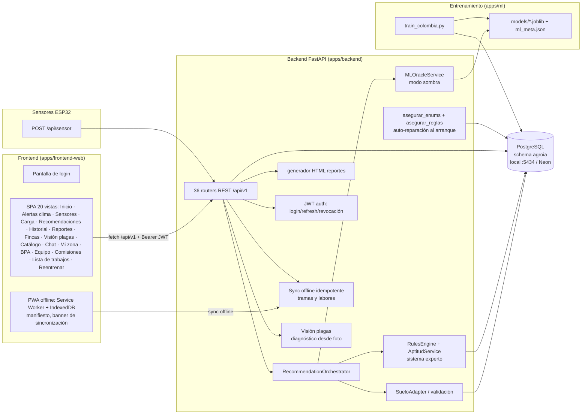
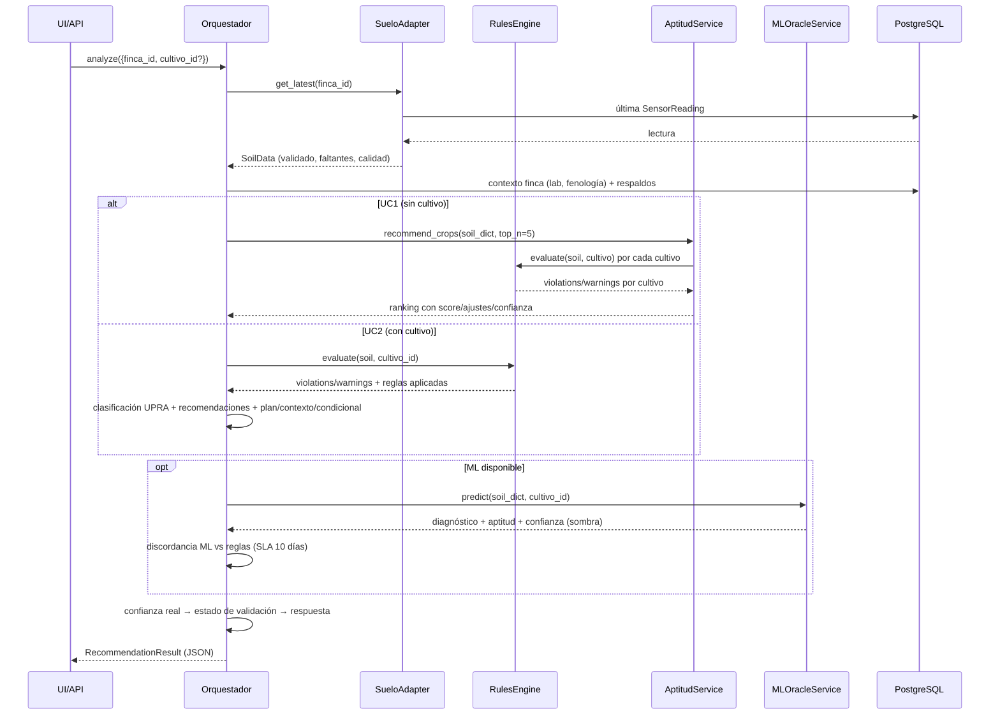

# Documento Funcional-Técnico — AgroIA (AgroInteligente Colombia)

**Versión:** 3.0 · **Fecha:** 2026-08-28
**Alcance:** Descripción funcional y técnica de cada sección del aplicativo, los servicios que invoca, qué hace cada servicio, y —con especial detalle— cómo se invoca el modelo de recomendación/diagnóstico y qué parámetros recibe.

---

## Tabla de contenidos

1. [Propósito del documento](#1-propósito-del-documento)
2. [Visión general y stack tecnológico](#2-visión-general-y-stack-tecnológico)
3. [Arquitectura de componentes](#3-arquitectura-de-componentes)
4. [Autenticación y sesión (lo más básico)](#4-autenticación-y-sesión-lo-más-básico)
5. [El frontend SPA: navegación y utilidades](#5-el-frontend-spa-navegación-y-utilidades)
6. [Recorrido sección por sección](#6-recorrido-sección-por-sección)
   - [6.11 🕵️ Auditoría](#611--auditoría-de-acciones-solo-admin) · [6.12 🔄 Ciclos productivos](#612--ciclos-productivos-por-lote-historial_ciclos_lote) · [6.13 ⛅ Alertas climáticas](#613--alertas-climáticas-proactivas) · [6.14 🗺️ Enriquecimiento SIG IGAC/UPRA](#614--enriquecimiento-sig-igacupra) · [6.15 💰 Precios de insumos dinámicos](#615--precios-de-insumos-dinámicos-roi) · [6.16 🖼️ Almacenamiento de imágenes](#616--almacenamiento-de-imágenes-chat-y-labores) · [6.17 🧪 Validación de rendimiento real](#617--validación-de-rendimiento-real-anti-outliers) · [6.18 🧪 Análisis de laboratorio](#618--análisis-de-laboratorio-ica) · [6.19 ⚖️ Antagonismos nutricionales](#619--antagonismos-nutricionales) · [6.20 🌾 Precios de cosecha](#620--precios-de-cosecha-inteligencia-de-mercado-uc1) · [6.21 📡 PWA offline](#621--pwa-offline-first) · [6.22 🔬 Visión plagas](#622--visión-plagas-diagnóstico-desde-foto)
7. [Ingesta de datos IoT — `POST /api/sensor`](#7-ingesta-de-datos-iot--post-apisensor)
8. [El motor de recomendaciones (corazón del sistema)](#8-el-motor-de-recomendaciones-corazón-del-sistema)
9. [Aceptación humana de recomendaciones (human-in-the-loop)](#9-aceptación-humana-de-recomendaciones-human-in-the-loop)
10. [El modelo de Machine Learning: entrenamiento y artefactos](#10-el-modelo-de-machine-learning-entrenamiento-y-artefactos)
11. [Reportes: anatomía del HTML generado](#11-reportes-anatomía-del-html-generado)
    - [11.1 Muestreo inteligente, ROI realista y simulación](#111-novedades-v13--muestreo-inteligente-roi-realista-y-modo-simulación) · [11.2 Historial de ciclos en el reporte](#112-historial-de-ciclos-en-el-reporte-v21)
12. [Persistencia y base de datos](#12-persistencia-y-base-de-datos)
13. [Despliegue y CI/CD](#13-despliegue-y-cicd)
14. [Seguridad y limitaciones conocidas](#14-seguridad-y-limitaciones-conocidas)
15. [Demo y restablecimiento de datos](#15-demo-y-restablecimiento-de-datos)
16. [Glosario](#16-glosario)

---

## 1. Propósito del documento

Este documento describe, de lo más básico (el login) a lo más complejo (la invocación del modelo de recomendación y diagnóstico), **qué hace cada sección del aplicativo AgroIA, qué servicios llama, qué hace cada servicio y qué parámetros recibe el modelo**. Está pensado para:

- **Analizar la construcción del software**: capas, módulos y responsabilidades.
- **Entender las funcionalidades** de cara al negocio agronómico.
- **Auditar la trazabilidad** de las recomendaciones: qué datos entran al modelo, con qué reglas y con qué confianza.

Todo lo descrito corresponde al código del repositorio `erick880709/Agro-ia` (rama `master`), desplegado en Render y con base de datos Neon (PostgreSQL 15).

---

## 2. Visión general y stack tecnológico

AgroIA es un sistema de **agricultura de precisión para Colombia**: sensores IoT (ESP32) miden variables de suelo, y un **motor híbrido** (sistema experto de reglas agronómicas UPRA/Cenicafé/AGROSAVIA + modelos de Machine Learning en modo sombra) emite recomendaciones de cultivos, diagnósticos de fertilidad y planes de acción.

| Capa | Tecnología | Ubicación |
|---|---|---|
| Frontend | SPA vanilla (HTML + CSS + JS, sin framework) | `apps/frontend-web/` |
| Backend | Python 3.11 · FastAPI · SQLAlchemy 2 (async/asyncpg) | `apps/backend/agroia_backend/` |
| Compartido | Config, base de datos, errores, logging | `apps/shared/agroia/` |
| ML | scikit-learn (RandomForest) · joblib · numpy | `apps/ml/agroia_ml/` |
| IoT | Consumidor de tramas y normalización | `apps/iot/` + `apps/backend/.../services/` |
| Base de datos | PostgreSQL 15, schema `agroia` (local Docker :5434 · producción Neon) | — |
| Despliegue | Dockerfile → Render Web Service Free (auto-deploy) | `apps/backend/Dockerfile`, `render.yaml` |
| CI | GitHub Actions (ruff → pytest → build Docker) | `.github/workflows/` |

**Principio rector:** el **sistema experto (reglas) es la fuente de verdad**. El ML corre en *modo sombra*: predice en paralelo, se compara con las reglas para detectar discordancia y sus métricas se reportan, pero las recomendaciones publicadas salen del motor de reglas.

---

## 3. Arquitectura de componentes



**Módulos clave del backend** (`apps/backend/agroia_backend/`):

| Módulo | Responsabilidad |
|---|---|
| `main.py` | Crea la app FastAPI, monta los 36 routers, sirve el frontend estático en `/`, y en el arranque (`lifespan`) ejecuta `asegurar_enums()` y `asegurar_reglas()`. |
| `api/*.py` | 36 routers HTTP: `auth`, `sensor_api`, `iot`, `fincas`, `ciclos`, `labores`, `recomendaciones`, `reportes`, `ml`, `chat`, `dashboard`, `catalogo`, `usuarios`, `location`, `sig`, `admin_precios`, `alertas`, `auditoria`, `demo`, `mantenimiento`, `agua_riego`, `balance_hidrico`, `bpa`, `curvas`, `extensionista`, `notificaciones`, `plagas`, `rotacion`, `variedades`, `equipo`, `comisiones`, `lista_trabajos`, `laboratorio`, `precios_cosecha`, `sync`, `vision`, `health`. |
| `services/orchestrator.py` | Orquesta el pipeline completo de recomendación (datos → reglas → ML → discordancia → confianza → respuesta). |
| `services/rules_engine.py` | Sistema experto: evalúa reglas agronómicas contra los datos de suelo. |
| `services/aptitud.py` | UC1: puntúa todos los cultivos y los ordena por aptitud. |
| `services/ml_oracle.py` | Oráculo ML en modo sombra (carga artefactos y predice). |
| `services/data_adapters.py` | Adapter de datos de suelo + validación de rangos físicos. |
| `services/reportes_html.py` | Genera el documento HTML del reporte (mapa de calor, plano, clima…). |
| `services/asegurar_enums.py` / `asegurar_reglas.py` | Auto-reparación idempotente de tipos enum y reglas en la BD al arrancar. |
| `services/acceso.py` | Control de acceso a fincas por rol (roles totales vs fincas permitidas). |
| `services/jwt_auth.py` | JWT v3: creación/validación de access+refresh tokens (HS256/RS256), rotación, revocación y middleware de autenticación con anti-suplantación. |
| `services/normalizacion_iot.py` | Normaliza tramas del firmware al esquema canónico. |
| `services/geografia.py` | Catálogo departamentos/municipios con centroides, cadena de validación de fincas y cálculo de área/perímetro de polígonos. |
| `services/puente_iot.py` | Puente de import del consumidor IoT (portable dev/contenedor). |
| `models/*.py` | Modelos SQLAlchemy (42 tablas en schema `agroia`). |
| `alembic/versions/` | Migraciones 001 → 041. |

---

## 4. Autenticación y sesión (lo más básico)

### 4.1 Pantalla de login

El frontend muestra `login-screen` si no hay sesión guardada. Ofrece:

- Formulario **email + contraseña**.
- **Cuentas demo de un clic**: 👑 Administrador, 🧑🌾 Agrónomo, 👤 Cliente (María) y 🌱 Cliente (Finca Demo). Cada botón llama al mismo endpoint con credenciales predefinidas en `index.html`.

### 4.2 Servicio que se invoca

**`POST /api/v1/auth/login`** — `apps/backend/agroia_backend/api/auth.py`

**Parámetros (body):**
```json
{ "email": "correo@ejemplo.co", "password": "••••" }
```

**Qué hace el servicio:**
1. Normaliza el email a minúsculas.
2. Busca el usuario en `agroia.usuarios` por email.
3. Verifica la contraseña con `verify_password()` (`services/auth_utils.py`, hash bcrypt sobre `password_hash`).
   - Credenciales inválidas → `401 CREDENCIALES_INVALIDAS`.
4. Verifica que la cuenta esté activa (`usuario.activo`) → si no, `403 USUARIO_INACTIVO`.
5. Emite los tokens JWT y devuelve los datos de sesión.

**Respuesta (JWT v3):**
```json
{
  "id": "uuid",
  "nombre": "Administrador Demo",
  "email": "…",
  "rol": "Admin",
  "activo": true,
  "access_token": "eyJ…",
  "refresh_token": "…",
  "token_type": "bearer",
  "expira_en_segundos": 28800
}
```

**Autenticación JWT (v3.0, `services/jwt_auth.py`):**
- **Access token** (8 h, `jwt_access_token_expire_minutes=480`) y **refresh token** (30 días) firmados con `JWT_SECRET` (HS256; RS256 si se configuran claves PEM). Sin secreto configurado se usa un secreto de desarrollo (advertencia en logs).
- **`POST /api/v1/auth/refresh`**: rota el par; un refresh **reusado** (ya rotado) revoca toda la cadena y responde 401 (`REFRESH_REUSADO`).
- **`POST /api/v1/auth/logout`**: mete el `jti` del access token en `token_blacklist` (revocación real).
- **`GET /api/v1/auth/me`** devuelve el usuario del token; `_sobrescribir_cabeceras()` descarta cabeceras `X-User-*` enviadas por el cliente cuando hay Bearer (anti-suplantación: el rol/email salen del token firmado, no de cabeceras confiadas).
- **Middleware HTTP**: valida el Bearer en toda la app salvo rutas públicas (`/api/v1/health`, `/api/v1/auth/login`, `/api/v1/auth/refresh`, `/api/sensor`, `/api/v1/iot/sensor`, `/api/v1/iot/ingest` — ingesta de tramas sin credenciales —, `/docs`, `/openapi.json`, `/redoc`, `/media`).
- **Compatibilidad**: si no hay Bearer, se aceptan las cabeceras heredadas `X-User-Role`/`X-User-Email` (modo transición, `auth_allow_legacy_headers=true`).
- **Tablas** (migración 036): `token_blacklist` (jti) y `refresh_tokens` (hash SHA-256 del token; nunca se guarda el token en claro). El job de mantenimiento limpia expirados (`limpiar_tokens_expirados`).

### 4.3 Sesión en el cliente

- La respuesta se guarda en `localStorage` bajo la clave `agroia_sesion`.
- Al recargar, `init()` restaura la sesión y arranca la app sin volver a loguear.
- `cerrarSesion()` borra la clave y recarga.

### 4.4 Roles, permisos y cabeceras

Cada petición `fetch` lleva:

| Cabecera | Cuándo | Propósito |
|---|---|---|
| `Authorization: Bearer <access_token>` | Siempre (JWT v3) | Autenticación real; el frontend renueva automáticamente con el refresh antes de que expire (single-flight `_refreshEnCurso`). |
| `X-User-Role` | Modo legado sin Bearer | Rol activo (`Admin`, `Agronomo`, `Cliente`, …) |
| `X-User-Email` | Solo rol Cliente (legado) | Identificar al cliente para filtrar sus fincas |

**Matriz de acceso** (implementada en `services/acceso.py` y en el frontend):

| Rol | Pestañas visibles | Fincas visibles | Acciones de escritura |
|---|---|---|---|
| **Admin** | Inicio, Sensores, Carga, Recomendaciones, Historial, Reportes, Fincas, Catálogo + menú **⚙️ Administración** (Registrar finca, Usuarios, Insumos, Auditoría, BPA, **Equipo de trabajo, Comisiones, Lista de trabajos**, Reentrenar ML) | Todas | Registrar/editar fincas, aceptar recomendaciones, cambiar roles, precios de insumos, fichas del catálogo, checklist BPA, **equipo de trabajo, comisiones y novedades**, reentrenar ML |
| Agrónomo | Inicio, Sensores, Carga, Recomendaciones, Historial, Reportes, Catálogo | Todas | Aceptar recomendaciones, actualizar datos agronómicos, registrar agua de riego, monitoreo de plagas y labores |
| **Extensionista** (v4) | **Mi zona** (landing tras login), Inicio, Sensores, Historial, Reportes, Catálogo | Solo las de sus `municipios_asignados` | **Escritura en su zona**: agua de riego (`ROL_ESCRITURA` en `agua_riego.py`), monitoreo de plagas (`plagas.py`) y checklist BPA (`bpa.py`); sin acceso a catálogo global ni auditoría |
| **Cliente** | Inicio, Sensores, Historial, Reportes, Catálogo | Solo las ligadas a su email (`fincas_permitidas_ids`) | **Solo lectura** (`exigir_no_cliente` bloquea) |

`services/acceso.py` expone tres funciones:
- `fincas_permitidas_ids(db, rol, email)`: Admin/Agrónomo devuelven `None` (todas); Extensionista filtra por `finca.municipio ∈ usuario.municipios_asignados`; cliente, los IDs de fincas ligadas.
- `verificar_acceso_finca(db, rol, email, finca_id)`: 403 `FINCA_NO_AUTORIZADA` si el rol no tiene acceso a la finca.
- `exigir_no_cliente(rol)`: bloquea acciones de escritura para clientes (el Extensionista **sí** puede escribir en su zona).

---

## 5. El frontend SPA: navegación y utilidades

`apps/frontend-web/app.js` es una SPA sin framework (~3.700 líneas).

**Estado global (`state`):** `fincas`, `cultivos`, `dispositivos`, `fincaId`, `catalogo`, `usuarios`, `sesion`, `rol`, `tabActual`, `cargandoSensores`, `ultimoAnalisis` (resultado del último análisis, usado por el panel de aceptación).

**Helper `api(path, opts)`:** envuelve `fetch(API + path)` con `API = '/api/v1'`, inyecta las cabeceras de rol, parsea JSON y convierte errores `detail.message` en excepciones legibles para mostrar banners.

**Navegación (`goTab`):** cambia la clase `active` de la vista y dispara la carga perezosa de datos por pestaña:

| Pestaña | Carga al entrar |
|---|---|
| `historial` | `cargarHistorial()` |
| `sensores` | `cargarSensores()` |
| `inicio` | `cargarDashboard()` |
| `alertas` | `cargarAlertasClima()` (todas las alertas activas de las fincas visibles según rol, agrupadas por ubicación) |
| `fincas` (solo admin) | `renderFincasList()` |
| `usuarios` (solo admin) | `cargarUsuarios()` |
| `insumos` (solo admin) | `cargarPreciosInsumos()` |
| `auditoria` (solo admin) | `cargarAuditoria()` |
| `bpa` (solo admin) | `cargarBpa()` (checklist + visitas + reporte de trazabilidad) |
| `equipo` (solo admin) | `cargarEquipo()` (empleados + tarifas + novedades) |
| `comisiones` (solo admin) | `cargarComisiones()` |
| `lista-trabajos` (solo admin) | `cargarListaTrabajos()` (semáforo + gráfico por etapa) |
| `reg-finca` (solo admin) | — (wizard de registro estático en su propia vista) |

**Menú «⚙️ Administración» (solo Admin, v2.10):** la barra de navegación agrupa en un
**desplegable** las secciones administrativas: **🏡 Registrar finca** (wizard completo de 3 pasos
en su propia vista), **�️ Fincas** (listado de fincas), **📜 Historial** (recomendaciones),
**👥 Administrar usuarios**, **💰 Administrar insumos** (página propia con la tabla de precios
dinámicos), **🕵️ Auditoría**, **📋 Trazabilidad / BPA** (checklist + visitas de verificación), **🧑‍🤝‍🧑 Equipo de trabajo**, **🗂️ Comisiones**, **📊 Lista de trabajos** y **🤖 Reentrenar modelo**. Para el Admin, «Fincas» e «Historial» **ya no aparecen como
pestañas en la barra superior** (solo en el menú, sin duplicarlas); para Agrónomo y Cliente,
«Historial» sigue visible en la barra superior porque no tienen el menú Administración.
**Actualización v2.13 (menú ⚙️ Administración):** además de las opciones originales, el menú
incluye ahora **📋 Trazabilidad / BPA** (checklist ICA 30021 + visitas de verificación con fecha y
verificador), **🧑‍🤝‍🧑 Equipo de trabajo** (empleados con datos personales y de emergencia, tarifas
por rol y novedades/incapacidades con reemplazo), **🗂️ Comisiones** (órdenes de trabajo de campo
por finca: 1 instrumentador + N cadeneros sensoristas, valores de comisión/cobro del
servicio/validación/plataforma y fin de medición obligatorio para liberar el equipo) y
**📊 Lista de trabajos** (semáforo de etapa por finca, actividades faltantes, filtros y gráfico
por etapa). Todo auditado con fecha de registro y modificación.

El desplegable es **flotante**: se posiciona con `position: fixed` sobre el contenido de la
página (escapa del `overflow` del nav), se abre hacia arriba cuando no cabe abajo, se
reposiciona en `scroll`/`resize` y se cierra al elegir una opción o al hacer clic fuera.

**Menú «❓ Ayuda» (todos los roles, v2.13):** segundo desplegable de la barra con los
**manuales de usuario por rol** (archivos estáticos en `apps/frontend-web/ayuda-*.html`):
👑 Administrador, 🧑‍🌾 Agrónomo y 👤 Cliente, más el enlace **🎓 Capacitación — flujo completo**
(`/capacitacion.html`), visible para todos los roles: guía end-to-end del registro de la finca
hasta el reporte, con maquetas de pantalla, estados por etapa y el reporte explicado sección
por sección. La visibilidad de los manuales es por rol: el Admin ve los tres;
Agrónomo y Cliente solo el suyo (los enlaces llevan `data-roles` y se filtran en `aplicarRol`).
Cada manual es una guía paso a paso del alcance de su rol, con capturas reales de la app,
**GIF animados** de los flujos principales y un **reproductor de video** (carrusel de pantallas
con ▶/⏸ y barra de progreso) — generados con `scripts/gen_ayuda_gifs.py` (Pillow) y servidos
desde `/media-ayuda/` bajo el mount estático del frontend.

---

## 6. Recorrido sección por sección

### 6.1 🏠 Inicio (Dashboard)

**Qué hace el usuario:** ve el resumen de su finca: semáforo de aptitud, KPIs, alertas y últimas lecturas.

**Servicio que llama:** `GET /api/v1/dashboard/{finca_id}?modo=agricultor|experto` (`api/dashboard.py`)

**Qué hace el servicio:**
1. Verifica acceso del rol a la finca.
2. Llama a `services/dashboard_service.py::get_dashboard_data(finca_id)`:
   - Última recomendación persistida (clasificación, confianza, color del semáforo).
   - KPIs (pH, N, P, K, CE…), series temporales, alertas (confianza < 80 % genera alerta).
3. Formatea según `modo`:
   - `agricultor`: lenguaje coloquial con semáforo 🟢🟡🟠🔴.
   - `experto`: datos crudos + enlaces de exportación (`/export?format=csv|json|excel`).

**Respuesta (modo agricultor):** `{finca_id, modo, mensaje, semaforo:{clasificacion, color, confianza}, kpis[], alertas[], guia}`.

### 6.2 📡 Sensores IoT

**Qué hace el usuario:** monitorea las lecturas en tiempo real (auto-refresco cada 10 s solo con la pestaña activa), el estado de conexión de los dispositivos, y **prueba tramas con el simulador** («🔗 API de sensores — simulador de trama»): un textarea precargado con el formato real del firmware y botón «📡 Enviar trama» que llama a `POST /api/sensor` y muestra el resultado (dispositivo, finca asociada, variables recibidas, advertencias).

**Servicios que llama:**
- `GET /api/v1/lecturas/{finca_id}?limite=10` — últimas lecturas de `sensor_readings` (con pos_x/pos_y, calidad, 17 variables).
- `GET /api/v1/sensores/{finca_id}/status` — por cada sensor: última transmisión y estado (`online` < 12 h, `datos_desactualizados` < 24 h, `offline`).
- `POST /api/sensor` — envío de la trama desde el simulador (mismo endpoint de los sensores físicos).

**Qué hace la UI:** pinta la tabla de lecturas (incluye nombre de finca y mini-ID con botón copiar), indicador "actualizando…" y guarda contra dobles peticiones (`state.cargandoSensores`).

### 6.3 📂 Cargar archivo

**Qué hace el usuario:** sube un archivo con mediciones (cuando el sensor perdió conexión) y obtiene la recomendación al instante.

**Servicio que llama:** `POST /api/v1/carga` (`api/iot.py`) — `multipart/form-data`:

| Campo | Tipo | Descripción |
|---|---|---|
| `file` | archivo | CSV pares (`ph,7.1`), CSV ancho (cabecera + filas), TXT (`clave=valor`) o JSON (trama del firmware) |
| `device_id` | texto | Opcional |
| `finca_id` | UUID | Opcional (relación directa sin dispositivo) |
| `cultivo_id` | UUID | Opcional (activa UC2 al instante) |

**Qué hace el servicio:**
1. `exigir_no_cliente` (bloquea clientes).
2. `decodificar_contenido` + `parsear_archivo_sensor` (`services/carga_archivo.py`).
3. Normaliza cada trama con `normalizar_trama` (igual que una trama en vivo).
4. Persiste `SensorReading` (con `SET LOCAL search_path`).
5. Ejecuta el **orquestador de recomendaciones** al instante (UC1 sin `cultivo_id`, UC2 con él) y persiste en historial.

### 6.4 🧪 Recomendaciones (la sección central)

**Qué hace el usuario:** elige finca y, opcionalmente, cultivo y **presupuesto de fertilización ($/ha)** , y pulsa «Analizar suelo».

**Servicio que llama:** `POST /api/v1/recomendaciones/analyze`

**Parámetros (body):**
```json
{ "finca_id": "uuid", "cultivo_id": "uuid | null", "presupuesto_cop": 500000 }
```

- `cultivo_id = null` → **UC1** (¿qué me conviene sembrar?).
- `cultivo_id` presente → **UC2** (diagnóstico para el cultivo sembrado).
- `presupuesto_cop` (opcional, ≥ 0) → activa el **plan económico de fertilización** (sección 8.9).

**Qué hace el servicio y el orquestador:** ver sección 8 (el detalle completo del pipeline y del modelo). **Importante:** el análisis **nunca se bloquea por datos faltantes** — si faltan parámetros esenciales o no hay lecturas, devuelve una recomendación preliminar con `variables_faltantes_esenciales` y el requisito de aval de un agrónomo (sección 8.10).

**Respuesta clave:**
```json
{
  "cultivo": "Aguacate",
  "clasificacion_upra": "Moderadamente apta (sujeta a confirmación de textura)",
  "confianza": 0.571, "confianza_real": 0.55, "estado_validacion": "sujeta a confirmación de textura",
  "respaldos": 1, "variables_faltantes_fertilidad": ["calcio", …],
  "variables_faltantes_esenciales": [],
  "fenologia_ajustada": "Etapa Fructificación: … ⏳ Faltan ~N GDD para cosecha, optimice riego (…)",
  "plan_economico": { "presupuesto_cop", "costo_ideal", "costo_plan", "cobertura_pct",
      "diferencia_rendimiento_pct", "incluidos[]", "aplazados[]" },
  "recomendaciones": [ { "variable": "pH", "estado": "DEFICIT", "valor_actual": 4.9,
      "rango_ideal": "[5.5 - 6.5]", "accion": "…", "prioridad": "Alta", "fuente": "Cenicafé",
      "confiabilidad": "Sin validar", "condicional": true,
      "contexto": "pH 4.9 — ácido en escala general, pero fuera del rango óptimo para Aguacate [5.5–6.5]",
      "plan": { "fuente": "Cal dolomítica…", "frecuencia": "…", "dosis": "…" } } ],
  "sugerencias_cultivos": [ { "cultivo_id", "cultivo", "icono", "score", "confianza",
      "clasificacion", "reglas_especificas", "ajustes[]" } ],
  "justificacion": { "resumen", "variables_analizadas", "reglas_aplicadas", "faltantes", "excesos", "confianza", "confianza_real", "respaldos_expertos" },
  "advertencia": "…", "discordancia": null, "tiempo_respuesta_ms": 1613, "modo": "analizar_cultivo"
}
```

**Qué hace la UI con la respuesta (`renderAnalisis`):**
- Cabecera: cultivo, badge de clasificación + badge de estado de validación, barra de confianza (final y real), respaldos de expertos.
- Avisos: fenología ajustada (incluye GDD), variables de fertilidad faltantes, advertencia, discordancia.
- **Bloque «📝 Complete los parámetros esenciales»**: si la respuesta trae `variables_faltantes_esenciales`, se muestran inputs para cada valor faltante (pH, N, P, K, CE) y el botón «💾 Guardar y reanalizar» ingesta los valores vía `POST /api/sensor` y reejecuta el análisis automáticamente.
- Tabla de diagnóstico: Variable · Estado (DÉFICIT/EXCESO/**SIN DATO**) · Lectura · Rango ideal · Acción (con marcador *condicional a confirmación de laboratorio* y contexto de pH) · Prioridad · **Confiabilidad** · **Plan sugerido** (fuente, frecuencia, dosis).
- **Bloque «💰 Plan económico vs. plan ideal»**: costo del plan, costo ideal, presupuesto, cobertura %, diferencia de rendimiento estimada y listas de acciones Incluidas/Aplazadas.
- Ranking «🌾 Cultivos sugeridos (ranking del motor)»: #, cultivo, score, clasificación, confianza, nº de reglas y **columna de descripción de reglas aplicadas** (variable, estado, rango, acción, prioridad).

**Panel de aceptación (Admin/Agrónomo):** al final aparece «✅ Aceptar recomendación» + caja de texto para ampliar acciones (ver sección 9).

### 6.5 📜 Historial

**Servicio que llama:** `GET /api/v1/recomendaciones/historial/{finca_id}?page=&page_size=&cultivo_id=`

**Qué hace:** paginación sobre `agroia.recomendaciones` (fecha, cultivo, clasificación, confianza, estado) ordenada desc. El frontend la pinta como lista de tarjetas.

### 6.6 📄 Reportes

**Servicio que llama:** `POST /api/v1/reportes/generar`

**Parámetros (body):**
```json
{ "finca_id": "uuid", "tipo": "siembra | cultivo | completo",
  "cultivo_id": "uuid | null", "presupuesto_cop": 500000 }
```

**Qué hace el servicio (`api/reportes.py`):**
1. Verifica acceso y valida la finca. **No se bloquea por falta de lecturas**: si no las hay, el análisis corre en modo preliminar (sección 8.10) y el reporte se genera igual.
2. Construye el orquestador y ejecuta UC1 (`siembra`/`completo`) y UC2 (`cultivo`/`completo`, usando el `cultivo_id` o el top del ranking).
3. Recopila los **parámetros esenciales faltantes** (`variables_faltantes_esenciales` de UC1/UC2, o los 4 esenciales si no hay lecturas) para la sección «P» del reporte.
4. Calcula el plan económico para el ROI (plan del análisis o plan ideal si no se declaró presupuesto) y carga los **precios de referencia de la ficha técnica** del cultivo analizado.
5. `_muestras_geo`: lecturas con `pos_x/pos_y` para mapa de calor y plano.
6. Resuelve **clima IDEAM** del día de la muestra (`external_apis.fetch_ideam_clima_fecha`) a partir de coordenadas de la finca (parser de enlaces Google + fallback lat/lng; sin ubicación se omite).
7. Llama a `generar_reporte_html()` (sección 11) y devuelve `{titulo, tipo, html, parametros_faltantes[], preliminar}`.

**Qué hace la UI:** muestra el HTML en un iframe/pestaña nueva y ofrece **descargar PDF** (impresión del navegador con `@media print` del propio HTML).

### 6.7 🏡 Fincas — registro en 3 secciones, validación y lotes (registro solo Admin)

**Wizard de 3 secciones** (SPA en `index.html` + `app.js`):

1. **Información básica**: nombre, propietario, teléfono, email, departamento (select de 33), municipio (filtrado por departamento con el catálogo de `departamentos.js`), vereda / corregimiento.
2. **Ubicación**: 📍 Usar mi ubicación (geolocalización del navegador, con precisión ±m) · 🗺️ Seleccionar en mapa (Leaflet/OpenStreetMap: se marcan los vértices del lindero y «Cerrar polígono» calcula área/perímetro y genera el GeoJSON) · 🔗 Pegar enlace Google Maps (parse local de `lat, lng`, `@lat,lng` y `!3d…!4d…`; los enlaces cortos `maps.app.goo.gl` se resuelven con `GET /location/resolver-enlace` siguiendo la redirección). Muestra Latitud, Longitud, Altitud msnm (`GET /location/elevation`) y Precisión.
3. **Características del predio**: tipo de área (finca completa / lote / parcela), área registrada (ha), **área georreferenciada calculada automáticamente del polígono** (con perímetro), ¿la finca tiene varios lotes? Sí/No y dimensiones opcionales.

**Servicios:**
- `GET /api/v1/fincas?search=` — listado (Admin/Agrónomo todas; cliente solo las suyas).
- `POST /api/v1/fincas` — registro (solo Admin): campos básicos + georreferenciación (`latitud`/`longitud` directos o `coordenadas_google`, `vereda`, `precision_gps`, `fuente_geolocalizacion`, `geometria` GeoJSON, `area_declarada_ha`, `tipo_area`, `tiene_multiples_lotes`) + campos agronómicos. Ejecuta la **cadena de validación** (abajo) y crea el **lote principal**.
- `PUT /api/v1/fincas/{id}` — **edición de datos básicos** (solo Admin): nombre, ubicación, propietario, contactos, área, altitud, vereda, coordenadas. Registra auditoría `finca.actualizar`.
- `DELETE /api/v1/fincas/{id}` — **eliminación de finca** (solo Admin): limpia recomendaciones + discordancias, lecturas de sensores y dispositivos IoT (los lotes, chat, aceptaciones y relaciones finca-usuario caen por ON DELETE CASCADE) y registra `finca.eliminar` con el detalle de lo borrado.
- `PATCH /api/v1/fincas/{id}` — actualización de datos agronómicos (Admin/Agrónomo): pendiente, drenaje, historial, validación de laboratorio, cultivo sembrado, edad, etapa fenológica.
- `GET /api/v1/fincas/{id}/lotes` — lotes (unidades productivas) de la finca.
- `POST /api/v1/fincas/{id}/lotes` — **agregar lote** (Admin/Agrónomo) con características propias: nombre, área (ha), geometría, profundidad de suelo (cm) y pedregosidad; si quedan ≥ 2 lotes marca la finca como multi-lote.
- `PATCH /api/v1/fincas/{id}/lotes/{lote_id}` — **editar características del lote** (Admin/Agrónomo).
- `DELETE /api/v1/fincas/{id}/lotes/{lote_id}` — **eliminar lote** (solo Admin): desactivación lógica; rechaza con `422 ULTIMO_LOTE` si es el último lote activo de la finca.
- `GET /api/v1/location/catalogo` — catálogo departamento → municipios (33 departamentos, con centroides) usado por la validación y por el frontend.
- `GET /api/v1/location/resolver-enlace?url=` — resuelve enlaces cortos de Google Maps a coordenadas.

**Cadena de validación al guardar** (`services/geografia.py::validar_creacion_finca`):

| # | Paso | Regla | Código de rechazo |
|---|---|---|---|
| 1 | ¿Departamento existe? | Catálogo de 33 departamentos | `DEPARTAMENTO_INVALIDO` |
| 2 | ¿Municipio pertenece al departamento? | Catálogo municipios por departamento | `MUNICIPIO_NO_PERTENECE` |
| 3 | ¿Coordenadas válidas? | WGS84 (−90…90, −180…180) | `COORDENADAS_INVALIDAS` |
| 4 | ¿Coinciden con el municipio? | Distancia Haversine al centroide ≤ 50 km | `COORDENADAS_FUERA_MUNICIPIO` |
| 5 | ¿Área razonable? | 0.01–100 000 ha | `AREA_NO_RAZONABLE` |
| 6 | ¿Precisión aceptable? | ≤ 100 m (50–100 m → advertencia) | `PRECISION_INSUFICIENTE` |

Cada paso se devuelve en la respuesta (`validaciones[]` con estado `ok/error/warn`) y se pinta en la UI con ✅/⚠️/❌; los rechazos llegan como `422 VALIDACION_FINCA` con la lista completa de pasos.

**Separación arquitectónica Finca ≠ Lote**: al guardar se crea automáticamente el **lote principal** (`agroia.lotes`) con el área calculada (polígono) o la declarada. La finca identifica el predio; el lote es la unidad productiva que después se analiza (sensores, muestras, reportes).

**Características del lote SIEMPRE obligatorias**: `profundidad_suelo_cm` (5–500 cm), `pedregosidad` (Ninguna | Moderada | Alta) y dimensiones `largo_metros`/`ancho_metros` (> 0) son **requeridos** en `POST /api/v1/fincas`, aunque se registre la finca completa (`tipo_area=finca_completa`): los parámetros del suelo y las dimensiones enriquecen el estudio. El backend los rechaza con 422 si faltan, y el lote principal se crea siempre con ellos.

**Área/perímetro calculados** (`calcular_geometria_geojson`): fórmula de Gauss (shoelace) sobre proyección equirectangular + perímetro Haversine; acepta `Polygon` GeoJSON o anillo plano `[[lng,lat], …]`.

**Qué hace la UI:** tarjetas por finca con ID y botón «Copiar» (para configurar el firmware), formulario wizard con navegación Siguiente/Atrás, el panel de validaciones al guardar, y **botones de administración por tarjeta**: «🗂️ Lotes» (panel que lista los lotes y permite agregar con características propias, editar ✏️ y eliminar 🗑️), «✏️ Editar» (modal con los datos básicos) y «🗑️ Eliminar» (confirmación y borrado en cascada).

### 6.8 👥 Usuarios (solo Admin)

**Servicios:**
- `GET /api/v1/usuarios` — listado de usuarios.
- `POST /api/v1/usuarios` — alta por admin.
- `PUT /api/v1/usuarios/{id}` — **edición de usuario** (solo Admin): nombre, email, rol, activo/inactivo y reemplazo de las fincas relacionadas. Rechaza con `422 SELF_DEACTIVATE` si el admin intenta desactivarse a sí mismo.
- `DELETE /api/v1/usuarios/{id}` — **desactivación** (solo Admin, eliminación lógica Ley 1581): `activo=false` + desvinculación de fincas; rechaza con `422 SELF_DELETE` para la propia cuenta del admin. El registro se conserva en auditoría.
- `PUT /api/v1/admin/usuarios/{id}/rol` — cambio de rol.
- (Perfil propio: `GET/PUT/DELETE /usuarios/me`.)

**Qué hace la UI:** cada tarjeta de usuario muestra el badge de rol (e «Inactivo» en rojo si fue desactivado) y botones «✏️ Editar» (modal con nombre/email/rol/estado y multi-select de fincas) y «🗑️ Desactivar» (confirmación).

### 6.9 🌾 Catálogo (Admin/Agrónomo gestionan; Cliente consulta)

**Servicios:**
- `GET /api/v1/cultivos` — 30 cultivos activos con icono, ficha técnica y **fisiología** (`profundidad_radicular_min_cm`, `gdd_total_requerido`, `dias_ciclo`).
- `GET /api/v1/cultivos/{id}` / `POST /cultivos` — detalle y alta (con fisiología opcional).
- `PATCH /api/v1/cultivos/{id}` — editar fisiología/datos agronómicos del cultivo.
- `GET /api/v1/fichas`, `GET/POST/PUT /fichas/…` — fichas técnicas.
- `POST /fichas/{id}/enviar-revision | aprobar | rechazar` — flujo editorial de fichas.

**Qué hace la UI:** cada tarjeta del catálogo muestra la línea de fisiología «🌱 raíz ≥ N cm · G GDD · D días» cuando el cultivo la tiene registrada.

### 6.10 💬 Chat asesor (pestaña Reportes)

**Servicio:** `POST /api/v1/chat/consultar`

**Parámetros (body):**
```json
{ "finca_id": "uuid", "mensaje": "¿Cuánto fertilizante aplico?",
  "cultivo_id": "uuid | null", "historial": [ { "rol": "user|assistant", "contenido": "…" } ],
  "imagen_base64": "… (foto JPG/PNG, opcional, ≤ ~4,5 MB)" }
```

**Qué hace (`api/chat.py` + `services/agronomo_chat.py` + `agronomo_kb.py`):**
1. Verifica acceso a la finca y carga la última lectura.
2. Ejecuta el orquestador (UC1 o UC2) para tener contexto real.
3. Enruta la pregunta a la **base de conocimiento** (cal/fertilización/riego, clima por época, diagnóstico diferencial, "por qué este cultivo").
4. **Foto adjunta (botón 📎 en la UI)**: si hay `OPENAI_API_KEY` con modelo de visión (gpt-4o, gpt-4.1, gpt-4o-mini…), la imagen se envía multimodal con el prompt *«Analiza esta foto de cultivo y da un diagnóstico»*. Sin visión, la foto queda guardada como referencia en `chat_memoria.imagen_base64` y el prompt textual lo indica. La respuesta incluye `imagen_guardada` / `imagen_analizada`.
5. Si `OPENAI_API_KEY` está configurado usa LLM; si no, responde el **motor local determinista** con respuesta fundamentada (fuentes, confianza, datos utilizados, qué falta).
6. Guarda memoria conversacional en `chat_memoria` (`GET /chat/memoria/{finca_id}`).

### 6.11 🕵️ Auditoría de acciones (solo Admin)

**Servicio:** `GET /api/v1/auditoria?page=&page_size=&entidad=&accion=&search=` (solo Admin).

**Qué registra** (`models/auditoria.py` + `services/auditoria.py::registrar_auditoria`, tabla `agroia.auditoria`, migración 015): quién (email, nombre, rol), qué acción, sobre qué entidad, cuándo, desde qué IP y un `detalle` JSONB con contexto (nombre, campos cambiados, conteos de lo eliminado…). Eventos:

| Acción | Cuándo |
|---|---|
| `auth.login` | Cada inicio de sesión exitoso |
| `finca.crear` / `finca.actualizar` / `finca.eliminar` / `finca.agronomicos` | Gestión de fincas |
| `lote.crear` / `lote.actualizar` / `lote.eliminar` | Gestión de lotes |
| `usuario.crear` / `usuario.actualizar` / `usuario.eliminar` | Gestión de usuarios |
| `demo.reset` | Restablecimiento de la demo |

**Qué hace la UI:** pestaña «🕵️ Auditoría» con filtros por entidad (finca/lote/usuario/auth/demo) y búsqueda por email/nombre/ID, tabla paginada (fecha, usuario, acción, detalle) y navegación anterior/siguiente.

### 6.12 🔄 Ciclos productivos por lote (`historial_ciclos_lote`)

**Servicios** (tabla relacional migración 016, indexada por `(lote_id, fecha_siembra)`; migración 017 agrega `variedad` y `densidad_siembra_plantas_ha` al ciclo y `fecha_siembra`/`variedad`/`densidad_siembra_plantas_ha` al lote):

- `GET /api/v1/fincas/{finca_id}/lotes/{lote_id}/ciclos` — historial de ciclos del lote (más reciente primero), con `cultivo_nombre` resuelto del catálogo.
- `POST /api/v1/fincas/{finca_id}/lotes/{lote_id}/ciclos` — registrar ciclo (Admin/Agrónomo): `cultivo_id`, `fecha_siembra` (obligatoria), `fecha_cosecha`, `variedad`, `densidad_siembra_plantas_ha`, `rendimiento_tn_ha`, `calidad_cosecha` (Premium | Estándar | Rechazo), `aplicaciones` JSONB (`[{producto, dosis_kg_ha, fecha, tipo}]`), `incidencias` JSONB (`[{plaga, severidad, fecha, control}]`), `practicas_riego` y `observaciones`. Valida fechas (cosecha ≥ siembra), cultivo del catálogo y enums de calidad/riego.
- `PATCH …/ciclos/{ciclo_id}` — editar ciclo (Admin/Agrónomo).
- `DELETE …/ciclos/{ciclo_id}` — eliminar ciclo (solo Admin).
- **`POST /api/v1/fincas/{finca_id}/ciclo/iniciar`** — **flujo rápido desde Recomendaciones** (Admin/Agrónomo): recibe `{cultivo_id, fecha_siembra, variedad?, densidad_siembra_plantas_ha?}` y en una sola transacción (1) crea el ciclo en `historial_ciclos_lote` sobre el lote principal, (2) **actualiza `fincas.cultivo_sembrado`** con el nombre del cultivo y (3) **actualiza el lote** (`fecha_siembra`, `variedad`, `densidad_siembra_plantas_ha`) para que el análisis actual use el cultivo recién sembrado. Auditoría `ciclo.iniciar`.
- **`POST /api/v1/fincas/{finca_id}/ciclos/carga-csv`** — **carga masiva del historial de ciclos** (Admin/Agrónomo): recibe `{csv_texto}` con columnas `lote, cultivo, fecha_siembra, fecha_cosecha, rendimiento, aplicaciones_texto`. El lote se busca por nombre y **se crea si no existe**; el cultivo se resuelve por nombre en el catálogo; fechas en ISO o `DD/MM/YYYY`; el rendimiento va en t/ha; el texto de aplicaciones se convierte a JSONB con el parser. Las filas inválidas se reportan (`errores[{fila, mensaje}]`) sin abortar la carga. Auditoría `ciclo.carga_csv`.
- **`GET /api/v1/fincas/{finca_id}/ciclo/activo`** — ciclo abierto (sin cosechar) más reciente del lote principal; alimenta el botón «✏️ Cosechar ciclo» del Dashboard.
- **`POST /api/v1/fincas/{finca_id}/ciclo/cosechar`** — **cierre del ciclo** (Admin/Agrónomo): `{fecha_cosecha, rendimiento (obligatorio), unidad_rendimiento (kg_ha|t_ha), calidad_cosecha?, resumen_aplicaciones?}`. Normaliza el rendimiento a t/ha (kg/ha ÷ 1000), convierte el resumen en texto plano («Urea 150kg, DAP 80kg») a JSONB con un **parser simple** (separa por coma/punto y coma/salto de línea; los gramos se normalizan a kg) y rechaza con `NO_CICLO_ACTIVO` si no hay ciclo abierto o `FECHAS_INVALIDAS` si la cosecha es anterior a la siembra. Auditoría `ciclo.cosechar`.

**Qué hace la UI:** en el panel de lotes, cada lote tiene el botón «🔄 Ciclos» que abre su historial y el formulario «➕ Registrar ciclo productivo» (cultivo del catálogo, fechas, variedad, densidad, rendimiento t/ha, calidad, riego, aplicaciones/incidencias en JSON y observaciones), con edición ✏️ en modal y eliminación 🗑️. Cada acción queda en auditoría (`ciclo.crear/actualizar/eliminar`).

**Flujo rápido en Recomendaciones**: sobre el botón «🧪 Analizar suelo» está el botón **«🌱 Registrar nuevo ciclo»** (Admin/Agrónomo): abre un modal con cultivo (preseleccionado con el elegido en el selector), fecha de siembra (obligatoria), variedad y densidad (plantas/ha, opcionales). Al guardar llama `POST …/ciclo/iniciar` y la finca/lote quedan actualizados para el análisis siguiente; el selector de Recomendaciones adopta el cultivo recién sembrado.

**Cierre del ciclo en el Dashboard y en el Historial**: cuando hay un ciclo abierto, la tarjeta «⚡ Acciones rápidas» (P1) y el Historial (P6) muestran el bloque «🔄 Ciclo activo» con el botón **«✏️ Cosechar ciclo»** (Admin/Agrónomo): modal con fecha de cosecha (por defecto hoy), rendimiento obligatorio (kg/ha o t/ha — alimenta el ROI futuro), calidad opcional y un textarea para pegar el resumen de aplicaciones («Urea 150kg, DAP 80kg») — o **cargar un CSV pequeño** (`Producto,Dosis,Unidad`; la UI lo convierte a texto y el parser del backend lo vuelve JSONB). Al guardar, el ciclo se cierra (`fecha_cosecha`, `rendimiento_tn_ha`, `calidad_cosecha`, `aplicaciones`) y el bloque desaparece.

**Carga masiva en P4 (Cargar archivo)**: tarjeta «🗂️ Carga masiva — historial de ciclos (CSV)» para **grandes fincas**: sube un CSV con el historial de los últimos 5 años (`lote, cultivo, fecha_siembra, fecha_cosecha, rendimiento, aplicaciones_texto`), con botón de **plantilla de ejemplo** descargable. La UI muestra el resumen (ciclos importados, lotes creados y filas con error).

### 6.13 ⛅ Alertas climáticas proactivas

**Servicio programado** (tarea asyncio en el `lifespan` de `main.py`): cada **6 horas** (primer ciclo 45 s tras el arranque) evalúa todas las fincas con coordenadas contra el **pronóstico de 7 días de Open-Meteo** (gratis, sin API key; `services/external_apis.py::fetch_pronostico_open_meteo`, timeout 12 s, degradación con gracia si falla). Desde v2.12 el servicio admite `modelo=auto|ecmwf`: `ecmwf` consume el **modelo internacional ECMWF (IFS 0.25°)** expuesto por Open-Meteo (`models=ecmwf_ifs025`), alimentado de los **datos abiertos de ECMWF** (`https://data.ecmwf.int/forecasts`, CC BY 4.0). Nota de investigación: `smartmet-server` (fmidev) es la infraestructura del FMI (Finlandia) y su frontend público `opendata.fmi.fi` sirve solo su dominio nacional; **no expone un endpoint público de ECMWF para Colombia**, por lo que la vía JSON pública es Open-Meteo con `ecmwf_ifs025` y el repositorio de datos crudos es `data.ecmwf.int`.

**Reglas** (`services/clima_alertas.py`, umbrales configurables `UMBRAL_LLUVIA_MM=20` y `UMBRAL_HELADA_C=5`):

1. **Lluvia > 20 mm en 24h** (próximos 3 días) **+ labores de Fertilización pendientes** programadas en la ventana → «Aplace la aplicación de {producto}: se pronostican X mm en 24h (fecha), riesgo de lixiviación».
2. **Temperatura mínima < 5 °C** + `etapa_fenologica == 'Floración'` + cultivo sensible (café, aguacate, cacao, cítricos, mango, mora, lulo…) → «Riesgo de helada: temperatura mínima de X °C el (fecha) durante la floración. Active el sistema de riego por aspersión».

**Persistencia**: tabla `agroia.alertas_climaticas` (migración 019) — `finca_id` (FK CASCADE), `tipo` (`lluvia_aplicacion` | `helada_floracion`), `severidad` (Alta), `mensaje`, `fecha_alerta`, `pronostico` JSONB (día disparador + 3 días) y `activa`. Al evaluar, las alertas previas del mismo tipo/finca **se desactivan** (solo queda la más reciente).

**Endpoints**:
- `GET /api/v1/fincas/{finca_id}/alertas-climaticas/activas` — alertas activas de hoy (banner del Dashboard P1).
- `GET /api/v1/alertas-climaticas` — **listado global «⛅ Alertas clima» (todos los roles)**: alertas activas de las fincas visibles para el rol (`fincas_permitidas_ids`: Cliente → solo sus fincas, Extensionista → su zona, Admin/Agrónomo → todas) con `finca_nombre`, `departamento`, `municipio`, `latitud` y `longitud` para agrupar por ubicación.
- `POST /api/v1/alertas-climaticas/evaluar` (solo Admin) — disparo manual; acepta `{finca_id?, pronostico?}` con **pronóstico inyectado** para pruebas deterministas/demos.

**UI**: P1 muestra el contenedor `#dashboard-alertas` sobre los KPIs con banners de colores (azul = lluvia/lixiviación, rojo = helada). **Menú «⛅ Alertas clima» (v2.14, todos los roles)**: pestaña propia en la barra superior que lista las alertas activas de las fincas visibles según el rol; el frontend **agrupa por ubicación** (tipo de alerta + departamento/municipio): si varias fincas comparten la misma zona, se muestra **una sola tarjeta con «📍 {municipio}, {departamento}»** y un desplegable con las fincas; con una sola finca, muestra el nombre de la finca. El Admin ve además el botón **«🔄 Evaluar ahora»** (dispara el endpoint manual). El **reporte (sección N)** agrega «⛅ Pronóstico extendido (7 días)» con tabla de fecha/lluvia/T mín/T máx y avisos ⚠️/🥶 cuando supera los umbrales. El selector del reporte trae **`ambos` por defecto**: consulta Open-Meteo (mejor modelo) y **ECMWF (IFS 0.25°, datos abiertos CC BY 4.0)** y muestra ambas tablas; la de ECMWF se etiqueta «Pronóstico según el modelo internacional ECMWF».

### 6.14 🗺️ Enriquecimiento SIG IGAC/UPRA

**Objetivo**: dejar de depender del sensor para textura/MO/CIC. Al registrar la finca (P2), el polígono GeoJSON se intersecta (centroide) con las **zonas de referencia del Estudio General de Suelos del IGAC** (1:100.000) y las zonificaciones **UPRA/SIPRA** — `services/sig_suelos.py::ZONAS_SUELOS_COLOMBIA` (11 regiones: Eje Cafetero, Antioquia, Cundinamarca con posible fragipán, Boyacá, Santander, Tolima, Nariño, Costa Atlántica, Costa Pacífica, Orinoquía, Amazonia).

**Relleno automático**: se crea una fila en `sensor_readings` con `calidad = 'estimado_por_sig'` y `sensor_id = 'sig-igac-upra'` que precarga **textura** (clases granulométricas IGAC: Franca, Franco-arenosa, Franco-arcillosa, Franco-limosa — migración 020 amplía el enum `texturasuelo`), **materia orgánica (%)** y **CIC (meq/100g)**; además completa el lote principal (`profundidad_suelo_cm`, `pedregosidad`) si venían vacíos.

**Precedencia** (`SueloAdapter.get_latest`): el **sensor gana SIEMPRE** — las variables que el sensor mide no se tocan; el SIG solo rellena las faltantes, que quedan marcadas en `estimaciones_sig`. En las filas del diagnóstico su `confiabilidad` muestra «Estimado por SIG (IGAC/UPRA)» y el Dashboard etiqueta la lectura «🗺️ estimado SIG».

**Endpoints** (Admin/Agrónomo):
- `POST /api/v1/fincas/{id}/enriquecer-sig` — disparo manual (reutiliza la fila SIG reciente, idempotente). Auditoría `sig.enriquecer`.
- `GET /api/v1/fincas/{id}/enriquecimiento-sig` — última estimación SIG registrada.
- El `POST /fincas` lo ejecuta automáticamente si la finca trae coordenadas (no bloquea el registro si falla).

**Geoservicio real (opcional)**: `intentar_geoservicio_igac()` consulta un WMS/WFS GetFeatureInfo si se define `SIG_IGAC_WMS_URL`; sin configuración degrada con gracia a las zonas de referencia locales.

**Resolución de zonas (refinada)**: `_estimate_region_from_coords()` evalúa las regiones **más específicas primero** (Nariño, Tolima, Eje Cafetero, Cundinamarca/Sabana, Boyacá, Santander, Antioquia, Pacífico, Orinoquía, Amazonia y Caribe al final). Validada en **13 puntos del país** (Armenia, Bogotá, Pasto, Ibagué, Honda, Villavicencio, Yopal, Tunja, Bucaramanga, Barranquilla, Medellín, Manizales, Leticia). Caso exigido verificado de punta a punta: finca de prueba en Zipaquirá (polígono GeoJSON) → zona «Cundinamarca / Sabana de Bogotá», textura **Franco-arcillosa**, capa limitante «**Posible fragipán**/arcillolita», MO 7.5 %, CIC 28.0, `calidad = estimado_por_sig` y lote completado.

**Fix relacionado**: `registrar_finca` normaliza `tipo_riego` al nombre del enum (`GOTEO|ASPERSION|GRAVEDAD|SECANO`) — valores en minúscula antes rompían el INSERT con error de enum.

**Impacto**: textura/MO/CIC dejan de ser faltantes; el análisis «preliminar» queda solo para variables dinámicas (pH y CE), que sí requieren medición.

### 6.15 💰 Precios de insumos dinámicos (ROI actualizable)

**Problema que resuelve**: los costos del plan económico estaban quemados en `economia.py::COSTOS_VARIABLE` (pH 350k, N 180k COP/ha); una subida del 40 % de la urea en 3 meses dejaba el ROI inválido.

**Tabla `agroia.precios_insumos`** (migración 021): `producto` (clave única, ej. «Urea», «DAP», «KCl», «Cal dolomítica»), `precio_kg_cop`, `fecha_actualizacion` y `fuente` (cotización). El modelo es `models/precio_insumo.py`.

**Cálculo dinámico** (`services/economia.py`): `calcular_plan_economico(recomendaciones, presupuesto_cop, precios_insumos=None)` convierte el precio por kg a costo por ha con `DOSIS_PRODUCTO_VARIABLE` (ej. N = Urea 60 kg/ha → costo = 60 × precio_kg). `cargar_precios_insumos(db)` lee la tabla; el orquestador (UC1 y UC2) y el reporte la consultan en cada análisis.

**Fallback honesto**: si un producto no tiene registro, se usa el costo estático de referencia y el resultado incluye `advertencia_precios = «⚠️ Precios de referencia desactualizados: sin registro en precios_insumos para …»` (mostrada en P5 y en el bloque del plan económico del reporte) junto con `precios_faltantes` y `precios_fuente`.

**Endpoints (solo Admin)** — `api/admin_precios.py`:
- `GET /api/v1/admin/precios-insumos` — precios vigentes con fecha de actualización.
- `PUT /api/v1/admin/precios-insumos` — upsert `{precios: [{producto, precio_kg_cop, fuente?}]}`; `fecha_actualizacion = hoy`. Auditoría `precios.actualizar`.

**UI**: panel «💰 Precios de insumos» en la pestaña Usuarios (Admin) con tabla editable de los 14 insumos del plan y botón «💾 Guardar precios».

### 6.16 🖼️ Almacenamiento de imágenes (chat y labores)

**Problema que resuelve**: las imágenes en Base64 dentro de PostgreSQL inflan la BD (Neon Free) y ralentizan las consultas.

- **Chat — job programado**: `services/mantenimiento.py::limpiar_imagenes_chat()` ejecuta `UPDATE agroia.chat_memoria SET imagen_base64 = NULL WHERE ts < NOW() - make_interval(days => 90)`. Corre **cada 24 h** en el `lifespan` (primer ciclo a los 2 min) y manualmente vía `POST /api/v1/admin/chat/limpiar-imagenes` (solo Admin, auditoría `mantenimiento.chat_imagenes`, responde `liberadas`).
- **Labores — fotos en disco**: migración 022 agrega `labores.imagen_url` (ruta, máximo 500 caracteres). `POST /api/v1/labores/{id}/foto` (multipart `file`, Admin/Agrónomo) valida formato (JPEG/PNG/WebP) y tamaño (máx 5 MB), guarda el archivo en `media/labores/` (disco local o `AGROIA_MEDIA_DIR`; S3/R2 a futuro) y solo persiste la ruta. FastAPI sirve `/media` vía StaticFiles. Auditoría `labor.foto`. Pensado para la PWA con geolocalización y foto.

### 6.17 🧪 Validación de rendimiento real (anti-outliers del Ground Truth)

**Problema que resuelve**: un usuario que escribe «50 t/ha» de café (esperado ≈ 2 t/ha) envenena las etiquetas doradas del aprendizaje activo (sección 10.5).

- **Al cosechar** (`POST …/ciclo/cosechar`): se compara el rendimiento normalizado (t/ha) contra el `rendimiento_esperado` de la ficha técnica. Si `declarado > esperado × 2` o `< esperado × 0.3` → **no se bloquea el guardado**, pero el ciclo queda marcado `rendimiento_atipico = true` (migración 022) y la respuesta incluye `advertencia_rendimiento` («Este rendimiento es atípico para este cultivo en Colombia… Verifique el dato…»), que la UI muestra en un banner amarillo tras guardar.
- **Ground Truth protegido**: `services/ml_labels.py::etiquetas_ciclos` excluye los ciclos atípicos (marca + recálculo defensivo de la regla) — el ML nunca aprende de outliers humanos.

### 6.18 🧪 Análisis de laboratorio ICA

**Problema que resuelve**: los sensores NPK sin calibrar degradan la confianza del diagnóstico; el análisis de laboratorio es la fuente de verdad para N/P/K/pH/MO.

- **Tabla `analisis_laboratorio`** (migración 037): `resultados` JSONB normalizado, `fecha_muestreo`/`fecha_resultado`, `laboratorio_nombre`, `fuente`.
- **Endpoints** (`api/laboratorio.py`):
  - `POST /api/v1/fincas/{id}/lab/ingestar` — recibe el informe de laboratorio (diccionario variable→valor) y lo **normaliza por alias** (`ALIASES`: pH/N/P/K/MO/MateriaOrgánica…), valida cada variable contra los rangos físicos (`SOIL_RANGES`) y lo persiste.
  - `GET /api/v1/fincas/{id}/lab/analisis` — historial de análisis de la finca.
  - `DELETE /api/v1/fincas/{id}/lab/analisis/{id}` — elimina un análisis (experto).
- **Efecto en el motor**: si N/P/K/pH/MO están validados, la finca queda `validacion_laboratorio=true`; el orquestador toma el análisis **reciente (ventana 90 días)** como fuente prioritaria sobre el sensor, elimina la penalización `npk_sin_calibrar` y lo registra en la justificación (`laboratorio_reciente`).
- **Confiabilidad**: las variables respaldadas por laboratorio pasan a «Validado en laboratorio» en el diagnóstico y el reporte.

### 6.19 ⚖️ Antagonismos nutricionales

**Problema que resuelve**: corregir un nutriente sin mirar interacciones puede empeorar otro (exceso de K bloquea Ca/Mg; exceso de P bloquea Zn).

- **Reglas `tipo='antagonismo'`** (migración 038): `asegurar_reglas()` siembra 4 reglas idempotentes (K-Ca-Mg, P-Zn, N-maduración, pH-ácido con Mg) marcadas `tipo='antagonismo'`; `rules_engine.load_rules()` las separa de las primarias.
- **Evaluación**: `evaluar_antagonismos()` corre después de las violaciones primarias y **agrega hallazgos con estado `INTERACCION` y `secundaria=true`** — se muestran como «AJUSTE NUTRICIONAL» (badge distintivo) sin desordenar el diagnóstico principal.
- **Justificación**: el reporte incluye `interacciones_nutricionales` para trazabilidad de por qué se ajustó una recomendación.

### 6.20 🌾 Precios de cosecha (inteligencia de mercado — UC1)

**Problema que resuelve**: recomendar un cultivo apto pero no rentable en la región.

- **Tabla `precios_cosecha`** (migración 039): `precio_promedio_cop_kg`, `rendimiento_promedio_t_ha`, `departamento`, `fecha_actualizacion`, `fuente`.
- **Endpoints** (`api/precios_cosecha.py`):
  - `GET /api/v1/cultivos/precios?departamento=` — precios por cultivo y departamento.
  - `PUT /api/v1/admin/precios-cosecha` — upsert por cultivo+departamento (solo Admin).
- **Enriquecimiento de sugerencias** (`services/precios_cosecha.py::enriquecer_sugerencias`): calcula `ingreso_bruto_cop_ha = rendimiento × precio × 1000`, `utilidad_estimada_cop_ha` (ingreso menos costo del plan cuando existe) y `score_ponderado = score×0.7 + utilidad_norm×30`; marca el mejor como `mas_rentable` (badge «Más rentable» en la tabla de sugerencias).
- **Panel admin**: pestaña «🌾 Precios de cosecha» en Administración (cultivo + departamento + precio + rendimiento).

### 6.21 📡 PWA offline-first

**Problema que resuelve**: en campo no siempre hay señal; las tramas y labores deben capturarse sin conexión y sincronizarse al volver.

- **Shell PWA** (`apps/frontend-web/`): `manifest.json` (instalable, tema verde AgroIA) + `sw.js` (Service Worker, **network-first con respaldo de caché** para el shell estático; la API nunca se cachea).
- **Cola IndexedDB** (`offline.js`): `encolarOffline(tipo, payload)` guarda en `agroia-offline/pendientes` con `idempotency_key` (UUID). Al perder conexión, el simulador de tramas y la actualización de labores encolan en lugar de fallar. Banner «📡 N registro(s) pendientes de sincronizar». Reintento automático: evento `online` + `setInterval` cada 30 s (fallback de Background Sync).
- **Backend de sync** (`api/sync.py`, migración 040 `sync_registro`):
  - `GET /api/v1/sync/estado` — salud y hora del servidor.
  - `POST /api/v1/sync/sensor-readings` — batch de tramas: cada una se reenvía por el pipeline normal (`SensorFrame` → `ingesta_sensor`); duplicados detectados por `idempotency_key` → `{aceptados, duplicados, errores}`.
  - `POST /api/v1/sync/labores` — batch de labores completadas offline (estado/observaciones/fecha de ejecución), idempotente, con auditoría `labor.actualizar_offline`.
- **Seguridad**: los endpoints de sync exigen rol no-cliente (las tramas y labores son escritura de expertos).

### 6.22 🔬 Visión plagas (diagnóstico desde foto — P12)

**Problema que resuelve**: identificar plagas/enfermedades desde una foto tomada en campo.

- **Tabla `vision_diagnosticos`** (migración 041): finca, usuario, `imagen_url`, `resultado_json`, fecha.
- **Endpoints** (`api/vision.py`):
  - `POST /api/v1/vision/analizar-plaga?finca_id=` (multipart `file`, JPEG/PNG/WebP máx 5 MB): guarda la imagen en `media/vision/` (servida en `/media/vision/...`), registra el diagnóstico y responde con el **contrato definitivo** `{plaga, confianza, severidad, recomendacion, fuente, imagen_url}`.
  - `GET /api/v1/vision/diagnosticos/{finca_id}` — historial (acceso por rol a la finca).
  - `POST /api/v1/vision/admin/reentrenar` — solicitud de reentrenamiento (solo Admin, stub de orquestación MLflow).
- **Degradación graciosa**: el modelo propio **AgroIA v1.0 está en entrenamiento**; mientras tanto la inferencia responde `fuente: "modelo_agroia_v1_stub"` con plaga «No determinada» y recomendación de dictamen experto vía chat, de modo que el flujo completo (carga → persistencia → historial) queda operativo desde ya.
- **UI**: pestaña «🔬 Visión plagas» (Admin/Agrónomo/Extensionista): selector de finca, carga de foto e historial con tabla de resultados.

---

## 7. Ingesta de datos IoT — `POST /api/sensor`

Doble ruta (ambas montadas): `api/sensor_api.py` (formato firmware, **la que usan los sensores**) y `api/iot.py::/sensor` (trama canónica).

### 7.1 Formato real de la trama del firmware

```json
{
  "device_id": "esp32-npk-001",
  "finca_id": "a0562767-13a8-4a49-bd98-e8097d5b2674",
  "latitude": 4.578333,
  "longitude": -75.666944,
  "humidity": 94.0,
  "temperature": 22.8,
  "conductivity": 126.0,
  "ph": 7.0,
  "nitrogen": 5.0,
  "phosphorus": 8.0,
  "potassium": 20.0,
  "rssi": -45,
  "uptime_s": 3600
}
```

- Obligatorio: `device_id` (string). Opcionales: `finca_id` (UUID, asocia el dispositivo a la finca), `latitude`/`longitude` (**grados decimales WGS84** del punto de toma, tipo float; el servidor los **convierte a metros relativos al centroide de la finca** antes de guardarlos en `pos_x`/`pos_y`; si el firmware ya envía `pos_x`/`pos_y` en metros locales se guardan tal cual), `humidity` (% HR ambiente, float), `temperature` (°C ambiente, float), `conductivity` (µS/cm, float), `ph`, `nitrogen`/`phosphorus`/`potassium` (ppm, float), `rssi` (dBm, int) y `uptime_s` (s, int). Opcionales de suelo: `soil_humidity`/`soil_temperature` (se guardan como `humedad`/`temperatura_suelo`), y cualquier variable del `MAPA_CAMPOS`.
- `humidity`/`temperature` se guardan como **ambientales** (DHT22). Este es el formato precargado en el simulador de la pestaña Sensores IoT.

### 7.2 Procesamiento (paso a paso)

1. **Normalización** (`services/normalizacion_iot.py`): `MAPA_CAMPOS` traduce nombres del firmware al esquema canónico:
   - `nitrogen→nitrogeno`, `phosphorus→fosforo`, `potassium→potasio`, `calcium→calcio`… `humidity→humedad_ambiental` (DHT22), `soil_humidity→humedad` (suelo), `conductivity→conductividad_electrica` **convirtiendo µS/cm → dS/m (×10⁻³)**.
   - Campos de telemetría (`device_id, rssi, uptime_s, firmware, timestamp`) se excluyen.
   - Si vienen N/P/K → advertencia **`npk_sin_calibrar`** (el sensor NPK no está validado contra laboratorio).
2. **Resolución de finca**: `finca_id` de la trama → finca del `device_id` registrado → auto-registro del dispositivo a la primera finca. Si la trama trae un `finca_id` inexistente → `422 FINCA_NOT_FOUND`. Si el dispositivo cambió de finca, se reasocia (`sensor_finca_actualizada`).
3. **Georreferencia** (`services/geo_utils.py`): si la trama trae `latitude`/`longitude` (grados) sin `pos_x`/`pos_y`, se calcula el desplazamiento Este/Norte (m) desde el centroide de la finca (fórmula equirectangular, R=6 371 km) y el resultado se guarda en `pos_x`/`pos_y`; la respuesta añade la advertencia **`gps_convertido_a_relativo`**. Si la finca no tiene coordenadas → advertencia `gps_sin_centroide_finca` y `pos_x`/`pos_y` = NULL. Así, el mapa de calor (sección M) y el plano del lote (sección N) siempre reciben metros.
4. **Persistencia** (`services/puente_iot.py → apps/iot/agroia_iot/consumer.py::process_sensor_message`): inserta `SensorReading` ejecutando antes `SET LOCAL search_path TO public, agroia` (protección contra el search_path frágil de Neon/pgBouncer), actualiza telemetría del `DispositivoIoT` (rssi, uptime).
5. **Respuesta 202**: `{status, device_id, finca_id, auto_registrado, variables_recibidas[], advertencias[], recibida_en}`.

---

## 8. El motor de recomendaciones (corazón del sistema)

`services/orchestrator.py::RecommendationOrchestrator.analyze(request)` — ejecutado por `/recomendaciones/analyze`, `/reportes/generar`, `/chat/consultar` y `/carga`.

### 8.1 Pipeline completo (numerado)



### 8.2 Paso 1 — SueloAdapter y validación (`services/data_adapters.py`)

- `SueloAdapter.get_latest(finca_id)` trae la última `SensorReading` y la convierte en `SoilData` (18 variables: `ph, nitrogeno, fosforo, potasio, calcio, magnesio, azufre, hierro, manganeso, zinc, cobre, boro, materia_organica, cic, textura, humedad, temperatura_suelo, conductividad_electrica`).
- `validate_soil_reading`: valida rangos físicos (`SOIL_RANGES`, p. ej. pH 0–14, N 0–500); valores fuera de rango → `calidad = "out_of_range"`. Clasifica faltantes:
  - **Bloqueantes** (`missing_blocking`): `ph`, `conductividad_electrica`. **Ya no producen 422**: el análisis sigue con los datos disponibles y la advertencia «faltan parámetros esenciales… requiere el aval de un agrónomo» (sección 8.10).
  - **No bloqueantes**: el resto (generan advertencia de "recomendación parcial").
- Si **no hay ninguna lectura** (`soil_data is None`), el orquestador devuelve la **recomendación preliminar sin datos** (sección 8.10) en lugar de fallar.
- `to_dict()` devuelve solo variables presentes.

### 8.3 Paso 2 — Sistema experto: RulesEngine (`services/rules_engine.py`)

- Carga de `agroia.reglas_agronomicas` las reglas **específicas del cultivo** + las **universales** (`cultivo_id IS NULL`). Hoy: **54 reglas activas, 17 variables, 10 cultivos con reglas específicas** (Café 7, Maíz 4, Papa 3, Plátano 2, Arroz 2, Aguacate 5, Cacao 5, Fríjol 4, Tomate 5, Yuca 4 + 8 reglas universales de Ca/Mg/S/Fe/Mn/Zn/Cu/B).
- Cada regla: `variable, umbral_min, umbral_max, accion, prioridad (Critica/Alta/Media/Baja), fuente (UPRA/Cenicafé/AGROSAVIA)`.
- Compara la lectura contra umbrales → `RuleViolation` (DEFICIT si `< min`, EXCESO si `> max`).
- Resultado: `RulesResult{status: OK|WARNING|FORBIDDEN, violations[], warnings[], applied_rules, total_rules}`.

### 8.4 UC1 — AptitudService (`services/aptitud.py`)

Para cada cultivo evaluable (con ≥1 regla específica):
- **Penalización** = Σ pesos por violación/warning: Critica=30, Alta=20, Media=10, Baja=5.
- **Profundidad radicular (fisiología del cultivo)**: si el cultivo declara `profundidad_radicular_min_cm` y la profundidad efectiva del lote es menor, se suma `min(40, 10 + déficit×0.5)` (prioridad Crítica si el déficit ≥ 15 cm) con ajuste «profundidad_suelo» y rango «≥ N cm para Cultivo». Cultivos de raíz profunda sin dato usan el fallback de 60 cm.
- **Score** = `max(0, 100 − min(penalización, 100))`.
- **Clasificación UPRA**: ≥80 Apta · ≥60 Moderadamente apta · ≥40 Marginalmente apta · <40 No apta.
- **Confianza base** = `min(0.99, max(0.05, (100−penalización)/100 × (0.75 + 0.25 × cobertura)))`.
- Se devuelven los top 5 con `ajustes` (hasta 5 por cultivo): variable, estado, rango, acción, prioridad, fuente.

### 8.5 Paso 3 — ML en modo sombra: qué parámetros se envían al modelo

`services/ml_oracle.py::MLOracleService.predict(soil_dict, cultivo_id)`

**Parámetros de entrada al modelo:**

| Parámetro | Qué es | Valores |
|---|---|---|
| `soil_dict` | Diccionario con las variables medidas (claves canónicas) | Solo claves presentes, p. ej. `{ph: 4.9, nitrogeno: 85, …}` |
| `cultivo_id` | UUID del cultivo (UC2) o `None` | Se reduce a `idx = 0 si None else hash(uuid) % 5` |

**Transformación a features (`_features`):**
- Matriz `X` de **18 columnas** = las 17 variables canónicas (`ph, nitrogeno, …, conductividad_electrica`) **+ 1 columna `cultivo_idx`** (índice del cultivo).
- **Imputación de faltantes**: las variables ausentes se rellenan con la **mediana por variable** calculada en el entrenamiento y guardada en `ml_meta.json` (fallback −1). Esto permite predecir con datos incompletos (los sensores reales solo envían ~7 variables).

**Modelos cargados (lazy, 18 artefactos `ml_*.joblib`):**
- `ml_aptitud`: RandomForest clasificador de aptitud UPRA.
- `ml_diagnostico_*` (17): uno por variable → DEFICIT / OK / EXCESO.

**Qué devuelve:**
```json
{
  "disponible": true,
  "cultivo": "No apta",
  "clasificacion": "No apta",
  "diagnostico": { "ph": {"estado": "DEFICIT", "confianza": 0.98}, … },
  "confianza": 0.776,
  "confianza_aptitud": 0.81
}
```
> Si no hay artefactos o falta numpy, devuelve `None` y el sistema opera solo con reglas.

### 8.6 Paso 4 — Discordancia ML vs reglas

Si el ML predice bloqueo y las reglas también, se registra `discordancia {tipo: ml_vs_reglas, cultivo_ml, confianza_ml, regla_bloqueante, sla_vencimiento: +10 días}` y se avisa en la respuesta. No altera la recomendación publicada (las reglas mandan).

### 8.7 Paso 5 — Confianza real y estado de validación

**Confianza base (UC2):** `max(0.05, min(0.99, 1 − (n_violaciones×0.20 + n_warnings×0.05)))`.

**Ajustes sobre la base (`_ajustar_confianza`):**

| Factor | Fórmula |
|---|---|
| Fertilidad faltante | `factor = max(0.6, 1 − 0.04 × n_faltantes)` sobre las 10 variables de fertilidad (MO, CIC, Ca, Mg, S, Fe, Mn, Zn, Cu, B) |
| Esenciales faltantes | `factor = max(0.55, 1 − 0.15 × n_esenciales)` (ph/CE sin dato) |
| Sensor NPK sin calibrar | `× 0.9` |
| Respaldo humano | `+ min(0.10, 0.02 × aceptaciones)` (máx +0.10) |

`confianza_real = base × factor_fertilidad × factor_esenciales × factor_sensor` · `confianza_final = min(0.99, confianza_real + respaldo)`.

**Estado de validación (umbral duro):**
0. Faltan **parámetros esenciales** → `pendiente_validacion` (requiere aval de un agrónomo).
1. Cultivo sensible a drenaje (aguacate, cacao, cítricos, palma) **sin textura** → `sujeta a confirmación de textura`.
2. `confianza_final < 0.80` → `pendiente_validacion` (la clasificación se muestra **"Pendiente de validación técnica"**, nunca "Apta" a secas).
3. Hay variables de fertilidad faltantes → `preliminar` ("Apta (preliminar)").
4. Si no → `validada`.

### 8.8 Paso 6 — Enriquecimiento de cada recomendación (UC2)

- **Confiabilidad**: `Validado en laboratorio` (si la finca tiene `validacion_laboratorio=true`) · `Calibrado de fábrica` (pH/CE) · `Sin validar` (N/P/K de sensor).
- **Condicional**: acciones sobre N/P/K sin validar se marcan *"condicional a confirmación de laboratorio"*.
- **Contexto pH**: "pH 4.9 — ácido en escala general, pero fuera del rango óptimo para Aguacate [5.5–6.5]" (consulta el rango de pH del cultivo, filtrando en Python para no emitir casts de enum frágiles).
- **Plan ejecutable**: fuente + frecuencia por variable (`PLAN_FERTILIZACION`: urea/DAP/KCl/cal dolomítica…); dosis = "Dosis a definir por técnico agrónomo tras análisis de laboratorio" salvo validación lab.
- **Fenología**: si la finca registra cultivo sembrado/edad/etapa, se añade el ajuste de manejo por etapa (vegetativa → priorizar N; floración → P y B; fructificación → K y Ca; cosecha → respetar carencias).
- **GDD acumulado (IDEAM)**: con la fisiología del cultivo (`gdd_total_requerido` + `dias_ciclo`) y la etapa fenológica de la finca, se estima el GDD acumulado (GDD diario = máx(0, T_promedio − 10 °C) con la climatología IDEAM según las coordenadas) y se compara con el requerido; si falta, se avisa *«⏳ Faltan ~N GDD para cosecha, optimice riego»*.
- **Filas SIN DATO**: cada parámetro esencial faltante aparece como fila «SIN DATO» con la acción de suministrarlo para una recomendación certera.

### 8.9 Plan económico de fertilización (brecha económica)

`services/economia.py::calcular_plan_economico(recomendaciones, presupuesto_cop)` — cuando el productor declara `presupuesto_cop` ($/ha):

1. **Costo por variable** (`COSTOS_VARIABLE`, COP/ha estimados): pH 350 k, N 180 k, P 150 k, K 160 k, MO 200 k, Ca 120 k, Mg 100 k, S 80 k, micros (Fe/Mn/Zn/Cu/B) 60 k, CIC 100 k, CE/humedad 0.
2. **Plan ideal** = todas las acciones (costo_ideal).
3. **Plan optimizado al presupuesto**: las obligatorias (prioridad **Crítica** o pH/CE) siempre entran; el resto se ordena por **severidad** (prioridad×10 + desviación relativa al rango ideal) y se incluye hasta agotar el presupuesto; el resto queda **aplazado** con su motivo.
4. Salida: `costo_ideal`, `costo_plan`, `cobertura_pct`, `diferencia_rendimiento_pct` (proporción no cubierta × 40 %), `incluidos[]`, `aplazados[]`. Si hay aplazados se añade la advertencia «💰 El presupuesto no cubre todo el plan ideal…». Sin presupuesto, el plan equivale al ideal (cobertura 100 %).

### 8.10 Recomendación sin datos: nunca se bloquea

- **Sin ninguna lectura**: `_recomendacion_sin_datos()` devuelve un resultado **preliminar** (confianza 5 %, `estado_validacion=pendiente_validacion`): UC1 → ranking del catálogo prioritario (Café, Maíz, Arroz, Plátano, Papa) con score 50 y ajuste «sin lecturas»; UC2 → filas «SIN DATO» por cada parámetro esencial (ph, nitrogeno, fosforo, potasio).
- **Con datos parciales**: el motor corre con lo disponible (las reglas sin dato se omiten) y la respuesta incluye `variables_faltantes_esenciales`, la advertencia *«la recomendación no tiene el 100% de certeza y requiere el aval de un agrónomo»* y el estado `pendiente_validacion`.
- **Pantalla de captura**: la UI ofrece el bloque «📝 Complete los parámetros esenciales» que ingesta los valores vía `POST /api/sensor` y reanaliza al instante.

### 8.11 Confianza transparente — semáforo de 4 barras

- `analyze` devuelve `desglose_confianza` (y la UI/reporte lo pintan como 4 barras): 🟢 **Calibración del sensor** (100 % si el NPK está validado en laboratorio, 60 % si solo está calibrado de fábrica) · 🟡 **Cobertura de fertilidad** (baja 6 % por cada variable de fertilidad faltante) · 🔴 **Violaciones activas** (baja 20 % por cada violación crítica/alta) · 🟣 **Respaldo humano** (sube 2 % por cada aceptación de agrónomo, máx 100 %).
- Incluye `nota_subir` con los 2 consejos más rentables: *«Para subir la confianza al 80%, … (barra 1/2/3)»* — transparencia de **por qué** la confianza es la que es y **qué hacer** para mejorarla.

### 8.12 Muestreo inteligente (Farthest Point Sampling)

- `services/optimizador_muestreo.py::puntos_muestreo_optimos(muestras, n=3)`: descarta posiciones (0,0)/nulas, si hay ≤ n puntos los usa todos, y elige el punto más lejano del centroide y luego los más distantes entre sí — puntos de **máxima incertidumbre** donde la muestra compuesta de laboratorio aporta más información.
- Se activa en reportes preliminares por parámetros faltantes (sección P+05) y entrega GeoJSON descargable + proyección de confianza (confianza actual +0.27, máx 0.99).

### 8.13 Modo Simulación what-if (`POST /api/v1/reportes/simular`)

```json
{ "finca_id": "uuid", "soil_modificado": { "ph": 6.5, "nitrogeno": 200, "fosforo": 60, "potasio": 180 } }
```

Reejecuta `RulesEngine.evaluate` sobre el último suelo de la finca con las variables modificadas (**sin persistir nada**), y devuelve `{clasificacion, confianza, violaciones, advertencias, detalle[], soil_usado}`. Confianza = `max(0.05, min(0.99, 1 − violaciones×0.20 − advertencias×0.05))`. Es la herramienta del agrónomo para responder «¿y si aplico cal / fertilizo?» antes de invertir.

---

## 9. Aceptación humana de recomendaciones (human-in-the-loop)

**Servicio:** `POST /api/v1/recomendaciones/aceptar` (solo Admin/Agrónomo; `exigir_no_cliente`).

**Parámetros:**
```json
{
  "finca_id": "uuid", "cultivo_id": "uuid | null",
  "comentario": "Aplicar encalado en el primer trimestre…",
  "resumen": { "cultivo": "Aguacate", "clasificacion": "…", "confianza": 0.57, "recomendaciones": [] },
  "clasificacion_previa": "…", "confianza_previa": 0.57
}
```

**Qué hace:**
1. Inserta en `agroia.aceptaciones_recomendacion` (rol, comentario, resumen JSONB, clasificación/confianza previas).
2. Devuelve `{status, total_aceptaciones_finca, total_aceptaciones_cultivo, refuerzo_confianza, mensaje}`.
3. **Efecto en el modelo**: cada aceptación suma +0.02 de confianza al análisis de esa finca/cultivo (máx +0.10). El análisis siguiente muestra `respaldos: N` y en `/ml/estado` aparece `validaciones_humanas`. El comentario queda como feedback para futuros reentrenamientos.

---

## 10. El modelo de Machine Learning: entrenamiento y artefactos

`apps/ml/agroia_ml/train_colombia.py` (ejecutar con `python -m agroia_ml.train_colombia --registrar --active-learning`).

### 10.1 Datos y etiquetado

- **75 000 perfiles de suelo sintéticos** (2 500 × 30 cultivos) generados con distribuciones agronómicas plausibles por variable (`RANGOS`).
- **Etiquetas generadas por el propio sistema experto** (las reglas son la fuente de verdad):
  - `etiquetar(muestra, reglas)` → estado por variable (DEFICIT/OK/EXCESO) y clasificación de aptitud.
- **Imputación por medianas**: se calcula la mediana sintética por variable (guardada en `ml_meta.json.medianas`) y se **enmascara el 35 %** de las muestras (30–60 % de variables borradas) para que el modelo aprenda con datos incompletos como los de los sensores reales.

### 10.2 Modelos y métricas

- **17 RandomForest de diagnóstico** (uno por variable con reglas): `n_estimators=120, max_depth=12`, holdout 80/20 estratificado. F1 0.82–0.99.
- **1 RandomForest de aptitud UPRA** (`ml_aptitud`): F1 0.9111 (holdout), CV 5-fold 0.756 ± 0.201.
- **Concordancia en datos reales**: se evalúa contra las últimas lecturas de `sensor_readings` etiquetadas por el sistema experto. Media actual ≈ 0.66 (< 0.85).

### 10.3 Artefactos y promoción por variable

- Artefactos: `apps/ml/models/ml_*.joblib` (18) + `ml_meta.json` (fecha, variables, medianas, resultados, evaluación real, concordancia media, `modo_entrenamiento`, `etiquetas_doradas` y **`promovidas`**).
- Registro en BD: `modelos_ml` + `metricas_modelo` (stage **STAGING** por defecto; nombre `RF_*_colombia_sintetico`).
- **Promoción POR VARIABLE** (no global): si la **precisión real sobre el holdout dorado** (macro, ≥ 2 clases) alcanza **0.85 con ≥ 5 muestras**, ese modelo individual (`RF_diagnostico_<var>_colombia_activo`) pasa a **PRODUCTION** y queda `activo`, mientras los demás permanecen en STAGING. El modelo de aptitud se promueve solo si su concordancia dorada ≥ 0.85. Sin datos suficientes, todo queda en STAGING de forma honesta.

### 10.4 Oráculo en producción

`MLOracleService` carga los artefactos perezosamente, usa las mismas medianas de `ml_meta.json` para imputar y se invoca en cada análisis (sección 8.5). Lee `ml_meta.json.promovidas` y expone `variables_promovidas()`; cada predicción marca `promovido: true` en las variables promovidas. `GET /api/v1/ml/estado` incluye `variables_promovidas` y `GET /api/v1/ml/etiquetas-doradas` (Admin) resume el Ground Truth disponible.

### 10.5 Aprendizaje activo — Ground Truth humano (`--active-learning`)

- **Etiquetas doradas** (`services/ml_labels.py`):
  1. **Aceptaciones humanas**: cada `aceptaciones_recomendacion.resumen.recomendaciones[]` aporta estados por variable (DEFICIT/OK/EXCESO) validados por el agrónomo; se une a la última lectura de la finca anterior a la aceptación para reconstruir el perfil de suelo.
  2. **Ciclos cerrados**: `historial_ciclos_lote` con rendimiento real vs. `rendimiento_esperado` de la ficha técnica → etiqueta de aptitud verificada en campo (ratio ≥ 0.95 Apta · ≥ 0.75 Moderadamente · ≥ 0.5 Marginalmente · No apta).
- **Entrenamiento**: sintéticos (peso 1.0) + doradas (peso 10.0, `sample_weight`), con **partición por finca** (sin fuga de datos entre entrenamiento y holdout dorado).
- **Métricas reales** por variable: `precision_real`, `f1_real`, `n_golden_test` (guardadas también en `metricas_modelo`).
- **Validador ML en runtime** (orquestador): para cada variable promovida con violación de reglas, compara el diagnóstico ML vs. reglas. **Acuerdo → +0.02 de confianza por variable (máx +0.06)** y 5.ª barra en el semáforo; **desacuerdo → prevalece la regla** y se registra en `validacion_ml.desacuerdos`. La respuesta incluye `validacion_ml` y P5 muestra el banner «🤖 Validador ML activo».
- **Impacto**: el ML deja de ser sombra eterna: con uso real (aceptaciones y cosechas) gana precisión por nutriente y se convierte en validador de las reglas, sin riesgo global.

---

## 11. Reportes: anatomía del HTML generado

`services/reportes_html.py::generar_reporte_html()` produce un HTML autocontenido (con CSS para pantalla e `@media print` para PDF). Secciones:

| # | Sección | Contenido |
|---|---|---|
| T | Telemetría | Dispositivo, finca, última transmisión, RSSI, uptime, **Calidad NPK en 3 niveles**, validación lab, pH, CE, N, P, K, HR/T ambiente |
| pH | Escala | Barra de pH con marcador y etiqueta ácido/neutro/alcalino |
| P | **Parámetros faltantes** | Si el análisis es preliminar: lista de parámetros que «sería bueno contar» para mayor detalle y aviso de aval de agrónomo |
| 01 | Diagnóstico UC2 | Badge de clasificación + **badge de estado de validación** (PENDIENTE/PRELIMINAR/SUJETA A TEXTURA/VALIDADA), tabla con Acción, Prioridad, **Confiabilidad** y **Plan sugerido**, contexto pH, condicional NPK, respaldos, fenología + GDD, y bloque **«💰 Plan económico vs. plan ideal»** |
| 02 | Recomendación UC1 | Ranking top 5 con scorebar, badge de estado, confianza real y faltantes de fertilidad |
| M | Mapa de calor | Matriz de puntos `pos_x/pos_y` por variable, rampa de intensidad `#e8f5e9→#1b5e20` normalizada por parámetro; en PDF se imprimen **todas las variables** |
| N | Plano del lote | SVG con puntos, cierre convexo, **perímetro/área**, pendiente y drenaje del lote, metodología de muestreo, clima IDEAM del día de la muestra con **alerta fitosanitaria específica** (HR > 78 %), **historial de manejo** y tabla **«📜 Historial de ciclos — línea de tiempo»** (últimos 3 ciclos: Siembra → Aplicaciones destacadas → Cosecha → Rendimiento) |
| E | **Análisis económico proyectado** | Ganancia esperada = (rendimiento × precio de cosecha) × 1,15 si se aplica el plan · ROI = (ganancia − costo fertilización) ÷ costo · alerta «⚠️ Inversión justa, considere subvenciones» si ROI < 1,2 |
| 04 | Advertencias | Calidad de datos y limitaciones (NPK sin validar, faltantes, textura, presupuesto) + **alerta «⚠️ Histórico de P alto»** cuando los últimos 2 ciclos superan 120 kg/ha de fósforo |
| 05 | Próximos pasos | Plan de acción (incluye completar variables de fertilidad y umbral del 80 %) + **📈 Predicción de rendimiento** basada en el historial de ciclos (promedio × 1,15 plan optimizado / × 1,25 plan ideal) |

Las **12 mejoras de calidad** implementadas en el reporte (resumen): 1) NPK en 3 niveles sin "Calibrado" a secas · 2) pH contextualizado por cultivo · 3) acciones condicionales por confiabilidad del sensor · 4) faltantes de fertilidad bajan la confianza y marcan "preliminar" · 5) textura obligatoria para cultivos sensibles · 6) pendiente/drenaje en el plano · 7) historial de manejo · 8) plan ejecutable con fuente/frecuencia/dosis · 9) fenología · 10) alerta fitosanitaria cruzada con clima · 11) metodología de muestreo del mapa de calor · 12) umbral duro de confianza < 80 % → "Pendiente de validación técnica".

### 11.1 Novedades v1.3 — muestreo inteligente, ROI realista y modo simulación

- **P+05 · Muestreo inteligente**: cuando el análisis es preliminar por faltantes, la sección P agrega el bloque «📌 Muestreo inteligente — ¿dónde tomar la muestra de laboratorio?» con los puntos FPS en coordenadas del lote (cruces rojas), un **enlace de descarga GeoJSON** (`data:application/geo+json` con `download="puntos_muestreo.geojson"`) y la instrucción de toma de muestra compuesta con la proyección de confianza (0.55 → 0.82).
- **Semáforo de 4 barras** en la sección 01: junto al plan económico se pinta `desglose_confianza` (calibración/cobertura/violaciones/respaldo) con la nota de cómo llegar al 80 %.
- **ROI realista**: `POST /api/v1/reportes/generar` y `POST /api/v1/recomendaciones/analyze` aceptan `rendimiento_actual_t_ha`. El bloque `.eco-rend` muestra *«Con el plan ideal, su rendimiento podría pasar de X a Y t/ha (+15%). Con su presupuesto actual, pasaría a Y₂ t/ha (+Z₂%)»* — X = rendimiento declarado o el de la ficha técnica; Y₂ escala el +15 % por la cobertura del presupuesto.
- **Script de datos embebido**: el HTML incluye `<script type="application/json" id="datos-reporte">{suelo + umbrales}</script>` (con `</` escapado como `<\/`) para que la UI precargue los sliders del modo simulación sin llamadas extra.
- **Modo simulación**: el endpoint `POST /api/v1/reportes/simular` reejecuta el motor sin tocar BD (< 200 ms); en la UI se usa desde el panel «🧪 Simular enmienda» (sliders pH/N/P/K con debounce 250 ms).

### 11.2 Historial de ciclos en el reporte (v2.1)

- **Sección N (Plano del lote)** — tabla **«📜 Historial de ciclos — línea de tiempo (Siembra → Aplicaciones → Cosecha → Rendimiento)»** con los **últimos 3 ciclos** de `historial_ciclos_lote` (del lote principal): fechas, cultivo, aplicaciones destacadas (producto + dosis) y rendimiento t/ha.
- **Predicción de rendimiento (sección 05)**: *«Basado en su historial (promedio X t/ha) y aplicando el plan optimizado, estimamos un rendimiento de X×1,15 t/ha (+15%). Si aplica el plan ideal (sin restricción de presupuesto), estimamos X×1,25 t/ha (+25%)»* — calculada del promedio de los ciclos con rendimiento.
- **Advertencia de acumulación (sección 04)**: si los últimos 2 ciclos cosechados tienen aplicaciones de productos fosforados (DAP, fosfatos, P₂O₅…) > 120 kg/ha, se muestra *«⚠️ Histórico de P alto (últimos 2 ciclos > 120 kg/ha). Reduzca la dosis de fósforo en el plan actual para evitar fijación y ahorrar costos»*.
- Sin ciclos registrados, las tres piezas se omiten silenciosamente (el reporte no se degrada).

### 11.3 Labores / órdenes de trabajo (ejecución con trazabilidad, v2.3)

- **Tabla `agroia.labores`** (migración 018, FK a `lotes` y `recomendaciones`): `titulo`, `tipo` (Fertilización | Enmienda | Riego | Control Fitosanitario), `producto`, `dosis_kg_ha`, `fecha_programada`, `fecha_ejecucion`, `responsable_id`, `estado` (Pendiente | En Progreso | Completada | Cancelada) y `observaciones_ejecucion`.
- **P5**: junto a «✅ Aceptar recomendación», el botón **«📋 Generar órdenes de trabajo»** convierte cada acción de la tabla de diagnóstico en una labor individual (`POST /api/v1/fincas/{id}/labores/generar`); el tipo se infiere del texto (cal/enmienda → Enmienda, riego/agua → Riego, fungicida/plaga → Control Fitosanitario, resto → Fertilización) y se vincula a la recomendación más reciente.
- **P1**: widget **«📋 Tareas pendientes de hoy»** (`GET /api/v1/fincas/{id}/labores/pendientes-hoy`) que ahora identifica cada orden con su **finca y lote** (🏡/🗂️, la API responde `finca_nombre`/`lote_nombre`); al **seleccionar una orden (clic en la fila o «👁️ Ver detalle»)** se abre el modal de detalle con finca, lote, tipo, producto, dosis, fechas programada/ejecución, observaciones y foto adjunta; y botones «✔️ Completar» (fecha de ejecución automática + observación) y «🚫 Cancelar» (`PATCH /api/v1/labores/{id}`).
- **Reporte**: nueva sección **«Q — Órdenes de trabajo (labores)»** con la tabla Finca · Lote · Tipo · Tarea · Producto · Dosis · Programada · Ejecución · Estado (hasta 50 órdenes de la finca).
- **Trazabilidad**: auditoría `labor.generar`, `labor.actualizar`, `labor.completar`, `labor.eliminar` (`DELETE` solo Admin).
- **PWA (punto 5)**: preparado — el mismo `PATCH` acepta `observaciones_ejecucion` y `fecha_ejecucion`; la app móvil con geolocalización y foto se conectará a estos endpoints.

### 11.4 Alertas climáticas proactivas (pronóstico + fenología + labores, v2.4)

- **Fuente de pronóstico**: Open-Meteo Forecast (gratis, sin clave) con degradación con gracia; el diseño admite conmutar a IDEAM/NASA POWER sin tocar las reglas (el servicio recibe el pronóstico normalizado `[{fecha, precipitacion_mm, temp_min_c, temp_max_c}]`).
- **Servicio cada 6 h** + endpoint manual `POST /api/v1/alertas-climaticas/evaluar` (Admin) con pronóstico inyectable para pruebas deterministas.
- **Banner P1** con severidad y colores por tipo; **sección N del reporte** con pronóstico extendido de 7 días y avisos de umbrales.
- **Regla 1 (lixiviación)**: lluvia > 20 mm/24h en los próximos 3 días + fertilización pendiente → «Aplace la aplicación…». **Regla 2 (helada)**: T mín < 5 °C + Floración + cultivo sensible → «Riesgo de helada, active riego por aspersión».

### 11.5 Aprendizaje activo — promoción del ML por variable (v2.5)

- **Rompe el techo de 0.85**: ya no se exige concordancia global; el entrenamiento con `--active-learning` evalúa la **precisión real por variable** contra el Ground Truth humano y promueve **solo** los modelos que superan 0.85 (ej. `ml_diagnostico_fosforo` → PRODUCTION, el resto en sombra).
- **Ground Truth**: aceptaciones de agrónomos (estados por variable) + ciclos cerrados (rendimiento real vs. ficha) — `services/ml_labels.py`, visible en `GET /api/v1/ml/etiquetas-doradas`.
- **Validador ML en P5**: banner «🤖 Validador ML activo» con coincidencias (refuerzo de confianza) y discrepancias (prevalecen las reglas); el semáforo de confianza suma una 5.ª barra.

### 11.6 Capas oficiales IGAC/UPRA — enriquecimiento SIG (v2.6)

- **P2**: al registrar la finca, el polígono GeoJSON se intersecta con las zonas de referencia IGAC/UPRA y se precargan textura/MO/CIC con `calidad = estimado_por_sig`; el banner verde muestra la zona, la textura y la fuente oficial. Si el sensor mide, **sobrescribe** la estimación.
- **Confiabilidad transparente**: las filas del diagnóstico rellenadas por SIG muestran «Estimado por SIG (IGAC/UPRA)»; el Dashboard etiqueta la lectura «🗺️ estimado SIG».
- **Impacto en confianza**: menos variables faltantes → menos análisis «preliminares»; solo pH y CE (dinámicos) siguen exigiendo medición real.

### 11.7 Refinamientos SIG y validación nacional (v2.7)

- **Resolución de zonas corregida**: las cajas amplias (Caribe/Amazonia) capturaban puntos del interior (la Sabana de Bogotá caía en «Costa Atlántica»). Ahora las regiones específicas se evalúan primero; **13 puntos del país validados** de punta a punta.
- **Caso exigido verificado**: finca en Cundinamarca con polígono → textura **Franco-arcillosa** + capa limitante **fragipán** precargados con `calidad = estimado_por_sig` (MO 7.5 %, CIC 28.0).
- **Fix `tipo_riego`**: normalización al nombre del enum evita el 500 por valores en minúscula.

### 11.8 Precios de insumos dinámicos (v2.8)

- **El ROI deja de estar quemado**: el plan económico lee `precios_insumos` (COP/kg) y calcula costo/ha con la dosis por variable; ejemplo validado: subida de Urea a 3 500 COP/kg → N pasa de 180 000 a 210 000 COP/ha; DAP 4 800 → P de 150 000 a 168 000; KCl 4 200 → K de 160 000 a 189 000.
- **Sin registro → fallback estático con advertencia** «Precios de referencia desactualizados» en P5 y en el reporte.
- **Admin**: `GET/PUT /api/v1/admin/precios-insumos` + panel «💰 Precios de insumos» en Usuarios (tabla editable de 14 insumos).

### 11.9 Imágenes fuera de la BD y rendimiento verificado (v2.9)

### 11.10 Módulos v4 — agua, curvas, riego, plagas, variedades, rotación, BPA, notificaciones, Extensionista y ML (v2.12)

- **Migración `023_modulos_v4`** (agrupa 023→032): tablas `analisis_agua_riego`, `curvas_extraccion`, `monitoreo_plagas`, `variedades_cultivo`, `compatibilidad_rotacion`, `checklist_bpa`, `periodos_carencia`, `preferencias_notificacion`; columnas `kc_inicial/medio/final` en `cultivos` y `resistencia_penetracion_kpa` en `lotes`; enum `rolusuario` + `usuarios.municipios_asignados` (Extensionista).
- **1.A Agua de riego (FAO-29)**: `POST/GET /api/v1/fincas/{id}/agua-riego` — clasifica CE/RAS/cloruros/boro en ninguna | leve_moderada | severa con recomendación; datos estáticos versionados, no API externa.
- **1.B Curvas de extracción**: `GET/PUT /api/v1/cultivos/{id}/curva-extraccion` (también bajo `/api/v1/catalogo/...`); sin curva el motor usa el rango estático (degradación).
- **1.C Balance hídrico ETo/Kc**: `GET /api/v1/fincas/{id}/balance-hidrico?dias=7&modelo=auto|ecmwf` — Open-Meteo `et0_fao_evapotranspiration` × Kc (FAO-56, genérico por categoría si falta) − lluvia; bloque «💧 Necesidad de riego» en P1 y sección R del reporte. `modelo=ecmwf` usa el **modelo internacional ECMWF (IFS 0.25°, open data CC BY 4.0)**. Nota de contrato: `lote_id` se acepta pero hoy `cultivo_sembrado`/`etapa_fenologica` viven a nivel de finca; cuando se muevan a nivel de lote (fincas multi-lote con cultivos distintos) el Kc se recalculará por lote.
- **1.D Monitoreo de plagas (MIP)**: `POST/GET /api/v1/fincas/{id}/lotes/{lote_id}/monitoreo-plagas` con enriquecimiento informativo GBIF (`total_ocurrencias_co`); botón «🐛 Plagas» en el panel de lote.
- **1.E Variedades**: `GET /api/v1/cultivos/{id}/variedades?altitud_msnm=` filtra por compatibilidad altitudinal (semilla café Cenicafé); botón «🌾 Variedades» en Catálogo.
- **1.F Rotación**: `GET /api/v1/fincas/{id}/recomendacion-rotacion` (último ciclo cerrado × reglas `compatibilidad_rotacion`); sección S del reporte **y bloque «🔄 Rotación sugerida» dentro del modal «Registrar nuevo ciclo»** (botón «Usar este cultivo»).
- **1.G Trazabilidad BPA**: `GET/PUT /api/v1/fincas/{id}/bpa/checklist` (checklist ICA 30021/2017) y `GET .../bpa/reporte-trazabilidad` (labores + períodos de carencia); sección B del reporte y página «📋 Trazabilidad / BPA» en Administración. **Visitas de verificación (trazabilidad por medición)**: `POST/GET /api/v1/fincas/{id}/bpa/visitas` y `DELETE .../bpa/visitas/{visita_id}` (tabla `checklist_bpa_visitas`, migración 034) — cada visita guarda qué ítems se evaluaron (✅/❌) y quién, actualiza el checklist vigente con la fecha de la visita, y se puede quitar de la línea de tiempo sin tocar el checklist vigente.
- **1.H Compactación**: `resistencia_penetracion_kpa` opcional en `PATCH /fincas/{id}/lotes/{lote_id}`.
- **1.I Notificaciones**: `GET/PUT /api/v1/fincas/{id}/notificaciones/preferencias` (whatsapp|sms|email|ninguno); `services/notificaciones.py::enviar_whatsapp()` degrada a no-op sin `WHATSAPP_TOKEN/PHONE_NUMBER_ID`; el job de mantenimiento notifica labores que vencen en ≤ 2 días.
- **1.J Extensionista**: `GET /api/v1/extensionista/dashboard-zona` filtra fincas por `municipios_asignados`; `acceso.py` extiende `fincas_permitidas_ids`; pestaña «🗺️ Mi zona» (landing tras login) y demo de un clic.
- **2 Catálogo ampliado**: 15 cultivos (panela, ñame, chontaduro, lulo, mora, guayaba, granadilla/curuba, arveja, habichuela, ahuyama, fresa, coco, caucho, fique, quinua) con Kc; `POST /catalogo/cultivos` ahora exige `icono` (422 `ICONO_REQUERIDO`). Los 9 productos sin emoji exacto tienen **íconos vectoriales SVG propios** en `apps/frontend-web/img/iconos/` (panela, chontaduro, lulo, guayaba, granadilla, habichuela, ahuyama, caucho, fique) que el catálogo muestra como imagen; el resto de la UI usa el emoji aproximado.
- **3 Reentrenamiento ML**: `POST /api/v1/admin/ml/reentrenar` (Admin) encola `train_colombia.py` en background; página «🤖 Reentrenar modelo» en Administración. Siembra idempotente vía `POST /api/v1/admin/v4/sembrar` y `scripts/seed_v4.py`.
- **Reporte**: nuevas secciones R (riego), S (rotación), B (BPA) junto a Q (labores). Regla de degradación: sin datos, las secciones se omiten sin bloquear el análisis. El formulario de generación incluye selector de **modelo del pronóstico** con **`ambos` por defecto** (consulta y muestra las dos fuentes: Open-Meteo mejor disponible y **ECMWF IFS 0.25°** —esta última etiquetada «Pronóstico según el modelo internacional ECMWF»—); también `auto` o `ecmwf` para una sola fuente. La generación de reporte queda en auditoría como `reporte.generar` (marca el **fin de actividad** de la finca en la lista de trabajos).

### 11.11 Módulo operativo: equipo de trabajo, comisiones y lista de trabajos (v2.13)

- **Migración `035_equipo_comisiones`**: tablas `equipo_trabajo` (empleados con datos personales, contacto de emergencia, rol, fecha de ingreso, estado activo/desvinculado, valor por día), `tarifas_rol` (valor por día de trabajo por rol), `comisiones` (finca, servicio, fechas de asignación/inicio/fin, estado, valores de comisión/cobro/validación/plataforma), `comision_miembros` (instrumentador + uno o más cadeneros sensoristas + chofer/agrónomo opcionales) y `novedades_equipo` (incapacidades/ausencias con reemplazo). Todas con `created_at`/`updated_at` (registro y modificación) y auditoría por acción.
- **Endpoints (solo Admin)**:
  - `GET/POST/PUT/DELETE /api/v1/admin/equipo-trabajo` — CRUD auditable de empleados (el DELETE desvincula, no borra la trazabilidad); filtros por rol/estado/búsqueda.
  - `GET/PUT /api/v1/admin/equipo-trabajo/tarifas[/{rol}]` — valor por día de trabajo por rol.
  - `GET/POST/PUT/DELETE /api/v1/admin/comisiones` + `POST /comisiones/{id}/finalizar` — comisión por finca con equipo, fechas y valores; **regla de negocio**: un empleado no puede estar en dos comisiones activas (409 `EMPLEADO_OCUPADO`) y el fin de medición debe registrarse para liberar el equipo a otra finca; una comisión requiere exactamente un instrumentador y ≥ 1 cadenero.
  - `GET/POST /api/v1/admin/equipo-trabajo/novedades` + `PUT .../novedades/{id}/cerrar` — novedad (incapacidad/ausencia) con reemplazo opcional: al marcar reemplazo, el sustituto entra a la comisión con el mismo rol.
  - `GET /api/v1/admin/lista-trabajos?etapa=&estado=&desde=&hasta=` — cada finca como **orden de trabajo**: semáforo de etapa (`registro → asignacion_comision → toma_muestras → recomendacion → reporte → finalizada`), actividades faltantes, fechas de inicio/fin y conteos por etapa/estado para gráficos.
- **Decisión de reporte (validada)**: la lista de trabajos se presenta como **una sola vista completa con filtros** (por etapa, estado y fechas) + gráfico de barras por etapa, en lugar de separarla por tipo/finalidad: es una herramienta operativa de traza (“cómo estamos frente a cada cliente”) y la separación por finalidad ya la cubren los filtros; separar en varios reportes duplicaría la misma consulta con menos contexto.

### 11.12 JWT, laboratorio ICA, antagonismos, precios de cosecha, PWA y visión (v3.0)

- **JWT (036)**: login emite access (8 h) + refresh (30 d); refresh rotatorio con revocación de cadena ante reuso; logout con blacklist de `jti`; middleware con anti-suplantación (las cabeceras `X-User-*` del cliente se ignoran cuando hay Bearer); tablas `token_blacklist` y `refresh_tokens` (hash). `jwt_secret`, `jwt_access_token_expire_minutes=480`, `jwt_refresh_token_expire_days=30` en config y `JWT_SECRET` en `.env.example`/`render.yaml`.
- **Laboratorio ICA (037)**: ingesta de análisis de suelo normalizada por alias con validación de rangos; fuente prioritaria sobre el sensor con ventana de 90 días; finca `validacion_laboratorio=true` al validar N/P/K/pH/MO; sin penalización `npk_sin_calibrar`.
- **Antagonismos (038)**: reglas `tipo='antagonismo'` separadas de las primarias; hallazgos `INTERACCION` secundarios («AJUSTE NUTRICIONAL») en diagnóstico y reporte; 4 interacciones (K-Ca-Mg, P-Zn, N-maduración, pH ácido+Mg).
- **Precios de cosecha (039)**: upsert por cultivo+departamento (Admin); `ingreso_bruto_cop_ha`, `utilidad_estimada_cop_ha` y `score_ponderado` en las sugerencias con badge «Más rentable».
- **PWA offline (040)**: `manifest.json` + `sw.js` (network-first para el shell), cola IndexedDB con `idempotency_key`, banner de pendientes, reintento al volver la señal; `GET /api/v1/sync/estado`, `POST /api/v1/sync/sensor-readings` y `POST /api/v1/sync/labores` idempotentes (tabla `sync_registro`).
- **Visión plagas (041)**: subida de foto → diagnóstico con contrato definitivo y **degradación graciosa** (`modelo_agroia_v1_stub`) mientras entrena el modelo propio v1.0; historial por finca y reentrenamiento admin.

---
- **Chat**: job diario borra `imagen_base64` con más de 90 días (`POST /api/v1/admin/chat/limpiar-imagenes` para disparo manual).
- **Labores**: fotos en disco (`media/labores/`, servidas en `/media`); en BD solo `labores.imagen_url` (migración 022). Límite 5 MB, JPEG/PNG/WebP.
- **Rendimiento atípico**: al cosechar, si el rendimiento declarado es > 2× o < 0.3× el esperado de la ficha, se marca `rendimiento_atipico` y la UI muestra el banner amarillo (no bloquea el guardado); el Ground Truth del ML excluye esos ciclos.

---

## 12. Persistencia y base de datos

- **Servidor:** PostgreSQL 15. Local: Docker `agroia-postgres` puerto **5434** (user/db `agroia`). Producción: **Neon** (SSL obligatorio, `?sslmode=require` → normalizado a `?ssl=require` por `apps/shared/agroia/database.py::normalize_asyncpg_url`).
- **Schema:** todo vive en `agroia` (creado por `alembic/env.py` y `init-db.sql`).

### 12.1 Tablas principales

| Tabla | Uso |
|---|---|
| `usuarios` | Cuentas (rol enum, password_hash, activo, membresía) |
| `fincas` | Predios (+ coordenadas, área, pendiente, drenaje, historial JSONB, validación lab, cultivo sembrado/edad/etapa, **tipo_riego**, **vereda, precision_gps, fuente_geolocalizacion, geometria GeoJSON, área declarada/calculada, perímetro, tipo_area, tiene_multiples_lotes, fecha_georreferenciacion**) |
| `lotes` | **Unidades productivas dentro de una finca** (nombre, área, geometría, **profundidad_suelo_cm, pedregosidad**) — separación Finca ≠ Lote |
| `dispositivos_iot` | Sensores registrados (device_id, telemetría, npk_calibrado) |
| `sensor_readings` | Cada medición (17 variables + pos_x/pos_y + textura + calidad) |
| `cultivos` | Catálogo (30 activos, icono, nombre científico, **fisiología: profundidad_radicular_min_cm, gdd_total_requerido, dias_ciclo**) |
| `fichas_tecnicas` | Fichas agronómicas con flujo editorial |
| `reglas_agronomicas` | Sistema experto (54 activas; `cultivo_id NULL` = universal) |
| `recomendaciones` | Historial de análisis persistidos (clasificación enum, confianza, estado) |
| `discordancias` | Registro de discordancia ML vs reglas (SLA) |
| `modelos_ml` / `metricas_modelo` | Registro de entrenamientos y métricas (stage) |
| `chat_memoria` | Memoria conversacional del chat por finca (+ **imagen_base64** de la foto adjunta) |
| `aceptaciones_recomendacion` | Feedback humano (rol, comentario, resumen, confianza previa) |
| `historial_ciclos_lote` | **Ciclos productivos por lote** (siembra→cosecha): fechas, rendimiento t/ha, calidad, aplicaciones/incidencias JSONB, riego, observaciones — FK lotes ON DELETE CASCADE |
| `labores` | **Órdenes de trabajo**: título, tipo, producto/dosis, fechas programada/ejecución, responsable, estado y observaciones — FK lotes y recomendaciones |
| `alertas_climaticas` | **Alertas meteorológicas proactivas**: tipo (lluvia_aplicacion/helada_floracion), severidad, mensaje, fecha, pronóstico JSONB y flag `activa` — FK fincas CASCADE |
| `auditoria` | **Bitácora de acciones**: usuario (email/nombre/rol), acción, entidad, entidad_id, detalle JSONB, IP, fecha |
| `precios_insumos` | **Precios dinámicos de insumos**: producto (clave), COP/kg, fecha de actualización y fuente — alimenta el ROI del plan económico |
| `analisis_agua_riego` | **Análisis de agua de riego (FAO-29)**: pH, CE, iones, clasificación de riesgo por salinidad/sodio — alimenta la sección R del reporte |
| `curvas_extraccion` | Curvas de extracción de nutrientes por cultivo y etapa (kg/t) |
| `monitoreo_plagas` | Registros MIP de plagas/enfermedades por finca (incidencia y manejo) |
| `variedades_cultivo` / `compatibilidad_rotacion` / `periodos_carencia` | Variedades por cultivo, reglas de rotación compatible y períodos de carencia de agroquímicos |
| `checklist_bpa` / `checklist_bpa_visitas` | Checklist ICA 30021 por finca y **visitas de verificación por medición** (ítems ✅/❌, verificador y fecha) |
| `preferencias_notificacion` | Canal preferido por finca (whatsapp/sms/email/ninguno) para alertas |
| `equipo_trabajo` / `tarifas_rol` / `novedades_equipo` | Empleados (datos personales y de emergencia), tarifas por rol y novedades/incapacidades con reemplazo |
| `comisiones` / `comision_miembros` | Órdenes de trabajo de campo por finca: 1 instrumentador + N cadeneros, valores y fin de medición |
| `analisis_laboratorio` | **Análisis de suelo ICA** normalizado por alias (resultados JSONB, fechas de muestreo/resultado, laboratorio) — fuente prioritaria sobre el sensor |
| `precios_cosecha` | **Precio promedio por cultivo y departamento** (COP/kg, rendimiento t/ha, fuente) — alimenta utilidad estimada de las sugerencias |
| `token_blacklist` / `refresh_tokens` | Revocación JWT por `jti` y hashes SHA-256 de refresh tokens activos |
| `sync_registro` | **Idempotencia del sync offline** (idempotency_key, tipo, usuario, resultado) |
| `vision_diagnosticos` | **Diagnósticos de visión** (finca, usuario, imagen_url, resultado_json) |

### 12.2 Enums (12 tipos en schema `agroia`)

`clasificacionupra, estadodiscordancia, estadoficha, estadomembresia, estadorecomendacion, planmembresia, prioridadregla, rolusuario, stagemodelo, texturasuelo, tipofuente, variablesuelo`.

### 12.3 Migraciones (001 → 041)

- `001–003` tablas base y dispositivos · `004/005` creación y corrección de enums · `006` posiciones de muestreo · `007` chat_memoria · `008/009` auto-reparación de enums · `010` campos agronómicos de finca + aceptaciones · `011` georreferenciación de fincas + tabla `lotes` · `012` profundidad/pedregosidad del lote + tipo de riego · `013` `chat_memoria.imagen_base64` · `014` fisiología de cultivos · `015` tabla `auditoria` · `016` tabla `historial_ciclos_lote` · `017` inicio de ciclo · `018` tabla `labores` · `019` tabla `alertas_climaticas` · `020` enum `texturasuelo` ampliado con clases IGAC · `021` tabla `precios_insumos` · `022` `labores.imagen_url` (fotos en disco) + `historial_ciclos_lote.rendimiento_atipico` (anti-outliers).
- `023` módulos v4 (agrupa 023→032): agua de riego, curvas de extracción, monitoreo de plagas, variedades, rotación, checklist BPA, períodos de carencia, preferencias de notificación, `kc_inicial/medio/final` en `cultivos`, `resistencia_penetracion_kpa` en `lotes` y rol Extensionista · `033` reparación idempotente de `pos_x/pos_y` relativos al centroide · `034` visitas de verificación BPA (`checklist_bpa_visitas`) · `035` módulo operativo (`equipo_trabajo`, `tarifas_rol`, `novedades_equipo`, `comisiones`, `comision_miembros`).
- `036` JWT (`token_blacklist`, `refresh_tokens`) · `037` `analisis_laboratorio` · `038` reglas `tipo='antagonismo'` · `039` `precios_cosecha` · `040` `sync_registro` · `041` `vision_diagnosticos`.
- **Auto-reparación al arranque**: `asegurar_enums()` crea tipos enum faltantes y `asegurar_reglas()` siembra reglas faltantes (idempotentes, corren en el `lifespan` de `main.py`).

### 12.4 Gotchas de Neon (lecciones aprendidas)

- asyncpg no acepta `sslmode` (usar `ssl=require`).
- `search_path` sin `agroia` → los **casts de enum** (`$2::variablesuelo`) fallan intermitentemente. Defensas: `server_settings={"search_path": "public, agroia"}` en el engine, `SET LOCAL` antes de INSERTs con enum, y **evitar filtrar por columnas enum en SQL** (filtrar en Python).

---

## 13. Despliegue y CI/CD

- **Dockerfile** (`apps/backend/`): instala con Poetry, `PYTHONPATH` incluye `/app/apps/iot`, y en `CMD` ejecuta **`alembic upgrade head` y luego uvicorn en `$PORT`**.
- **Render** (Free): web service `agroia-backend` con auto-deploy en cada push a `master`; se duerme tras inactividad (cold start ~1 min). Health check `/api/v1/health`.
- **Neon**: Postgres Free con SSL; conexión normalizada por `database.py`.
- **CI (GitHub Actions)**: `ruff` (lint) → `pytest` (migraciones + tests) → build Docker.
- **Frontend**: servido por el mismo backend en `/` (StaticFiles). Un middleware sirve los estáticos con `Cache-Control: no-cache, no-store, must-revalidate` y los assets se versionan en `index.html` (`?v=…`) para evitar caché mixta tras cada deploy (HTML nuevo con CSS/JS viejos).

---

## 14. Seguridad y limitaciones conocidas

- **Autenticación**: JWT con access token (8 h) y refresh rotatorio (30 días), revocación por blacklist, anti-suplantación de cabeceras y refresh-reuse que revoca la cadena. Modo legado por cabeceras solo cuando no hay Bearer. **En producción configurar `JWT_SECRET`** (variable de entorno en Render) antes del primer despliegue.
- **ML en sombra**: no decide; la fuente de verdad son las reglas. La promoción a PRODUCTION exige concordancia ≥ 0.85 con datos reales.
- **Visión plagas**: el modelo propio AgroIA v1.0 está en entrenamiento; el endpoint entrega degradación graciosa (contrato definitivo, inferencia stub) — sin dependencias pesadas (torch/tf) en el servicio web.
- **Sensor NPK sin calibrar**: N/P/K llegan como 0 (sensor real) y se tratan como no confiables hasta validación de laboratorio.
- **Datos dispersos**: con ~7 variables de 18, la confianza real baja y la clasificación se marca preliminar o pendiente de validación (comportamiento deseado). **El análisis y el reporte nunca se bloquean por datos faltantes**: se generan en modo preliminar con aviso de aval de agrónomo.
- **Render Free / Neon Free**: límites de memoria y suspensión por inactividad; bajo carga pueden aparecer **502/500 intermitentes** que se resuelven reintentando (no son errores del aplicativo).

---

## 15. Demo y restablecimiento de datos

- **`POST /api/v1/demo/reset`** (solo rol Admin, `api/demo.py` + `services/demo_reset.py`): restablece los datos operativos para demostraciones — elimina fincas, lotes, recomendaciones, chat/memoria, aceptaciones y dispositivos de prueba; **conserva únicamente las lecturas del sensor real `esp32-npk-001`** y crea la finca demo completa **«Finca Demo — El Vergel»** (Quindío/Armenia, Café 4 años en Fructificación, riego por goteo, validación de laboratorio, historial agronómico y lote de 2,5 ha con suelo de 100 cm) reasociando el sensor y sus lecturas a ella.
- No toca usuarios/roles, catálogo, fichas ni reglas. Aplicado en local y producción; cada base queda con una sola finca demo con datos reales del sensor.

---

## 16. Glosario

| Término | Significado |
|---|---|
| **UC1** | Caso de uso "¿qué me conviene sembrar?" (ranking de cultivos) |
| **UC2** | Caso de uso "diagnóstico para el cultivo sembrado" |
| **Sistema experto** | Motor determinístico de reglas agronómicas (UPRA/Cenicafé/AGROSAVIA) |
| **Oráculo ML (sombra)** | Modelos RandomForest que predicen en paralelo para comparación/discordancia |
| **Confianza real** | Confianza base ajustada por cobertura de fertilidad y confiabilidad del sensor |
| **Estado de validación** | `validada` / `preliminar` / `pendiente_validacion` / `sujeta a confirmación de textura` |
| **Parámetros esenciales** | `ph` y `conductividad_electrica` (bloqueantes de calidad); sin ellos el análisis es preliminar con aval de agrónomo |
| **Plan económico** | Plan de fertilización optimizado al presupuesto del productor (costo ideal vs. plan, cobertura %, acciones incluidas/aplazadas) |
| **ROI** | Retorno de inversión del plan: (Ganancia esperada − Costo fertilización) ÷ Costo; < 1,2 → «considere subvenciones» |
| **GDD** | Grados-día acumulados (T base 10 °C) para madurez; se estima con la temperatura IDEAM y la etapa fenológica |
| **Respaldo** | Aceptación humana registrada; refuerza la confianza (+0.02 c/u, máx +0.10) |
| **Imputación por medianas** | Relleno de variables faltantes con la mediana calculada en entrenamiento |
| **Discordancia** | Desacuerdo ML vs reglas; se registra con SLA de 10 días |
| **Clasificación UPRA** | Apta / Moderadamente apta / Marginalmente apta / No apta por score |
| **search_path** | Ruta de esquemas de PostgreSQL; crítica para casts de enum en Neon |
