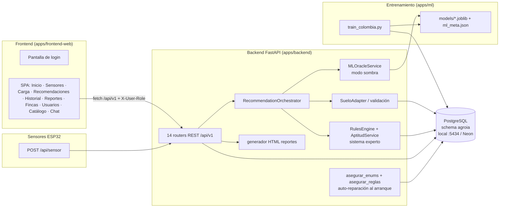
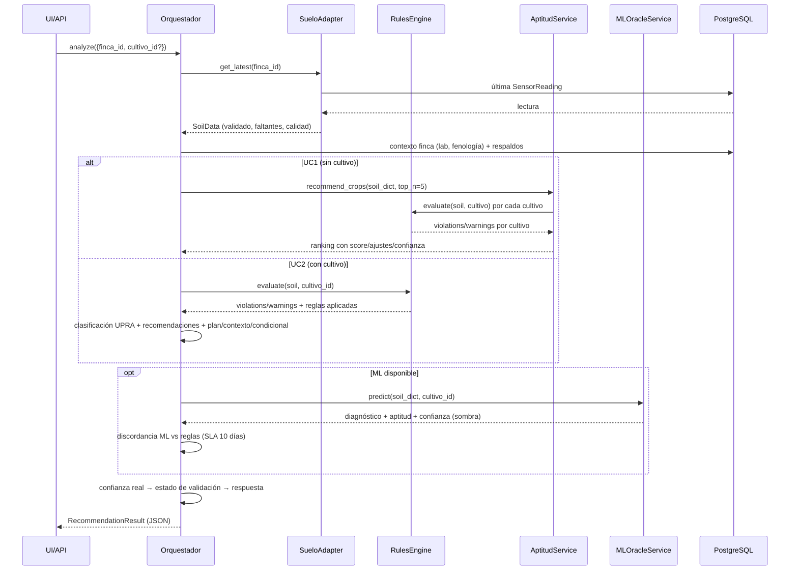

# Documento Funcional-Técnico — AgroIA (AgroInteligente Colombia)

**Versión:** 1.3 · **Fecha:** 2026-08-27
**Alcance:** Descripción funcional y técnica de cada sección del aplicativo, los servicios que invoca, qué hace cada servicio, y —con especial detalle— cómo se invoca el modelo de recomendación/diagnóstico y qué parámetros recibe.

---

## Tabla de contenidos

1. [Propósito del documento](#1-propósito-del-documento)
2. [Visión general y stack tecnológico](#2-visión-general-y-stack-tecnológico)
3. [Arquitectura de componentes](#3-arquitectura-de-componentes)
4. [Autenticación y sesión (lo más básico)](#4-autenticación-y-sesión-lo-más-básico)
5. [El frontend SPA: navegación y utilidades](#5-el-frontend-spa-navegación-y-utilidades)
6. [Recorrido sección por sección](#6-recorrido-sección-por-sección)
7. [Ingesta de datos IoT — `POST /api/sensor`](#7-ingesta-de-datos-iot--post-apisensor)
8. [El motor de recomendaciones (corazón del sistema)](#8-el-motor-de-recomendaciones-corazón-del-sistema)
9. [Aceptación humana de recomendaciones (human-in-the-loop)](#9-aceptación-humana-de-recomendaciones-human-in-the-loop)
10. [El modelo de Machine Learning: entrenamiento y artefactos](#10-el-modelo-de-machine-learning-entrenamiento-y-artefactos)
11. [Reportes: anatomía del HTML generado](#11-reportes-anatomía-del-html-generado)
12. [Persistencia y base de datos](#12-persistencia-y-base-de-datos)
13. [Despliegue y CI/CD](#13-despliegue-y-cicd)
14. [Seguridad y limitaciones conocidas](#14-seguridad-y-limitaciones-conocidas)
15. [Demo y restablecimiento de datos](#15-demo-y-restablecimiento-de-datos)
16. [Glosario](#16-glosario)

---

## 1. Propósito del documento

Este documento describe, de lo más básico (el login) a lo más complejo (la invocación del modelo de recomendación y diagnóstico), **qué hace cada sección del aplicativo AgroIA, qué servicios llama, qué hace cada servicio y qué parámetros recibe el modelo**. Está pensado para:

- **Analizar la construcción del software**: capas, módulos y responsabilidades.
- **Entender las funcionalidades** de cara al negocio agronómico.
- **Auditar la trazabilidad** de las recomendaciones: qué datos entran al modelo, con qué reglas y con qué confianza.

Todo lo descrito corresponde al código del repositorio `erick880709/Agro-ia` (rama `master`), desplegado en Render y con base de datos Neon (PostgreSQL 15).

---

## 2. Visión general y stack tecnológico

AgroIA es un sistema de **agricultura de precisión para Colombia**: sensores IoT (ESP32) miden variables de suelo, y un **motor híbrido** (sistema experto de reglas agronómicas UPRA/Cenicafé/AGROSAVIA + modelos de Machine Learning en modo sombra) emite recomendaciones de cultivos, diagnósticos de fertilidad y planes de acción.

| Capa | Tecnología | Ubicación |
|---|---|---|
| Frontend | SPA vanilla (HTML + CSS + JS, sin framework) | `apps/frontend-web/` |
| Backend | Python 3.11 · FastAPI · SQLAlchemy 2 (async/asyncpg) | `apps/backend/agroia_backend/` |
| Compartido | Config, base de datos, errores, logging | `apps/shared/agroia/` |
| ML | scikit-learn (RandomForest) · joblib · numpy | `apps/ml/agroia_ml/` |
| IoT | Consumidor de tramas y normalización | `apps/iot/` + `apps/backend/.../services/` |
| Base de datos | PostgreSQL 15, schema `agroia` (local Docker :5434 · producción Neon) | — |
| Despliegue | Dockerfile → Render Web Service Free (auto-deploy) | `apps/backend/Dockerfile`, `render.yaml` |
| CI | GitHub Actions (ruff → pytest → build Docker) | `.github/workflows/` |

**Principio rector:** el **sistema experto (reglas) es la fuente de verdad**. El ML corre en *modo sombra*: predice en paralelo, se compara con las reglas para detectar discordancia y sus métricas se reportan, pero las recomendaciones publicadas salen del motor de reglas.

---

## 3. Arquitectura de componentes



**Módulos clave del backend** (`apps/backend/agroia_backend/`):

| Módulo | Responsabilidad |
|---|---|
| `main.py` | Crea la app FastAPI, monta los 14 routers, sirve el frontend estático en `/`, y en el arranque (`lifespan`) ejecuta `asegurar_enums()` y `asegurar_reglas()`. |
| `api/*.py` | Endpoints HTTP: `auth`, `sensor_api`, `iot`, `fincas`, `recomendaciones`, `reportes`, `ml`, `chat`, `dashboard`, `catalogo`, `usuarios`, `location`, `health`. |
| `services/orchestrator.py` | Orquesta el pipeline completo de recomendación (datos → reglas → ML → discordancia → confianza → respuesta). |
| `services/rules_engine.py` | Sistema experto: evalúa reglas agronómicas contra los datos de suelo. |
| `services/aptitud.py` | UC1: puntúa todos los cultivos y los ordena por aptitud. |
| `services/ml_oracle.py` | Oráculo ML en modo sombra (carga artefactos y predice). |
| `services/data_adapters.py` | Adapter de datos de suelo + validación de rangos físicos. |
| `services/reportes_html.py` | Genera el documento HTML del reporte (mapa de calor, plano, clima…). |
| `services/asegurar_enums.py` / `asegurar_reglas.py` | Auto-reparación idempotente de tipos enum y reglas en la BD al arrancar. |
| `services/acceso.py` | Control de acceso a fincas por rol (MVP sin JWT). |
| `services/normalizacion_iot.py` | Normaliza tramas del firmware al esquema canónico. |
| `services/geografia.py` | Catálogo departamentos/municipios con centroides, cadena de validación de fincas y cálculo de área/perímetro de polígonos. |
| `services/puente_iot.py` | Puente de import del consumidor IoT (portable dev/contenedor). |
| `models/*.py` | Modelos SQLAlchemy (15+ tablas). |
| `alembic/versions/` | Migraciones 001 → 010. |

---

## 4. Autenticación y sesión (lo más básico)

### 4.1 Pantalla de login

El frontend muestra `login-screen` si no hay sesión guardada. Ofrece:

- Formulario **email + contraseña**.
- **Cuentas demo de un clic**: 👑 Administrador, 🧑🌾 Agrónomo, 👤 Cliente (María) y 🌱 Cliente (Finca Demo). Cada botón llama al mismo endpoint con credenciales predefinidas en `index.html`.

### 4.2 Servicio que se invoca

**`POST /api/v1/auth/login`** — `apps/backend/agroia_backend/api/auth.py`

**Parámetros (body):**
```json
{ "email": "correo@ejemplo.co", "password": "••••" }
```

**Qué hace el servicio:**
1. Normaliza el email a minúsculas.
2. Busca el usuario en `agroia.usuarios` por email.
3. Verifica la contraseña con `verify_password()` (`services/auth_utils.py`, hash bcrypt sobre `password_hash`).
   - Credenciales inválidas → `401 CREDENCIALES_INVALIDAS`.
4. Verifica que la cuenta esté activa (`usuario.activo`) → si no, `403 USUARIO_INACTIVO`.
5. Devuelve los datos de sesión.

**Respuesta:**
```json
{
  "id": "uuid",
  "nombre": "Administrador Demo",
  "email": "…",
  "rol": "Admin",
  "activo": true
}
```

> Nota MVP: no hay token JWT todavía. El rol viaja en cabeceras (ver 4.4). El endpoint está preparado para ser reemplazado por un Auth Service con OAuth2.

### 4.3 Sesión en el cliente

- La respuesta se guarda en `localStorage` bajo la clave `agroia_sesion`.
- Al recargar, `init()` restaura la sesión y arranca la app sin volver a loguear.
- `cerrarSesion()` borra la clave y recarga.

### 4.4 Roles, permisos y cabeceras

Cada petición `fetch` lleva:

| Cabecera | Cuándo | Propósito |
|---|---|---|
| `X-User-Role` | Siempre | Rol activo (`Admin`, `Agronomo`, `Cliente`, …) |
| `X-User-Email` | Solo rol Cliente | Identificar al cliente para filtrar sus fincas |

**Matriz de acceso** (implementada en `services/acceso.py` y en el frontend):

| Rol | Pestañas visibles | Fincas visibles | Acciones de escritura |
|---|---|---|---|
| **Admin** | Inicio, Sensores, Carga, Recomendaciones, Historial, Reportes, **Fincas**, **Usuarios**, Catálogo | Todas | Registrar/editar fincas, aceptar recomendaciones, cambiar roles, fichas del catálogo |
| **Agrónomo** | Igual sin Fincas ni Usuarios | Todas | Aceptar recomendaciones, actualizar datos agronómicos de fincas |
| **Cliente** | Inicio, Sensores, Historial, Reportes, Catálogo | Solo las ligadas a su email (`fincas_permitidas_ids`) | **Solo lectura** (`exigir_no_cliente` bloquea) |

`services/acceso.py` expone tres funciones:
- `fincas_permitidas_ids(db, rol, email)`: para Admin/Agrónomo devuelve `None` (todas); para cliente, los IDs de fincas ligadas.
- `verificar_acceso_finca(db, rol, email, finca_id)`: 403 `FINCA_NO_AUTORIZADA` si el cliente no tiene acceso.
- `exigir_no_cliente(rol)`: bloquea acciones de escritura para clientes.

---

## 5. El frontend SPA: navegación y utilidades

`apps/frontend-web/app.js` es una SPA sin framework (~1.400 líneas).

**Estado global (`state`):** `fincas`, `cultivos`, `dispositivos`, `fincaId`, `catalogo`, `usuarios`, `sesion`, `rol`, `tabActual`, `cargandoSensores`, `ultimoAnalisis` (resultado del último análisis, usado por el panel de aceptación).

**Helper `api(path, opts)`:** envuelve `fetch(API + path)` con `API = '/api/v1'`, inyecta las cabeceras de rol, parsea JSON y convierte errores `detail.message` en excepciones legibles para mostrar banners.

**Navegación (`goTab`):** cambia la clase `active` de la vista y dispara la carga perezosa de datos por pestaña:

| Pestaña | Carga al entrar |
|---|---|
| `historial` | `cargarHistorial()` |
| `sensores` | `cargarSensores()` |
| `inicio` | `cargarDashboard()` |
| `fincas` (solo admin) | `renderFincasList()` |
| `usuarios` (solo admin) | `cargarUsuarios()` |

---

## 6. Recorrido sección por sección

### 6.1 🏠 Inicio (Dashboard)

**Qué hace el usuario:** ve el resumen de su finca: semáforo de aptitud, KPIs, alertas y últimas lecturas.

**Servicio que llama:** `GET /api/v1/dashboard/{finca_id}?modo=agricultor|experto` (`api/dashboard.py`)

**Qué hace el servicio:**
1. Verifica acceso del rol a la finca.
2. Llama a `services/dashboard_service.py::get_dashboard_data(finca_id)`:
   - Última recomendación persistida (clasificación, confianza, color del semáforo).
   - KPIs (pH, N, P, K, CE…), series temporales, alertas (confianza < 80 % genera alerta).
3. Formatea según `modo`:
   - `agricultor`: lenguaje coloquial con semáforo 🟢🟡🟠🔴.
   - `experto`: datos crudos + enlaces de exportación (`/export?format=csv|json|excel`).

**Respuesta (modo agricultor):** `{finca_id, modo, mensaje, semaforo:{clasificacion, color, confianza}, kpis[], alertas[], guia}`.

### 6.2 📡 Sensores IoT

**Qué hace el usuario:** monitorea las lecturas en tiempo real (auto-refresco cada 10 s solo con la pestaña activa), el estado de conexión de los dispositivos, y **prueba tramas con el simulador** («🔗 API de sensores — simulador de trama»): un textarea precargado con el formato real del firmware y botón «📡 Enviar trama» que llama a `POST /api/sensor` y muestra el resultado (dispositivo, finca asociada, variables recibidas, advertencias).

**Servicios que llama:**
- `GET /api/v1/lecturas/{finca_id}?limite=10` — últimas lecturas de `sensor_readings` (con pos_x/pos_y, calidad, 17 variables).
- `GET /api/v1/sensores/{finca_id}/status` — por cada sensor: última transmisión y estado (`online` < 12 h, `datos_desactualizados` < 24 h, `offline`).
- `POST /api/sensor` — envío de la trama desde el simulador (mismo endpoint de los sensores físicos).

**Qué hace la UI:** pinta la tabla de lecturas (incluye nombre de finca y mini-ID con botón copiar), indicador "actualizando…" y guarda contra dobles peticiones (`state.cargandoSensores`).

### 6.3 📂 Cargar archivo

**Qué hace el usuario:** sube un archivo con mediciones (cuando el sensor perdió conexión) y obtiene la recomendación al instante.

**Servicio que llama:** `POST /api/v1/carga` (`api/iot.py`) — `multipart/form-data`:

| Campo | Tipo | Descripción |
|---|---|---|
| `file` | archivo | CSV pares (`ph,7.1`), CSV ancho (cabecera + filas), TXT (`clave=valor`) o JSON (trama del firmware) |
| `device_id` | texto | Opcional |
| `finca_id` | UUID | Opcional (relación directa sin dispositivo) |
| `cultivo_id` | UUID | Opcional (activa UC2 al instante) |

**Qué hace el servicio:**
1. `exigir_no_cliente` (bloquea clientes).
2. `decodificar_contenido` + `parsear_archivo_sensor` (`services/carga_archivo.py`).
3. Normaliza cada trama con `normalizar_trama` (igual que una trama en vivo).
4. Persiste `SensorReading` (con `SET LOCAL search_path`).
5. Ejecuta el **orquestador de recomendaciones** al instante (UC1 sin `cultivo_id`, UC2 con él) y persiste en historial.

### 6.4 🧪 Recomendaciones (la sección central)

**Qué hace el usuario:** elige finca y, opcionalmente, cultivo y **presupuesto de fertilización ($/ha)** , y pulsa «Analizar suelo».

**Servicio que llama:** `POST /api/v1/recomendaciones/analyze`

**Parámetros (body):**
```json
{ "finca_id": "uuid", "cultivo_id": "uuid | null", "presupuesto_cop": 500000 }
```

- `cultivo_id = null` → **UC1** (¿qué me conviene sembrar?).
- `cultivo_id` presente → **UC2** (diagnóstico para el cultivo sembrado).
- `presupuesto_cop` (opcional, ≥ 0) → activa el **plan económico de fertilización** (sección 8.9).

**Qué hace el servicio y el orquestador:** ver sección 8 (el detalle completo del pipeline y del modelo). **Importante:** el análisis **nunca se bloquea por datos faltantes** — si faltan parámetros esenciales o no hay lecturas, devuelve una recomendación preliminar con `variables_faltantes_esenciales` y el requisito de aval de un agrónomo (sección 8.10).

**Respuesta clave:**
```json
{
  "cultivo": "Aguacate",
  "clasificacion_upra": "Moderadamente apta (sujeta a confirmación de textura)",
  "confianza": 0.571, "confianza_real": 0.55, "estado_validacion": "sujeta a confirmación de textura",
  "respaldos": 1, "variables_faltantes_fertilidad": ["calcio", …],
  "variables_faltantes_esenciales": [],
  "fenologia_ajustada": "Etapa Fructificación: … ⏳ Faltan ~N GDD para cosecha, optimice riego (…)",
  "plan_economico": { "presupuesto_cop", "costo_ideal", "costo_plan", "cobertura_pct",
      "diferencia_rendimiento_pct", "incluidos[]", "aplazados[]" },
  "recomendaciones": [ { "variable": "pH", "estado": "DEFICIT", "valor_actual": 4.9,
      "rango_ideal": "[5.5 - 6.5]", "accion": "…", "prioridad": "Alta", "fuente": "Cenicafé",
      "confiabilidad": "Sin validar", "condicional": true,
      "contexto": "pH 4.9 — ácido en escala general, pero fuera del rango óptimo para Aguacate [5.5–6.5]",
      "plan": { "fuente": "Cal dolomítica…", "frecuencia": "…", "dosis": "…" } } ],
  "sugerencias_cultivos": [ { "cultivo_id", "cultivo", "icono", "score", "confianza",
      "clasificacion", "reglas_especificas", "ajustes[]" } ],
  "justificacion": { "resumen", "variables_analizadas", "reglas_aplicadas", "faltantes", "excesos", "confianza", "confianza_real", "respaldos_expertos" },
  "advertencia": "…", "discordancia": null, "tiempo_respuesta_ms": 1613, "modo": "analizar_cultivo"
}
```

**Qué hace la UI con la respuesta (`renderAnalisis`):**
- Cabecera: cultivo, badge de clasificación + badge de estado de validación, barra de confianza (final y real), respaldos de expertos.
- Avisos: fenología ajustada (incluye GDD), variables de fertilidad faltantes, advertencia, discordancia.
- **Bloque «📝 Complete los parámetros esenciales»**: si la respuesta trae `variables_faltantes_esenciales`, se muestran inputs para cada valor faltante (pH, N, P, K, CE) y el botón «💾 Guardar y reanalizar» ingesta los valores vía `POST /api/sensor` y reejecuta el análisis automáticamente.
- Tabla de diagnóstico: Variable · Estado (DÉFICIT/EXCESO/**SIN DATO**) · Lectura · Rango ideal · Acción (con marcador *condicional a confirmación de laboratorio* y contexto de pH) · Prioridad · **Confiabilidad** · **Plan sugerido** (fuente, frecuencia, dosis).
- **Bloque «💰 Plan económico vs. plan ideal»**: costo del plan, costo ideal, presupuesto, cobertura %, diferencia de rendimiento estimada y listas de acciones Incluidas/Aplazadas.
- Ranking «🌾 Cultivos sugeridos (ranking del motor)»: #, cultivo, score, clasificación, confianza, nº de reglas y **columna de descripción de reglas aplicadas** (variable, estado, rango, acción, prioridad).

**Panel de aceptación (Admin/Agrónomo):** al final aparece «✅ Aceptar recomendación» + caja de texto para ampliar acciones (ver sección 9).

### 6.5 📜 Historial

**Servicio que llama:** `GET /api/v1/recomendaciones/historial/{finca_id}?page=&page_size=&cultivo_id=`

**Qué hace:** paginación sobre `agroia.recomendaciones` (fecha, cultivo, clasificación, confianza, estado) ordenada desc. El frontend la pinta como lista de tarjetas.

### 6.6 📄 Reportes

**Servicio que llama:** `POST /api/v1/reportes/generar`

**Parámetros (body):**
```json
{ "finca_id": "uuid", "tipo": "siembra | cultivo | completo",
  "cultivo_id": "uuid | null", "presupuesto_cop": 500000 }
```

**Qué hace el servicio (`api/reportes.py`):**
1. Verifica acceso y valida la finca. **No se bloquea por falta de lecturas**: si no las hay, el análisis corre en modo preliminar (sección 8.10) y el reporte se genera igual.
2. Construye el orquestador y ejecuta UC1 (`siembra`/`completo`) y UC2 (`cultivo`/`completo`, usando el `cultivo_id` o el top del ranking).
3. Recopila los **parámetros esenciales faltantes** (`variables_faltantes_esenciales` de UC1/UC2, o los 4 esenciales si no hay lecturas) para la sección «P» del reporte.
4. Calcula el plan económico para el ROI (plan del análisis o plan ideal si no se declaró presupuesto) y carga los **precios de referencia de la ficha técnica** del cultivo analizado.
5. `_muestras_geo`: lecturas con `pos_x/pos_y` para mapa de calor y plano.
6. Resuelve **clima IDEAM** del día de la muestra (`external_apis.fetch_ideam_clima_fecha`) a partir de coordenadas de la finca (parser de enlaces Google + fallback lat/lng; sin ubicación se omite).
7. Llama a `generar_reporte_html()` (sección 11) y devuelve `{titulo, tipo, html, parametros_faltantes[], preliminar}`.

**Qué hace la UI:** muestra el HTML en un iframe/pestaña nueva y ofrece **descargar PDF** (impresión del navegador con `@media print` del propio HTML).

### 6.7 🏡 Fincas — registro en 3 secciones, validación y lotes (registro solo Admin)

**Wizard de 3 secciones** (SPA en `index.html` + `app.js`):

1. **Información básica**: nombre, propietario, teléfono, email, departamento (select de 33), municipio (filtrado por departamento con el catálogo de `departamentos.js`), vereda / corregimiento.
2. **Ubicación**: 📍 Usar mi ubicación (geolocalización del navegador, con precisión ±m) · 🗺️ Seleccionar en mapa (Leaflet/OpenStreetMap: se marcan los vértices del lindero y «Cerrar polígono» calcula área/perímetro y genera el GeoJSON) · 🔗 Pegar enlace Google Maps (parse local de `lat, lng`, `@lat,lng` y `!3d…!4d…`; los enlaces cortos `maps.app.goo.gl` se resuelven con `GET /location/resolver-enlace` siguiendo la redirección). Muestra Latitud, Longitud, Altitud msnm (`GET /location/elevation`) y Precisión.
3. **Características del predio**: tipo de área (finca completa / lote / parcela), área registrada (ha), **área georreferenciada calculada automáticamente del polígono** (con perímetro), ¿la finca tiene varios lotes? Sí/No y dimensiones opcionales.

**Servicios:**
- `GET /api/v1/fincas?search=` — listado (Admin/Agrónomo todas; cliente solo las suyas).
- `POST /api/v1/fincas` — registro (solo Admin): campos básicos + georreferenciación (`latitud`/`longitud` directos o `coordenadas_google`, `vereda`, `precision_gps`, `fuente_geolocalizacion`, `geometria` GeoJSON, `area_declarada_ha`, `tipo_area`, `tiene_multiples_lotes`) + campos agronómicos. Ejecuta la **cadena de validación** (abajo) y crea el **lote principal**.
- `PATCH /api/v1/fincas/{id}` — actualización de datos agronómicos (Admin/Agrónomo): pendiente, drenaje, historial, validación de laboratorio, cultivo sembrado, edad, etapa fenológica.
- `GET /api/v1/fincas/{id}/lotes` — lotes (unidades productivas) de la finca.
- `GET /api/v1/location/catalogo` — catálogo departamento → municipios (33 departamentos, con centroides) usado por la validación y por el frontend.
- `GET /api/v1/location/resolver-enlace?url=` — resuelve enlaces cortos de Google Maps a coordenadas.

**Cadena de validación al guardar** (`services/geografia.py::validar_creacion_finca`):

| # | Paso | Regla | Código de rechazo |
|---|---|---|---|
| 1 | ¿Departamento existe? | Catálogo de 33 departamentos | `DEPARTAMENTO_INVALIDO` |
| 2 | ¿Municipio pertenece al departamento? | Catálogo municipios por departamento | `MUNICIPIO_NO_PERTENECE` |
| 3 | ¿Coordenadas válidas? | WGS84 (−90…90, −180…180) | `COORDENADAS_INVALIDAS` |
| 4 | ¿Coinciden con el municipio? | Distancia Haversine al centroide ≤ 50 km | `COORDENADAS_FUERA_MUNICIPIO` |
| 5 | ¿Área razonable? | 0.01–100 000 ha | `AREA_NO_RAZONABLE` |
| 6 | ¿Precisión aceptable? | ≤ 100 m (50–100 m → advertencia) | `PRECISION_INSUFICIENTE` |

Cada paso se devuelve en la respuesta (`validaciones[]` con estado `ok/error/warn`) y se pinta en la UI con ✅/⚠️/❌; los rechazos llegan como `422 VALIDACION_FINCA` con la lista completa de pasos.

**Separación arquitectónica Finca ≠ Lote**: al guardar se crea automáticamente el **lote principal** (`agroia.lotes`) con el área calculada (polígono) o la declarada. La finca identifica el predio; el lote es la unidad productiva que después se analiza (sensores, muestras, reportes).

**Área/perímetro calculados** (`calcular_geometria_geojson`): fórmula de Gauss (shoelace) sobre proyección equirectangular + perímetro Haversine; acepta `Polygon` GeoJSON o anillo plano `[[lng,lat], …]`.

**Qué hace la UI:** tarjetas por finca con ID y botón «Copiar» (para configurar el firmware), formulario wizard con navegación Siguiente/Atrás y el panel de validaciones al guardar.

### 6.8 👥 Usuarios (solo Admin)

**Servicios:**
- `GET /api/v1/usuarios` — listado de usuarios.
- `POST /api/v1/usuarios` — alta por admin.
- `PUT /api/v1/admin/usuarios/{id}/rol` — cambio de rol.
- (Perfil propio: `GET/PUT/DELETE /usuarios/me`.)

### 6.9 🌾 Catálogo (Admin/Agrónomo gestionan; Cliente consulta)

**Servicios:**
- `GET /api/v1/cultivos` — 30 cultivos activos con icono, ficha técnica y **fisiología** (`profundidad_radicular_min_cm`, `gdd_total_requerido`, `dias_ciclo`).
- `GET /api/v1/cultivos/{id}` / `POST /cultivos` — detalle y alta (con fisiología opcional).
- `PATCH /api/v1/cultivos/{id}` — editar fisiología/datos agronómicos del cultivo.
- `GET /api/v1/fichas`, `GET/POST/PUT /fichas/…` — fichas técnicas.
- `POST /fichas/{id}/enviar-revision | aprobar | rechazar` — flujo editorial de fichas.

**Qué hace la UI:** cada tarjeta del catálogo muestra la línea de fisiología «🌱 raíz ≥ N cm · G GDD · D días» cuando el cultivo la tiene registrada.

### 6.10 💬 Chat asesor (pestaña Reportes)

**Servicio:** `POST /api/v1/chat/consultar`

**Parámetros (body):**
```json
{ "finca_id": "uuid", "mensaje": "¿Cuánto fertilizante aplico?",
  "cultivo_id": "uuid | null", "historial": [ { "rol": "user|assistant", "contenido": "…" } ],
  "imagen_base64": "… (foto JPG/PNG, opcional, ≤ ~4,5 MB)" }
```

**Qué hace (`api/chat.py` + `services/agronomo_chat.py` + `agronomo_kb.py`):**
1. Verifica acceso a la finca y carga la última lectura.
2. Ejecuta el orquestador (UC1 o UC2) para tener contexto real.
3. Enruta la pregunta a la **base de conocimiento** (cal/fertilización/riego, clima por época, diagnóstico diferencial, "por qué este cultivo").
4. **Foto adjunta (botón 📎 en la UI)**: si hay `OPENAI_API_KEY` con modelo de visión (gpt-4o, gpt-4.1, gpt-4o-mini…), la imagen se envía multimodal con el prompt *«Analiza esta foto de cultivo y da un diagnóstico»*. Sin visión, la foto queda guardada como referencia en `chat_memoria.imagen_base64` y el prompt textual lo indica. La respuesta incluye `imagen_guardada` / `imagen_analizada`.
5. Si `OPENAI_API_KEY` está configurado usa LLM; si no, responde el **motor local determinista** con respuesta fundamentada (fuentes, confianza, datos utilizados, qué falta).
6. Guarda memoria conversacional en `chat_memoria` (`GET /chat/memoria/{finca_id}`).

---

## 7. Ingesta de datos IoT — `POST /api/sensor`

Doble ruta (ambas montadas): `api/sensor_api.py` (formato firmware, **la que usan los sensores**) y `api/iot.py::/sensor` (trama canónica).

### 7.1 Formato real de la trama del firmware

```json
{
  "device_id": "esp32-npk-001",
  "finca_id": "8c2ea84f-b5fa-4291-a1e5-8b42fa5a9936",
  "pos_x": 20.0, "pos_y": 50.0,
  "ph": 6.1, "conductivity": 620,
  "nitrogen": 260, "phosphorus": 28, "potassium": 95,
  "soil_humidity": 31.0, "soil_temperature": 19.5,
  "humidity": 72.0, "temperature": 21.2,
  "rssi": -45, "uptime_s": 604800
}
```

- Obligatorio: `device_id`. Opcionales: `finca_id` (UUID, asocia el dispositivo a la finca), `pos_x`/`pos_y` (punto de muestreo en el lote), `soil_humidity`/`soil_temperature` (humedad/temperatura **del suelo**; se guardan como `humedad`/`temperatura_suelo`), y cualquier variable del `MAPA_CAMPOS`.
- `humidity`/`temperature` se guardan como **ambientales** (DHT22). Este es el formato precargado en el simulador de la pestaña Sensores IoT.

### 7.2 Procesamiento (paso a paso)

1. **Normalización** (`services/normalizacion_iot.py`): `MAPA_CAMPOS` traduce nombres del firmware al esquema canónico:
   - `nitrogen→nitrogeno`, `phosphorus→fosforo`, `potassium→potasio`, `calcium→calcio`… `humidity→humedad_ambiental` (DHT22), `soil_humidity→humedad` (suelo), `conductivity→conductividad_electrica` **convirtiendo µS/cm → dS/m (×10⁻³)**.
   - Campos de telemetría (`device_id, rssi, uptime_s, firmware, timestamp`) se excluyen.
   - Si vienen N/P/K → advertencia **`npk_sin_calibrar`** (el sensor NPK no está validado contra laboratorio).
2. **Resolución de finca**: `finca_id` de la trama → finca del `device_id` registrado → auto-registro del dispositivo a la primera finca. Si la trama trae un `finca_id` inexistente → `422 FINCA_NOT_FOUND`. Si el dispositivo cambió de finca, se reasocia (`sensor_finca_actualizada`).
3. **Persistencia** (`services/puente_iot.py → apps/iot/agroia_iot/consumer.py::process_sensor_message`): inserta `SensorReading` ejecutando antes `SET LOCAL search_path TO public, agroia` (protección contra el search_path frágil de Neon/pgBouncer), actualiza telemetría del `DispositivoIoT` (rssi, uptime).
4. **Respuesta 202**: `{status, device_id, finca_id, auto_registrado, variables_recibidas[], advertencias[], recibida_en}`.

---

## 8. El motor de recomendaciones (corazón del sistema)

`services/orchestrator.py::RecommendationOrchestrator.analyze(request)` — ejecutado por `/recomendaciones/analyze`, `/reportes/generar`, `/chat/consultar` y `/carga`.

### 8.1 Pipeline completo (numerado)



### 8.2 Paso 1 — SueloAdapter y validación (`services/data_adapters.py`)

- `SueloAdapter.get_latest(finca_id)` trae la última `SensorReading` y la convierte en `SoilData` (18 variables: `ph, nitrogeno, fosforo, potasio, calcio, magnesio, azufre, hierro, manganeso, zinc, cobre, boro, materia_organica, cic, textura, humedad, temperatura_suelo, conductividad_electrica`).
- `validate_soil_reading`: valida rangos físicos (`SOIL_RANGES`, p. ej. pH 0–14, N 0–500); valores fuera de rango → `calidad = "out_of_range"`. Clasifica faltantes:
  - **Bloqueantes** (`missing_blocking`): `ph`, `conductividad_electrica`. **Ya no producen 422**: el análisis sigue con los datos disponibles y la advertencia «faltan parámetros esenciales… requiere el aval de un agrónomo» (sección 8.10).
  - **No bloqueantes**: el resto (generan advertencia de "recomendación parcial").
- Si **no hay ninguna lectura** (`soil_data is None`), el orquestador devuelve la **recomendación preliminar sin datos** (sección 8.10) en lugar de fallar.
- `to_dict()` devuelve solo variables presentes.

### 8.3 Paso 2 — Sistema experto: RulesEngine (`services/rules_engine.py`)

- Carga de `agroia.reglas_agronomicas` las reglas **específicas del cultivo** + las **universales** (`cultivo_id IS NULL`). Hoy: **54 reglas activas, 17 variables, 10 cultivos con reglas específicas** (Café 7, Maíz 4, Papa 3, Plátano 2, Arroz 2, Aguacate 5, Cacao 5, Fríjol 4, Tomate 5, Yuca 4 + 8 reglas universales de Ca/Mg/S/Fe/Mn/Zn/Cu/B).
- Cada regla: `variable, umbral_min, umbral_max, accion, prioridad (Critica/Alta/Media/Baja), fuente (UPRA/Cenicafé/AGROSAVIA)`.
- Compara la lectura contra umbrales → `RuleViolation` (DEFICIT si `< min`, EXCESO si `> max`).
- Resultado: `RulesResult{status: OK|WARNING|FORBIDDEN, violations[], warnings[], applied_rules, total_rules}`.

### 8.4 UC1 — AptitudService (`services/aptitud.py`)

Para cada cultivo evaluable (con ≥1 regla específica):
- **Penalización** = Σ pesos por violación/warning: Critica=30, Alta=20, Media=10, Baja=5.
- **Profundidad radicular (fisiología del cultivo)**: si el cultivo declara `profundidad_radicular_min_cm` y la profundidad efectiva del lote es menor, se suma `min(40, 10 + déficit×0.5)` (prioridad Crítica si el déficit ≥ 15 cm) con ajuste «profundidad_suelo» y rango «≥ N cm para Cultivo». Cultivos de raíz profunda sin dato usan el fallback de 60 cm.
- **Score** = `max(0, 100 − min(penalización, 100))`.
- **Clasificación UPRA**: ≥80 Apta · ≥60 Moderadamente apta · ≥40 Marginalmente apta · <40 No apta.
- **Confianza base** = `min(0.99, max(0.05, (100−penalización)/100 × (0.75 + 0.25 × cobertura)))`.
- Se devuelven los top 5 con `ajustes` (hasta 5 por cultivo): variable, estado, rango, acción, prioridad, fuente.

### 8.5 Paso 3 — ML en modo sombra: qué parámetros se envían al modelo

`services/ml_oracle.py::MLOracleService.predict(soil_dict, cultivo_id)`

**Parámetros de entrada al modelo:**

| Parámetro | Qué es | Valores |
|---|---|---|
| `soil_dict` | Diccionario con las variables medidas (claves canónicas) | Solo claves presentes, p. ej. `{ph: 4.9, nitrogeno: 85, …}` |
| `cultivo_id` | UUID del cultivo (UC2) o `None` | Se reduce a `idx = 0 si None else hash(uuid) % 5` |

**Transformación a features (`_features`):**
- Matriz `X` de **18 columnas** = las 17 variables canónicas (`ph, nitrogeno, …, conductividad_electrica`) **+ 1 columna `cultivo_idx`** (índice del cultivo).
- **Imputación de faltantes**: las variables ausentes se rellenan con la **mediana por variable** calculada en el entrenamiento y guardada en `ml_meta.json` (fallback −1). Esto permite predecir con datos incompletos (los sensores reales solo envían ~7 variables).

**Modelos cargados (lazy, 18 artefactos `ml_*.joblib`):**
- `ml_aptitud`: RandomForest clasificador de aptitud UPRA.
- `ml_diagnostico_*` (17): uno por variable → DEFICIT / OK / EXCESO.

**Qué devuelve:**
```json
{
  "disponible": true,
  "cultivo": "No apta",
  "clasificacion": "No apta",
  "diagnostico": { "ph": {"estado": "DEFICIT", "confianza": 0.98}, … },
  "confianza": 0.776,
  "confianza_aptitud": 0.81
}
```
> Si no hay artefactos o falta numpy, devuelve `None` y el sistema opera solo con reglas.

### 8.6 Paso 4 — Discordancia ML vs reglas

Si el ML predice bloqueo y las reglas también, se registra `discordancia {tipo: ml_vs_reglas, cultivo_ml, confianza_ml, regla_bloqueante, sla_vencimiento: +10 días}` y se avisa en la respuesta. No altera la recomendación publicada (las reglas mandan).

### 8.7 Paso 5 — Confianza real y estado de validación

**Confianza base (UC2):** `max(0.05, min(0.99, 1 − (n_violaciones×0.20 + n_warnings×0.05)))`.

**Ajustes sobre la base (`_ajustar_confianza`):**

| Factor | Fórmula |
|---|---|
| Fertilidad faltante | `factor = max(0.6, 1 − 0.04 × n_faltantes)` sobre las 10 variables de fertilidad (MO, CIC, Ca, Mg, S, Fe, Mn, Zn, Cu, B) |
| Esenciales faltantes | `factor = max(0.55, 1 − 0.15 × n_esenciales)` (ph/CE sin dato) |
| Sensor NPK sin calibrar | `× 0.9` |
| Respaldo humano | `+ min(0.10, 0.02 × aceptaciones)` (máx +0.10) |

`confianza_real = base × factor_fertilidad × factor_esenciales × factor_sensor` · `confianza_final = min(0.99, confianza_real + respaldo)`.

**Estado de validación (umbral duro):**
0. Faltan **parámetros esenciales** → `pendiente_validacion` (requiere aval de un agrónomo).
1. Cultivo sensible a drenaje (aguacate, cacao, cítricos, palma) **sin textura** → `sujeta a confirmación de textura`.
2. `confianza_final < 0.80` → `pendiente_validacion` (la clasificación se muestra **"Pendiente de validación técnica"**, nunca "Apta" a secas).
3. Hay variables de fertilidad faltantes → `preliminar` ("Apta (preliminar)").
4. Si no → `validada`.

### 8.8 Paso 6 — Enriquecimiento de cada recomendación (UC2)

- **Confiabilidad**: `Validado en laboratorio` (si la finca tiene `validacion_laboratorio=true`) · `Calibrado de fábrica` (pH/CE) · `Sin validar` (N/P/K de sensor).
- **Condicional**: acciones sobre N/P/K sin validar se marcan *"condicional a confirmación de laboratorio"*.
- **Contexto pH**: "pH 4.9 — ácido en escala general, pero fuera del rango óptimo para Aguacate [5.5–6.5]" (consulta el rango de pH del cultivo, filtrando en Python para no emitir casts de enum frágiles).
- **Plan ejecutable**: fuente + frecuencia por variable (`PLAN_FERTILIZACION`: urea/DAP/KCl/cal dolomítica…); dosis = "Dosis a definir por técnico agrónomo tras análisis de laboratorio" salvo validación lab.
- **Fenología**: si la finca registra cultivo sembrado/edad/etapa, se añade el ajuste de manejo por etapa (vegetativa → priorizar N; floración → P y B; fructificación → K y Ca; cosecha → respetar carencias).
- **GDD acumulado (IDEAM)**: con la fisiología del cultivo (`gdd_total_requerido` + `dias_ciclo`) y la etapa fenológica de la finca, se estima el GDD acumulado (GDD diario = máx(0, T_promedio − 10 °C) con la climatología IDEAM según las coordenadas) y se compara con el requerido; si falta, se avisa *«⏳ Faltan ~N GDD para cosecha, optimice riego»*.
- **Filas SIN DATO**: cada parámetro esencial faltante aparece como fila «SIN DATO» con la acción de suministrarlo para una recomendación certera.

### 8.9 Plan económico de fertilización (brecha económica)

`services/economia.py::calcular_plan_economico(recomendaciones, presupuesto_cop)` — cuando el productor declara `presupuesto_cop` ($/ha):

1. **Costo por variable** (`COSTOS_VARIABLE`, COP/ha estimados): pH 350 k, N 180 k, P 150 k, K 160 k, MO 200 k, Ca 120 k, Mg 100 k, S 80 k, micros (Fe/Mn/Zn/Cu/B) 60 k, CIC 100 k, CE/humedad 0.
2. **Plan ideal** = todas las acciones (costo_ideal).
3. **Plan optimizado al presupuesto**: las obligatorias (prioridad **Crítica** o pH/CE) siempre entran; el resto se ordena por **severidad** (prioridad×10 + desviación relativa al rango ideal) y se incluye hasta agotar el presupuesto; el resto queda **aplazado** con su motivo.
4. Salida: `costo_ideal`, `costo_plan`, `cobertura_pct`, `diferencia_rendimiento_pct` (proporción no cubierta × 40 %), `incluidos[]`, `aplazados[]`. Si hay aplazados se añade la advertencia «💰 El presupuesto no cubre todo el plan ideal…». Sin presupuesto, el plan equivale al ideal (cobertura 100 %).

### 8.10 Recomendación sin datos: nunca se bloquea

- **Sin ninguna lectura**: `_recomendacion_sin_datos()` devuelve un resultado **preliminar** (confianza 5 %, `estado_validacion=pendiente_validacion`): UC1 → ranking del catálogo prioritario (Café, Maíz, Arroz, Plátano, Papa) con score 50 y ajuste «sin lecturas»; UC2 → filas «SIN DATO» por cada parámetro esencial (ph, nitrogeno, fosforo, potasio).
- **Con datos parciales**: el motor corre con lo disponible (las reglas sin dato se omiten) y la respuesta incluye `variables_faltantes_esenciales`, la advertencia *«la recomendación no tiene el 100% de certeza y requiere el aval de un agrónomo»* y el estado `pendiente_validacion`.
- **Pantalla de captura**: la UI ofrece el bloque «📝 Complete los parámetros esenciales» que ingesta los valores vía `POST /api/sensor` y reanaliza al instante.

### 8.11 Confianza transparente — semáforo de 4 barras

- `analyze` devuelve `desglose_confianza` (y la UI/reporte lo pintan como 4 barras): 🟢 **Calibración del sensor** (100 % si el NPK está validado en laboratorio, 60 % si solo está calibrado de fábrica) · 🟡 **Cobertura de fertilidad** (baja 6 % por cada variable de fertilidad faltante) · 🔴 **Violaciones activas** (baja 20 % por cada violación crítica/alta) · 🟣 **Respaldo humano** (sube 2 % por cada aceptación de agrónomo, máx 100 %).
- Incluye `nota_subir` con los 2 consejos más rentables: *«Para subir la confianza al 80%, … (barra 1/2/3)»* — transparencia de **por qué** la confianza es la que es y **qué hacer** para mejorarla.

### 8.12 Muestreo inteligente (Farthest Point Sampling)

- `services/optimizador_muestreo.py::puntos_muestreo_optimos(muestras, n=3)`: descarta posiciones (0,0)/nulas, si hay ≤ n puntos los usa todos, y elige el punto más lejano del centroide y luego los más distantes entre sí — puntos de **máxima incertidumbre** donde la muestra compuesta de laboratorio aporta más información.
- Se activa en reportes preliminares por parámetros faltantes (sección P+05) y entrega GeoJSON descargable + proyección de confianza (confianza actual +0.27, máx 0.99).

### 8.13 Modo Simulación what-if (`POST /api/v1/reportes/simular`)

```json
{ "finca_id": "uuid", "soil_modificado": { "ph": 6.5, "nitrogeno": 200, "fosforo": 60, "potasio": 180 } }
```

Reejecuta `RulesEngine.evaluate` sobre el último suelo de la finca con las variables modificadas (**sin persistir nada**), y devuelve `{clasificacion, confianza, violaciones, advertencias, detalle[], soil_usado}`. Confianza = `max(0.05, min(0.99, 1 − violaciones×0.20 − advertencias×0.05))`. Es la herramienta del agrónomo para responder «¿y si aplico cal / fertilizo?» antes de invertir.

---

## 9. Aceptación humana de recomendaciones (human-in-the-loop)

**Servicio:** `POST /api/v1/recomendaciones/aceptar` (solo Admin/Agrónomo; `exigir_no_cliente`).

**Parámetros:**
```json
{
  "finca_id": "uuid", "cultivo_id": "uuid | null",
  "comentario": "Aplicar encalado en el primer trimestre…",
  "resumen": { "cultivo": "Aguacate", "clasificacion": "…", "confianza": 0.57, "recomendaciones": [] },
  "clasificacion_previa": "…", "confianza_previa": 0.57
}
```

**Qué hace:**
1. Inserta en `agroia.aceptaciones_recomendacion` (rol, comentario, resumen JSONB, clasificación/confianza previas).
2. Devuelve `{status, total_aceptaciones_finca, total_aceptaciones_cultivo, refuerzo_confianza, mensaje}`.
3. **Efecto en el modelo**: cada aceptación suma +0.02 de confianza al análisis de esa finca/cultivo (máx +0.10). El análisis siguiente muestra `respaldos: N` y en `/ml/estado` aparece `validaciones_humanas`. El comentario queda como feedback para futuros reentrenamientos.

---

## 10. El modelo de Machine Learning: entrenamiento y artefactos

`apps/ml/agroia_ml/train_colombia.py` (ejecutar con `python -m agroia_ml.train_colombia --registrar`).

### 10.1 Datos y etiquetado

- **75 000 perfiles de suelo sintéticos** (2 500 × 30 cultivos) generados con distribuciones agronómicas plausibles por variable (`RANGOS`).
- **Etiquetas generadas por el propio sistema experto** (las reglas son la fuente de verdad):
  - `etiquetar(muestra, reglas)` → estado por variable (DEFICIT/OK/EXCESO) y clasificación de aptitud.
- **Imputación por medianas**: se calcula la mediana sintética por variable (guardada en `ml_meta.json.medianas`) y se **enmascara el 35 %** de las muestras (30–60 % de variables borradas) para que el modelo aprenda con datos incompletos como los de los sensores reales.

### 10.2 Modelos y métricas

- **17 RandomForest de diagnóstico** (uno por variable con reglas): `n_estimators=120, max_depth=12`, holdout 80/20 estratificado. F1 0.82–0.99.
- **1 RandomForest de aptitud UPRA** (`ml_aptitud`): F1 0.9111 (holdout), CV 5-fold 0.756 ± 0.201.
- **Concordancia en datos reales**: se evalúa contra las últimas lecturas de `sensor_readings` etiquetadas por el sistema experto. Media actual ≈ 0.66 (< 0.85).

### 10.3 Artefactos y promoción

- Artefactos: `apps/ml/models/ml_*.joblib` (18) + `ml_meta.json` (fecha, variables, medianas, resultados, evaluación real, concordancia media).
- Registro en BD: `modelos_ml` + `metricas_modelo` (stage **STAGING** por defecto).
- **Promoción automática a PRODUCTION solo si la concordancia real media ≥ 0.85**; si no, queda en STAGING de forma honesta, pendiente de más lecturas calibradas.

### 10.4 Oráculo en producción

`MLOracleService` carga los artefactos perezosamente, usa las mismas medianas de `ml_meta.json` para imputar y se invoca en cada análisis (sección 8.5). `GET /api/v1/ml/estado` expone modelos, métricas, `artefactos_meta`, `n_artefactos`, `oraculo_ml_disponible` y `validaciones_humanas`.

---

## 11. Reportes: anatomía del HTML generado

`services/reportes_html.py::generar_reporte_html()` produce un HTML autocontenido (con CSS para pantalla e `@media print` para PDF). Secciones:

| # | Sección | Contenido |
|---|---|---|
| T | Telemetría | Dispositivo, finca, última transmisión, RSSI, uptime, **Calidad NPK en 3 niveles**, validación lab, pH, CE, N, P, K, HR/T ambiente |
| pH | Escala | Barra de pH con marcador y etiqueta ácido/neutro/alcalino |
| P | **Parámetros faltantes** | Si el análisis es preliminar: lista de parámetros que «sería bueno contar» para mayor detalle y aviso de aval de agrónomo |
| 01 | Diagnóstico UC2 | Badge de clasificación + **badge de estado de validación** (PENDIENTE/PRELIMINAR/SUJETA A TEXTURA/VALIDADA), tabla con Acción, Prioridad, **Confiabilidad** y **Plan sugerido**, contexto pH, condicional NPK, respaldos, fenología + GDD, y bloque **«💰 Plan económico vs. plan ideal»** |
| 02 | Recomendación UC1 | Ranking top 5 con scorebar, badge de estado, confianza real y faltantes de fertilidad |
| M | Mapa de calor | Matriz de puntos `pos_x/pos_y` por variable, rampa de intensidad `#e8f5e9→#1b5e20` normalizada por parámetro; en PDF se imprimen **todas las variables** |
| N | Plano del lote | SVG con puntos, cierre convexo, **perímetro/área**, pendiente y drenaje del lote, metodología de muestreo, clima IDEAM del día de la muestra con **alerta fitosanitaria específica** (HR > 78 %) y **historial de manejo** |
| E | **Análisis económico proyectado** | Ganancia esperada = (rendimiento × precio de cosecha) × 1,15 si se aplica el plan · ROI = (ganancia − costo fertilización) ÷ costo · alerta «⚠️ Inversión justa, considere subvenciones» si ROI < 1,2 |
| 04 | Advertencias | Calidad de datos y limitaciones (NPK sin validar, faltantes, textura, presupuesto) |
| 05 | Próximos pasos | Plan de acción (incluye completar variables de fertilidad y umbral del 80 %) |

Las **12 mejoras de calidad** implementadas en el reporte (resumen): 1) NPK en 3 niveles sin "Calibrado" a secas · 2) pH contextualizado por cultivo · 3) acciones condicionales por confiabilidad del sensor · 4) faltantes de fertilidad bajan la confianza y marcan "preliminar" · 5) textura obligatoria para cultivos sensibles · 6) pendiente/drenaje en el plano · 7) historial de manejo · 8) plan ejecutable con fuente/frecuencia/dosis · 9) fenología · 10) alerta fitosanitaria cruzada con clima · 11) metodología de muestreo del mapa de calor · 12) umbral duro de confianza < 80 % → "Pendiente de validación técnica".

### 11.1 Novedades v1.3 — muestreo inteligente, ROI realista y modo simulación

- **P+05 · Muestreo inteligente**: cuando el análisis es preliminar por faltantes, la sección P agrega el bloque «📌 Muestreo inteligente — ¿dónde tomar la muestra de laboratorio?» con los puntos FPS en coordenadas del lote (cruces rojas), un **enlace de descarga GeoJSON** (`data:application/geo+json` con `download="puntos_muestreo.geojson"`) y la instrucción de toma de muestra compuesta con la proyección de confianza (0.55 → 0.82).
- **Semáforo de 4 barras** en la sección 01: junto al plan económico se pinta `desglose_confianza` (calibración/cobertura/violaciones/respaldo) con la nota de cómo llegar al 80 %.
- **ROI realista**: `POST /api/v1/reportes/generar` y `POST /api/v1/recomendaciones/analyze` aceptan `rendimiento_actual_t_ha`. El bloque `.eco-rend` muestra *«Con el plan ideal, su rendimiento podría pasar de X a Y t/ha (+15%). Con su presupuesto actual, pasaría a Y₂ t/ha (+Z₂%)»* — X = rendimiento declarado o el de la ficha técnica; Y₂ escala el +15 % por la cobertura del presupuesto.
- **Script de datos embebido**: el HTML incluye `<script type="application/json" id="datos-reporte">{suelo + umbrales}</script>` (con `</` escapado como `<\/`) para que la UI precargue los sliders del modo simulación sin llamadas extra.
- **Modo simulación**: el endpoint `POST /api/v1/reportes/simular` reejecuta el motor sin tocar BD (< 200 ms); en la UI se usa desde el panel «🧪 Simular enmienda» (sliders pH/N/P/K con debounce 250 ms).

---

## 12. Persistencia y base de datos

- **Servidor:** PostgreSQL 15. Local: Docker `agroia-postgres` puerto **5434** (user/db `agroia`). Producción: **Neon** (SSL obligatorio, `?sslmode=require` → normalizado a `?ssl=require` por `apps/shared/agroia/database.py::normalize_asyncpg_url`).
- **Schema:** todo vive en `agroia` (creado por `alembic/env.py` y `init-db.sql`).

### 12.1 Tablas principales

| Tabla | Uso |
|---|---|
| `usuarios` | Cuentas (rol enum, password_hash, activo, membresía) |
| `fincas` | Predios (+ coordenadas, área, pendiente, drenaje, historial JSONB, validación lab, cultivo sembrado/edad/etapa, **tipo_riego**, **vereda, precision_gps, fuente_geolocalizacion, geometria GeoJSON, área declarada/calculada, perímetro, tipo_area, tiene_multiples_lotes, fecha_georreferenciacion**) |
| `lotes` | **Unidades productivas dentro de una finca** (nombre, área, geometría, **profundidad_suelo_cm, pedregosidad**) — separación Finca ≠ Lote |
| `dispositivos_iot` | Sensores registrados (device_id, telemetría, npk_calibrado) |
| `sensor_readings` | Cada medición (17 variables + pos_x/pos_y + textura + calidad) |
| `cultivos` | Catálogo (30 activos, icono, nombre científico, **fisiología: profundidad_radicular_min_cm, gdd_total_requerido, dias_ciclo**) |
| `fichas_tecnicas` | Fichas agronómicas con flujo editorial |
| `reglas_agronomicas` | Sistema experto (54 activas; `cultivo_id NULL` = universal) |
| `recomendaciones` | Historial de análisis persistidos (clasificación enum, confianza, estado) |
| `discordancias` | Registro de discordancia ML vs reglas (SLA) |
| `modelos_ml` / `metricas_modelo` | Registro de entrenamientos y métricas (stage) |
| `chat_memoria` | Memoria conversacional del chat por finca (+ **imagen_base64** de la foto adjunta) |
| `aceptaciones_recomendacion` | Feedback humano (rol, comentario, resumen, confianza previa) |

### 12.2 Enums (12 tipos en schema `agroia`)

`clasificacionupra, estadodiscordancia, estadoficha, estadomembresia, estadorecomendacion, planmembresia, prioridadregla, rolusuario, stagemodelo, texturasuelo, tipofuente, variablesuelo`.

### 12.3 Migraciones (001 → 014)

- `001–003` tablas base y dispositivos · `004/005` creación y corrección de enums · `006` posiciones de muestreo · `007` chat_memoria · `008/009` auto-reparación de enums · `010` campos agronómicos de finca + aceptaciones · `011` georreferenciación de fincas + tabla `lotes` · `012` profundidad/pedregosidad del lote + tipo de riego · `013` `chat_memoria.imagen_base64` · `014` fisiología de cultivos (`profundidad_radicular_min_cm`, `gdd_total_requerido`, `dias_ciclo`).
- **Auto-reparación al arranque**: `asegurar_enums()` crea tipos enum faltantes y `asegurar_reglas()` siembra reglas faltantes (idempotentes, corren en el `lifespan` de `main.py`).

### 12.4 Gotchas de Neon (lecciones aprendidas)

- asyncpg no acepta `sslmode` (usar `ssl=require`).
- `search_path` sin `agroia` → los **casts de enum** (`$2::variablesuelo`) fallan intermitentemente. Defensas: `server_settings={"search_path": "public, agroia"}` en el engine, `SET LOCAL` antes de INSERTs con enum, y **evitar filtrar por columnas enum en SQL** (filtrar en Python).

---

## 13. Despliegue y CI/CD

- **Dockerfile** (`apps/backend/`): instala con Poetry, `PYTHONPATH` incluye `/app/apps/iot`, y en `CMD` ejecuta **`alembic upgrade head` y luego uvicorn en `$PORT`**.
- **Render** (Free): web service `agroia-backend` con auto-deploy en cada push a `master`; se duerme tras inactividad (cold start ~1 min). Health check `/api/v1/health`.
- **Neon**: Postgres Free con SSL; conexión normalizada por `database.py`.
- **CI (GitHub Actions)**: `ruff` (lint) → `pytest` (migraciones + tests) → build Docker.
- **Frontend**: servido por el mismo backend en `/` (StaticFiles). Un middleware sirve los estáticos con `Cache-Control: no-cache, no-store, must-revalidate` y los assets se versionan en `index.html` (`?v=…`) para evitar caché mixta tras cada deploy (HTML nuevo con CSS/JS viejos).

---

## 14. Seguridad y limitaciones conocidas

- **Autenticación MVP**: sin JWT; el rol viaja en cabeceras confiadas (`X-User-Role`). Pendiente: Auth Service.
- **ML en sombra**: no decide; la fuente de verdad son las reglas. La promoción a PRODUCTION exige concordancia ≥ 0.85 con datos reales.
- **Sensor NPK sin calibrar**: N/P/K llegan como 0 (sensor real) y se tratan como no confiables hasta validación de laboratorio.
- **Datos dispersos**: con ~7 variables de 18, la confianza real baja y la clasificación se marca preliminar o pendiente de validación (comportamiento deseado). **El análisis y el reporte nunca se bloquean por datos faltantes**: se generan en modo preliminar con aviso de aval de agrónomo.
- **Render Free / Neon Free**: límites de memoria y suspensión por inactividad; bajo carga pueden aparecer **502/500 intermitentes** que se resuelven reintentando (no son errores del aplicativo).

---

## 15. Demo y restablecimiento de datos

- **`POST /api/v1/demo/reset`** (solo rol Admin, `api/demo.py` + `services/demo_reset.py`): restablece los datos operativos para demostraciones — elimina fincas, lotes, recomendaciones, chat/memoria, aceptaciones y dispositivos de prueba; **conserva únicamente las lecturas del sensor real `esp32-npk-001`** y crea la finca demo completa **«Finca Demo — El Vergel»** (Quindío/Armenia, Café 4 años en Fructificación, riego por goteo, validación de laboratorio, historial agronómico y lote de 2,5 ha con suelo de 100 cm) reasociando el sensor y sus lecturas a ella.
- No toca usuarios/roles, catálogo, fichas ni reglas. Aplicado en local y producción; cada base queda con una sola finca demo con datos reales del sensor.

---

## 16. Glosario

| Término | Significado |
|---|---|
| **UC1** | Caso de uso "¿qué me conviene sembrar?" (ranking de cultivos) |
| **UC2** | Caso de uso "diagnóstico para el cultivo sembrado" |
| **Sistema experto** | Motor determinístico de reglas agronómicas (UPRA/Cenicafé/AGROSAVIA) |
| **Oráculo ML (sombra)** | Modelos RandomForest que predicen en paralelo para comparación/discordancia |
| **Confianza real** | Confianza base ajustada por cobertura de fertilidad y confiabilidad del sensor |
| **Estado de validación** | `validada` / `preliminar` / `pendiente_validacion` / `sujeta a confirmación de textura` |
| **Parámetros esenciales** | `ph` y `conductividad_electrica` (bloqueantes de calidad); sin ellos el análisis es preliminar con aval de agrónomo |
| **Plan económico** | Plan de fertilización optimizado al presupuesto del productor (costo ideal vs. plan, cobertura %, acciones incluidas/aplazadas) |
| **ROI** | Retorno de inversión del plan: (Ganancia esperada − Costo fertilización) ÷ Costo; < 1,2 → «considere subvenciones» |
| **GDD** | Grados-día acumulados (T base 10 °C) para madurez; se estima con la temperatura IDEAM y la etapa fenológica |
| **Respaldo** | Aceptación humana registrada; refuerza la confianza (+0.02 c/u, máx +0.10) |
| **Imputación por medianas** | Relleno de variables faltantes con la mediana calculada en entrenamiento |
| **Discordancia** | Desacuerdo ML vs reglas; se registra con SLA de 10 días |
| **Clasificación UPRA** | Apta / Moderadamente apta / Marginalmente apta / No apta por score |
| **search_path** | Ruta de esquemas de PostgreSQL; crítica para casts de enum en Neon |
